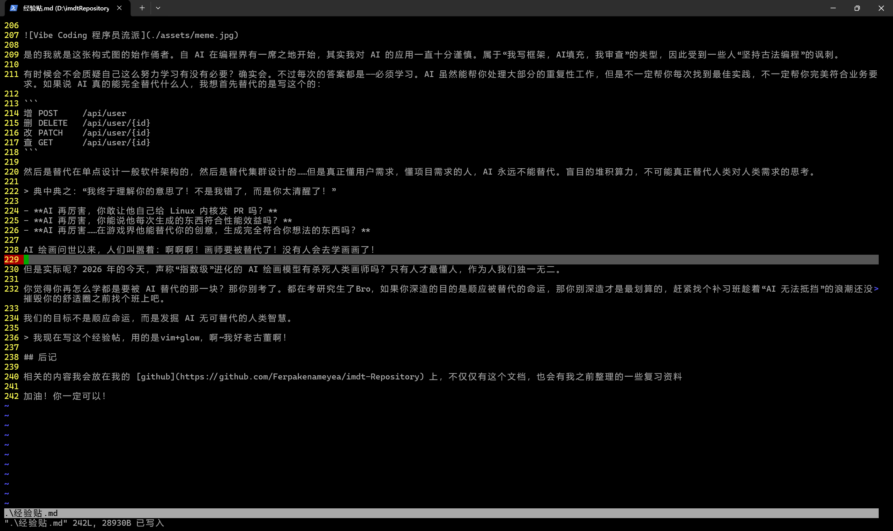

# IMDT 经验帖

> by MC的大虾

> 你不需要什么光环也可以上清华

## 引言

说实话考上 imdt 确实在我意料之外，我本来是抱着只有 10% 的希望的。确实是意外之喜。

我的初试：

|  政治   | 数学（二）  |  英语（一）  |  专业课（843）  | 总分 | 
|  ----  | ----  |  ----  | ----  |  ----  |
| 68  | 142 |  84  |  127  | 421 |

我其实一开始不太想把分数放前边，甚至想直接整个经验帖直接不提分数。因为会让人感觉好像是……某种难以得到的高分？但是感觉如果不这么写好像没有什么说服力。但是请读到这里的你不要有这种感觉。因为我一开始也完全没有自信，甚至我是慌的。

---

## 政治

这个我觉得应该没有太多好说的，毕竟全国都统一。我相关知识**虽然说不上贫乏，但是一定可以说得上是一无所知**。因为政治里面有一大块是**历史**，这一段可给我整惨了。我**对历史几乎就是完全不懂**的状态只有很模糊的理解。专业哲学术语更是**从0开始**。

正式开始准备差不多是 9 月中的时候（我开始得比较早），那时候看的是**肖秀荣**的[配套视频](https://www.bilibili.com/video/BV1fFG4znEWh/?spm_id_from=333.337.search-card.all.click&vd_source=7f99bdd49d4fc6ab38733e8e9f2a34e2)，就是[韩雪老师](https://space.bilibili.com/1184615448?spm_id_from=333.337.0.0)讲的。毕竟是肖神官方请来的老师很多地方都基本强一致，题外话比较少，马克思主义哲学的内容也讲得比较生动形象，甚至很多时候已经理解了还在不停举例子。对于政治，历史基本没啥了解的我确实比较推荐韩雪老师讲的课。直接去b站就可以搜，免费的。

买书的话我确实买多了，把肖秀荣的精讲精练（也就是最厚的那本书）还有1000题的纸质版买了，现在想来其实没什么必要，因为基本后面都只是抱着肖秀荣背诵手册在背+刷题。基本没有看精讲精练的机会（而且还死贵）。1000题在刷题小程序上也有，而且刷也比用纸质版的刷更方便。

刷题用的是**研兔刷题**，这个是完全免费的，看看广告就可以刷一整天。不仅仅是肖秀荣的1000题，很多的题册（包括肖四肖八，还有徐涛的，以及还有一些你听都没听过的老师的题册，还有很多年真题的原题）上面都有。而且这个比较像驾考宝典，就是你答错了还有评论区什么的，还有错误率辅助你。里面很多神人助记短语还是很有用的。就是不知道写这个经验帖的时候这个平台还活着没，希望还活着吧。

前期（从9月中到10月初）就是挨个挨个听韩雪讲精讲精练，挨个挨个把每一章都听完，开个1.5倍速，每天坚持听两章。不用怎么做笔记，我刚开始听前面第一本书到第二本书的时候还在用 Markdown 记笔记，那可是好一个练手速啊！！其实后面不需要，这一阶段只需要**专注**，认真和老师过完当堂课程的内容就行了。**一定不要边看边玩手机看微信**，要学就学，不想学直接关了去玩，别骗自己。每章听完后立马去做对应的1000题，也不多，基本一章平均下来也就十几道题。**不用做大题**，我刚开始可能还看一眼，结果发现基本没用，该不会的还是不会。感兴趣可以看一下，**这个阶段别在大题上浪费太多时间**。

中期（背诵手册到手到11月中）这个阶段差不多**背诵手册**来了，有一段时间韩雪还没出视频，自己就先看着然后预习。从10月中旬开始韩雪每天早上出[带背视频](https://www.bilibili.com/video/BV1gtWqzAEr8/?spm_id_from=333.337.search-card.all.click&vd_source=7f99bdd49d4fc6ab38733e8e9f2a34e2)。每天早上来图书馆，跟着韩雪老师把当天的带背过了，然后接着之前的预习进程自己往后面看一两章。差不多11月初就能预习完毕，之后就是每天跟着韩雪带背。每天看完带背其实时间不长，差不多50分钟，之后别闲着，直接打开**研兔刷题**，只要是上面没刷题记录的，都刷。

后期（一直到考试之前）这个阶段各种名册肖四肖八都会出来，差不多重心要放在拿分上而不是死磕知识点了。刷近几年的真题，多刷几遍（但是有**时效性**的别去硬记了，没必要），然后之前刷过的各种题册试着用研兔上面的**随机模拟考试**冲击冲击高分。肖四肖八的节点不用自己去在意，只要书到了就立马开背。**很多人对<u>背诵手册</u>有一些误解，拿来不是让你全塞脑子里，只是让你过一遍有个印象。这个阶段的刷题，找技巧才是王道。**

肖四肖八我也听了韩雪的带背，不过没有跟着韩雪去做最后必要的死记工作（特指背肖四）。我是跟着[青宁书生](https://space.bilibili.com/434070377?spm_id_from=333.337.0.0)背的，最后用的[背诵材料](https://www.bilibili.com/video/BV1Bt2WB5EYT/?spm_id_from=333.1387.upload.video_card.click&vd_source=7f99bdd49d4fc6ab38733e8e9f2a34e2)也是他整理的，没有按照肖四原文背，肖八过了选择题，没特别背过。我非常推荐看看[这个视频](https://www.bilibili.com/video/BV11oWsz9ENo?spm_id_from=333.788.videopod.sections&vd_source=7f99bdd49d4fc6ab38733e8e9f2a34e2)以及同一个系列的各个视频，你别看他叫做**邪修**，这才是一般人考政治该有的方法。**很多的时政内容你不可能完全记得完**，必须要找到从题干里面找答案的方法技巧。

**⚠️⚠️整个考研政治中的重中之重，重中之重⚠️⚠️**：学政治做题一定不要**死磕**！**别以为你学了点考研政治就能当政治家哲学家了**，**不要去反复<u>过度深入</u>探讨某一两个知识点！！**（如果这是你休息时光的乐趣，自便）别以为你好像深入学习了多少，**实际上就是在浪费你自己的备考时间去准备一些根本不会考的东西**，简单来说，用 *“啊我今天探讨得好深入好累啊~”* 来骗自己罢了，你本可以用这些之间去巩固更多你不太熟练的内容。能拿到分，能做对题目才是你学习的最终目的。

---

## 数学

我的数学能力比较差，可以说是偏垃圾。大一数分拼命复习才喜提 70 多分。缺乏数学直觉，而且很容易陷进错误思维漩涡，二级结论更是基本没有积累，更严重的是我还**粗心**老是算错。可以说从初中开始数学一直就是我的弱项。

但是这**都不重要**，因为数学二有足够的套路化和足够简单的风格。就说白了，数学二最难的几套，只要你在基础过完之后尝试一下，也不会觉得这难如登天。不能说你一次干个高分，基本能拿个勉强过得去的分数是完全可以的。

前期（3月初到约4月）：数学是我开始的最早的科目，因为其体量足够大。我买的也是网传神书，同时也是小肥猪经验帖里面的——**李永乐的线性代数和武忠祥的高等数学**（都看基础篇）。这两本书足够傻瓜式，知道大家本科期间没认真学，基本就是**从零开始教**。（对了，不要去担心大一的时候老师教的什么乱七八糟的定理什么 *柯西收敛准测* 啊什么的，数学二不需要）没看过视频课，就是每天看书然后跟着做上面的练习题，做完后然后做**汤家凤1800题**上面的对应章节的选择题，练手感跟思想。

中期（4月到约7月）：这一段时间就是提高巩固，还是**李永乐的线性代数和武忠祥的高等数学**的**强化篇**。（要不说这俩人编得好呢节奏确实舒服）差不多每天跟着学对应的强化章节，如果想做题汤家凤1800题的体量足够让你喝一壶。差不多做完汤家凤了（或者剩下的都是完全掌握的套路化了做题纯粹练字）就可以开始做稍微难一点的 **660 跟 330**（这两个都是买李永乐武忠祥俩人书配套，买的时候注意可以买一块捆绑的全家桶），还有买这俩人的书一般会给的**严选题**，这上面的题挺难的，每天做个五六道就力竭了（如果你是数学大佬随便乱杀当我没说）严选题也差不多搞完了就做做张宇 1000 题。

后期（8月到考试前）：这一阶段反而稍微休闲养老一点了。差不多开始做模拟卷跟真题，每天做完卷子就可以了没有太多额外补充，除非发现自己真的有某一两个知识点啃不过想刷一刷，我记得我当时是特殊形式的微分方程解不来然后上网找了找特训。我做了李林和张宇的模拟卷，然后近20年的数学二真题刷了两遍。**模拟卷肯定是有难度，而且难度不低**！但是千万不要气馁也不要把模拟卷的难度跟真题混为一谈。（我说实话不知道出模拟卷的这些人咋想的这不纯打击信心吗）。总之得有选择地去看里面的题，多看那种**看起来很简单实际上一不小心就爆炸**的题目，没必要花几个小时，一天，甚至几天去攻克一道题目，你是在考研不是在当理论数学家，你的目标是拿到高分而不是破解“顶尖”难题。（同样的，如果这是你娱乐的方式，当我没说）

后期情况：要不说模拟卷真是有毛病，考下来基本上130的屈指可数，大多是110，120，三个小时做下来时间也很紧，很容易让人陷入自我怀疑。但是做真题一般就 140 手感好能连续 150，三个小时差不多能歇着歇着做甚至还能看会手机。

⚠️⚠️ 很多一些网上的脑残自媒体这时候就会开始狂吠了：“啊啊啊，同学们别被真题的简单骗了，不要掉以轻心啊，真题太简单了没什么参考价值啊！这里很有可能考啊！二十年从未考过务必重视啊！”然后真就拿个20年没考过的冷门知识点，或者是陷阱题，或者是那种你从来没刷到过的积分怪题来干扰你的心态，觉得自己一无所知。这里直接举例：[考研竞赛凯哥](https://space.bilibili.com/42428180?spm_id_from=333.788.upinfo.head.click)的很多打着“**积分好题**”名头的视频，真题要这么考那也基本没人能做（**当然他分享做题方法的很多秒杀技巧视频还是很有用的**，部分难题中的解决方案也很有意义，选择性的吸收学习）。当猴子杂耍看个乐就行了，真有兴趣闲暇时间慢慢研究，别花费你宝贵的时间去看这些不会考的东西。

另外一些数学基础比较好的同学用数学一来准备数学二，我想说：**除非你特别把握给你出啥题你基本都能满分，别这么搞**。数学一的考试方式和考试内容很多都和数学二非常不一样，如果你硬要套，基本就是学习了很多对你拿分没有帮助的东西。做事都讲究个事半功倍。你一天只学数学吗？啃数学啃牛逼了你一天做其他科目的时间也被挤得差不多了。

总之无论如何，在大后期永远记住一件事：**真题永远是最有参考价值，最有意义的，不要去看那些宣扬焦虑跟打着“好题”名号的装逼分享视频。如果真题都没有参考价值，那你还参考啥？那些卖书卖课，觊觎你口袋里人民币的机构吗？**

---

> 注意，接下来的两门科目具有强烈的个人倾向，不一定具有强参考价值。请务必根据自己的实际情况进行学习！⚠️⚠️

---

## 英语

我英语能力还可以，总体来说没有太怎么非常复习。而且开始复习得很晚，基本上是 9 月份才开始高强度复习。用的是新东方的考研英语阅读专项训练册强化版，里面其实就是真题的主观题。然后做了两编到 2010 年的英语一真题。

背单词是有背的，从4月份开始背。考研英语里面还是有很多平常日常刷视频刷不到的单词。我用的是“不背单词”这个手机APP里面的“红宝书”单词册，他的学习模式足够用心，每次不是记忆了过后就不再考察而是会反复考察记忆并且还有拼写辅助。到6月份的之前进度推进都比较慢，每天也就背个十来个单词，6月份之后每天差不多背150个。（但是不背单词中间有很多很多比较弱智的单词所以也跳过了很多，单词量不一定具有很大的参考价值）

差不多到10月份的时候红宝书就背完了然后每天就只是打卡复习。

背单词这个东西其实不在于你每天要记忆多少而是要长期坚持。可能一两天懒了就一直懒下去然后复习队列里面积累了一千多个单词看都不想看。

在考试前一个月才开始准备的主观题。**翻译纯粹靠感觉。基本没有背过什么写作模板，因为你有没有用那些比较知名的模板老师看得出来。只要一发现你是在套模板其实分数就不高了**。然后看了几集刘晓艳的写作课程其实很有用，重点就是英语写作文不在于你内容写的白不白痴，只需要基本扣题的情况下把语法秀出来就好了。复杂句式多套套多写被动句。

整个英语卷子重点应该还是在客观题上，说白了除非你真的写作是一把好手，主观题再怎么拉也就那样。客观题是真的拉分。参考的话我后期做真题基本上 90% 客观题能控制在扣5分以内，特别特别难的年份可能有一两套是扣了15~20分的区间。

另外一个小 tips 是确实**非常非常推荐打游戏的时候把游戏 UI 调成英文，或者看视频不开字幕尝试着啃生肉**（虽然这样可能有点嘉豪）。玩游戏的时候自然而然就把一些单词学到了。这种路径学到的单词一般不会忘。

---

## 专业课

专业课一直是最奇怪难准备的科目。

**计算机相关**我理论复习用的是王道的考研书，但是王道说实话感觉很多题目的参考价值不大写的也很奇怪，考察的点感觉非常冷门。数据结构和计算机硬件组成由于我是软件工程专业本身本科也要学，所以基本上读王道就是再复习一遍，没有很大的参考价值。虽然计算机网络今年说砍了，但是仍然是出了几分的题目（诡异）幸好在考纲出来之前已经完全读过了一遍计算机网络加上室友考我本校复习 408 在寝室里学习，阴差阳错地意外学到了本次考试原题。

实际上 843 里面的计算机相关考试的风格很奇怪，不太注重非常深的考察（例如像 408 那样考浮点数运算过程，浮点数运算边界情况什么的），大多考的是背诵。所以看完一遍王道后我转变思路，自己用 Markdown 整理了复习资料里面的背诵知识点。每天就是拿着 Markdown 让 ai 对我进行默写评分和抽问。我自己觉得这个模式还是挺好用的。

代码题可以参考这个[知乎文章](https://zhuanlan.zhihu.com/p/645297108)，里面的题目跟着里面的节奏每天就刷一天的题单。由于我本身代码基础还不错，所以基本能很快写完，估计没有太大参考价值。考试用的是 C 语言，而且可以用铅笔写所以方便擦。考的也很简单，甚至没有上面我说的知乎里面的题目难。同时也可以参考一下群文件里面的往年题当中的题目，基本难度不大。

部分同学在复习的时候有过**背代码**的方式，对于我个人来说我相信理解代码更重要，因为考场上的题目很容易就会与你背的题目有一内内的细微区别，只要出题者灵机一动你不就炸了吗。

**概率论**我自己觉得我是准备有点过头了以至于基础没有准备非常好。用的是余炳森的概率论讲义，难度不大。但是就算余炳森的书上难度已经不大了，考试实际难度比这个还要低一个档次。如果能轻松拿捏书上的题目，那么考试的题目基本上是乱杀。**不过一定要汲取我的教训**，我是有协方差的公式没有记清楚系数所以考试的时候痛失几分，不过问题不大。 

> 另外同样的，非常不建议时间紧/数学基础一般的同学去纠结概率论里面的概念的**证明**，花几天的时间去证明一个你本来可以直接用的结论。你的任务是拿分，不是学好概率论。在考研这样一个高压紧急情况下，必须忽略次要矛盾，抓**主要矛盾**。

艺术设计相关内容是专业课里面最模糊的内容，没人能说清楚他要考什么。我是听了b站熊硕老师的[课程](https://www.bilibili.com/video/BV1ck4y1B7aX/?spm_id_from=333.337.search-card.all.click)，不过说实话用处不是很大。体量多没有特别的重点，差不多是当作学累了之后放松看的东西。没做过笔记。

但是我对相关的游戏理论**有一定了解**，比如心流、游戏策划设计、常见游戏元素（奖励，引导）的系统作用等，虽然不是非常非常懂但是还是能稍微说出来个所以然。所以考试的时候也差不多写出来了还画了图。（心流的那个图）至于非游戏的艺术内容，我看之前考纲里面写的，去看那本艺术设计相关的教科书但是太厚太枯燥了，实在看不下去。不过就在写这一段的时候，我的学长铅笔Pencil-Hu刚好开放了他的艺术设计 Notion。可以参考一下[这一篇](https://jade-park-d9f.notion.site/)。不在于背多少，就是多看看有个印象。

最后的设计大题经过我学长（铅笔 Pencil-Hu）的中间帮助找到了我同校的一个学新媒体的同学，有需要可以联系一下。（微信号：iukoi_Mayzz，非清深）。她花差不多一个多小时帮我学习一下基本的设计框架和答题方法与思路。同时练习着做了往年的一个真题（结果这次练习恰好可以用在我当年的考试设计大题上）非常负责任讲得也很清楚。

---

## 复试

复试没有太怎么准备。毕竟不可能两三个月做出一个很完善的作品或者搞一场科研。就是做了 ppt，然后让 ai 帮我模拟了一下面试。

由于复试内容保密，恕我不能透露详细内容。

我是**零科研，零奖学金，零游戏制作奖项**。学校 GPA 3.65（注意，不同学校 GPA 标准不同，绝对大小没有太大参考意义），英语只有四六级（没考口语）。没有保研资格。可以说成绩上是非常**平平无奇**的一个人。但是我本身对计算机开发足够热情，比较喜欢花很多时间钻研游戏跟项目开发（同时也是本科成绩拉跨的原因之一）所以自己做了挺多稀奇古怪的项目。在复试的时候也是有了填充作品集和 ppt 的关键作用。具体做成什么样，可以看看下面的几项（同时也是放在我作品集里面的），同时可以看看我的 [Github](https://github.com/Ferpakenameyea)

- [KBBeat](https://www.bilibili.com/video/BV1Kk5Pz3E68/?spm_id_from=333.1387.homepage.video_card.click&vd_source=7f99bdd49d4fc6ab38733e8e9f2a34e2)
- [再见双人](https://www.bilibili.com/video/BV191fbBnEZk/?spm_id_from=333.1387.homepage.video_card.click)
- [Yufan's Horror](https://www.bilibili.com/video/BV1YUfbBJEzm/?spm_id_from=333.1387.homepage.video_card.click)
- [光影桥途](https://www.bilibili.com/video/BV15VSHYEEpc/?spm_id_from=333.1387.homepage.video_card.click)

不一定很好但也说不上差，我本身对做项目有点 *完美主义* 所以比较尴尬我的不敢拿出来放。

然后同时感谢之前说的那位帮我弄初试设计题目的新媒体同学，帮我把作品集用 Figma 进行设计装订成册，至少看起来像那么回事。

---

## 杂项与思想

### 心理健康

备考是很长期痛苦的一件事情。决心要考研必须要做好脱一层皮的准备。我自己本人其实心理说不上防御力非常强，实际上很容易遭到创伤只不过好的比较快。特别是 5 月当时面试某知名大厂暑期实习的时候，因为心理测评结果中“存在可能的焦虑倾向”从而被拒绝，这样一件事情当时给了我非常非常大的打击。同时加上那一段时间另外一件事的打击和复习造成的持续心理压力，当时确实是几乎快要抑郁了。

不过后面慢慢也就过去了，抽出几天来，什么也不学，纯玩。多跟家里人交流，多跟朋友交流，多往前看，想哭就哭，人不是铁打的得学会自己发泄情绪。

同时如果真的心理有严重问题不要自己随便找地方乱测，可以找找心理医生。像我之前那样把某大厂的心理测评（甚至此心理测评会直接筛除那些表露不想加班的人）信以为真是万不可取的。人的心理是一个非常复杂的东西，不是有限道客观题就能标签化和测清楚的。

考研大后期意外拿到了华为的 Offer（是真的很意外，没准备地面试结果过关斩将拿到了）也算是给了自己充分一战的勇气。

平时看抽象视频和发癫很多，是放空大脑的好东西。

同时非常想安利 Toby（Toby Fox）的作品。他作品（特别是 2025 才更的 DR ch3-4）当中的故事核心以及配乐在考研过程中给了我非常大的激励。

**非常推荐这两首我特爱的曲子**，从绝望和恐惧里面硬生生靠微弱的希望杀出一条路的感觉真的很激励我，考研的时候经常会听原曲b站上的东方风，钢琴，电子改编。

话说 imdt 有 DR 粉吗！！？？😋😋😋😋

> 在那一天真的到来之前……我们都继续相信结局可以改变吧！-- DR ch4 末尾段

**推荐的乐曲：**

- [Crumbling Tower](https://music.163.com/song?id=2711379351&uct2=U2FsdGVkX1+9IIk2CCWEPJVORRVcyjx8xmJ+l2lnHlI=)
- [GUARDIAN](https://music.163.com/song?id=2711379352&uct2=U2FsdGVkX1+Szxbzh76jVauRNl3aUuhCX3WI2hpbu1I=)

> 噢对，同时考研的时候听音乐我个人觉得最好不要听带歌词的。不听也可以只是难免一天那么长时间有点难受。 

### 时间安排

我前期都挺懒的。到10月之前每天差不多12点出门，下午一点到图书馆或者咖啡厅然后学到晚上8点，有时甚至6点就走了。还是起不了早。

10月之后改变作息，10点中到图书馆，12点吃饭下午2:30到图书馆学到晚上10点图书馆闭馆。

前期差不多一天有效时长5个小时，后期一天有效时长大约7个小时。

不过核心还是在于一个**有效学习时长**的问题。其实**备考不在于谁学习的时间长**，而是在于学习的这段时间里有没有专注，有没有解决一天的计划和任务。很多人早上八九点就到图书馆晚上十一二点回来，其实大多时间还是在发呆跟玩手机，稍微强点就是在反复做一些已经完全掌握或者之前说的没什么意义的题。有效学习一个小时比得上半学半玩五个小时。

晚上我睡得并不早甚至喜欢熬夜，前期偶尔晚上打游戏到两三点（暗区突围启动！）后期差不多每天12点睡。

### 考试

考试那两天早上是跟我研友打车去的。交通不同人情况不一样就不细说了。

一些考试的额外技巧（当然不可以作弊）可以去看看[青宁书生](https://space.bilibili.com/434070377?spm_id_from=333.337.0.0)在快考试那几天发的视频，我这里就不说了。我有头疼的毛病所以那两天是药丸战士，每场考试之前吃一片布洛芬+喝1瓶魔爪提神，虽然很不健康但是也就那两天。（byd把能量打满了是吧）

考试时冷静是最重要的，尤其是在清华本部考那种氛围很容易给人压力，不要因为题目难就慌，也拒绝因为题目简单而掉以轻心。并且我会在考试的时候暗暗鼓励自己，深呼吸，放轻松。数学作答的时候**很推荐把草稿纸划分区域**，方便检查。数学像我一样比较粗心的可以在做完后（一般数学二做完时间比较充裕）正向和反向都验算一下。

### 担忧与不可及

很多同学在考之前就开始担忧。因为 imdt 它本身就沾了“清华”二字似乎高不可攀遥不可及。说白了就是害怕这么一个名头，还没有真正开始考就被这样的一个 tag 给心理上压垮了。同时还有对不可知的未来的担忧。

但是冷静分析一下其实从整体上来说，考研上清北**真的没有高考上清北困难**。我在整场考试之前也是慌慌的，害怕和焦虑始终围绕着我。“那么多人就考进十几个，我这么废的能要我吗？” “要是我没考上怎么办？打工？我不想二战啊！” “清华听起来太遥远了吧……”

同时群里面也会有意无意的凡尔赛，好像没有在本科生阶段发过顶刊论文、做过什么好科研项目、拿过什么奖学金……你就根本没有清华的入场券。但是真的如此吗？

在几个月前我半信半疑地觉得——不是的。如今我一个“三无产品”以及低排名选手终于可以在此处坚定地向大家说：不是的！你不需要成为别人眼里的“高级存在”也能考上心仪的学校和专业。

如果有一个东西被所有人捧上似乎无法企及的顶尖，咱们的目标就是将它拉下所谓神坛。

### “考研是一个人的朝圣”

> 注，此部分有强烈个人色彩，谨慎参考 

一些同学在考研的过程当中喜欢一直和其他同学交流，但实际上我不太推荐。考研说白了是所有人长时间自习，没有谁规定必须什么时候学什么，每个人的起跑线也不一样。你可能数学好，我可能编程好，每个人的侧重点也不一样。和准备中高考相比其实差别非常大。如果一定要和你的研友拉平节奏，实际上这种方式不仅是对别人节奏的过度控制，也是对自己进度的不负责。

**少去关注别人，别做别人生活的看客。**

这一部分的标题我是从刘晓艳老师的[视频](https://www.bilibili.com/video/BV1Q49uY9E9W/?spm_id_from=333.337.search-card.all.click&vd_source=7f99bdd49d4fc6ab38733e8e9f2a34e2)内容摘抄而来。你可能有很多同学要和你一起考，但是最终来说是一个人的奋斗，孤独和独自努力必定是整个备考过程中的常态。

可以和你的同学进行部分问题交流，和同学进行资料分享，但是**一定不要试图让自己去适应他人的节奏，也不要把自己的节奏强加在他人身上**。如果你一直试图去模仿他人的节奏，最终就是你可能过度复习了很多你已经学得非常好的部分，但是你没有学好的部分根本没有静下心来认真地，随着自己真实想法地巩固加强。

因此备考过程中除了找资料，也尽可能别去大群一直吹水。处理好自己地事情就行了。有什么想聊的可以跟 ai 聊，不打扰别人也满足自己随时有人聊天的需求。

### AI 焦虑

> 注，此部分有强烈个人色彩，谨慎参考 

为什么说这个呢，也是根据群里的交流话题而来。自 ChatGPT 在互联网掀起惊涛骇浪之日起，对于人类在工程界的地位的质疑声此起彼伏。同时随着最近的 Vibe Coding 浪潮掀起，Claude Code，Gemini，Cursor 各种高级编程工具涌现，以人们无法想象的速度更新换代，一些极端的声音开始响起：

- **未来没人会学习编程了**！

- **未来程序员都没有活路了**！

- **“古法编程”没有意义！**

自 AI 在编程界有一席之地开始，其实我对 AI 的应用一直十分谨慎。属于“我写框架，AI填充，我审查”的类型，因此受到一些人“坚持古法编程”的讽刺。

有时候会不会质疑自己这么努力学习有没有必要？确实会。不过每次的答案都是——必须学习。AI 虽然能帮你处理大部分的重复性工作，但是不一定帮你每次找到最佳实践，不一定帮你完美符合业务要求。如果说 AI 真的能完全替代什么人，我想首先替代的是写这个的：

```
增 POST     /api/user
删 DELETE   /api/user/{id}
改 PATCH    /api/user/{id}
查 GET      /api/user/{id}
```

然后是替代在单点设计一般软件架构的，然后是替代集群设计的……但是真正懂用户需求，懂项目需求的人，AI 永远不能替代。盲目的堆积算力，不可能真正替代人类对人类需求的思考。

> 典中典之：“我终于理解你的意思了！不是我错了，而是你太清醒了！”

- **AI 再厉害，你敢让他自己给 Linux 内核发 PR 吗？**
- **AI 再厉害，你能说他每次生成的东西符合性能效益和最佳实践吗？**
- **AI 再厉害……在游戏界他能替代你的创意，生成完全符合你想法的东西吗？**

AI 绘画问世以来，人们叫嚣着：啊啊啊！画师要被替代了！没有人会去学画画了！

但是实际呢？2026 年的今天，声称“指数级”进化的 AI 绘画模型有完全杀死人类画师这个职业吗？

只有人才最懂人，作为人我们独一无二。

你觉得你再怎么学都是要被 AI 替代的那一块？那你别考了。都在考研究生了Bro，如果你深造的目的是顺应被替代的命运，那你别深造才是最划算的，赶紧找个培训班趁着“AI 无法抵挡”的浪潮还没摧毁你的舒适圈之前找个班上吧。

我们的目标不是顺应命运，而是发掘 AI 无可替代的人类智慧。



> 顺带一提，我现在写这个经验帖，用的是vim+glow（终端渲染 markdown 的工具），啊\~我好老古董啊！我真是 AI 时代最后的守墓人呀！😋😋

## 后记与致谢

相关的内容我会放在我的 [github](https://github.com/Ferpakenameyea/imdt-Repository) 上，不仅仅有这个文档，也会有我之前整理的一些复习资料

**本篇内容中部分话题可能写的有点针锋相对，不过我希望带给你们的是激励和斗志，而不是劝退**

非常感谢（不分先后）：

- 我的学长：一支铅笔 Pencil Hu：带我入坑 imdt，路上提供的一系列至关重要的帮助。
- 我的家人：理解我对梦想的追求，生活上无吝啬的帮助。
- 小肥猪等前辈：对 imdt 上岸经验的整理。
- b 站青宁书生，韩雪老师在这里等 up：持续的鼓励和无偿整理的资料视频。
- 我的网友们：不嫌弃白天学习疲倦导致的菜，晚上继续跟我打游戏。和我谈心。
- 我的同学们：考研过程中对我的包容和理解，在我耍脾气的时候的忍让，和我一起模拟考和解决难题，大半夜和我在外面谈心（冷啊！）在最终考试两天对我起床杂音的接受。帮助我整理艺术设计制作作品集。

加油！你一定可以！

> MC的大虾 2026/4/24 日写到此处
