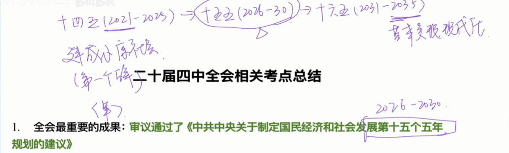

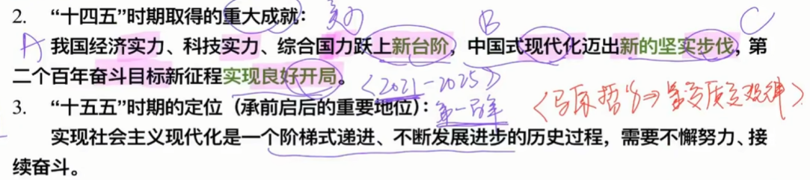

十四五：实力层面的新台阶，现代化层面的新步伐，目标层面的良好开局

十五五：**承前启后**
前：2021年百年奋斗目标
后：2025基本实现现代化

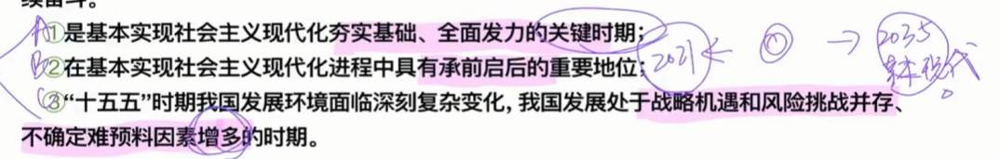

前两点：国内
后一点：国际

**战略机遇和风险挑战并存**：体现了矛盾原理，同一性和斗争性，相互转化

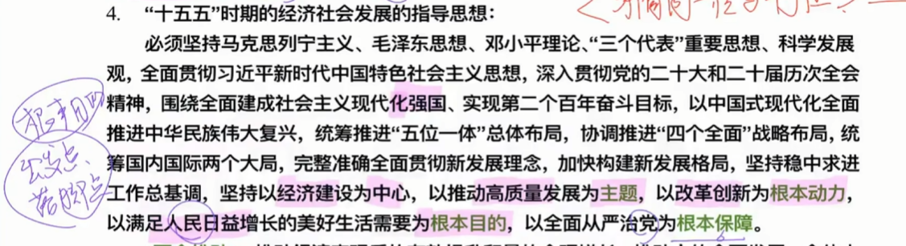

经济，人民（发展经济为了人民）

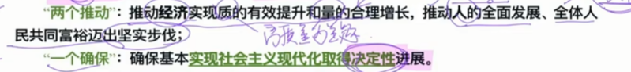

两个推动，经济和人民

一个确保，社会主义现代化**决定性进展**

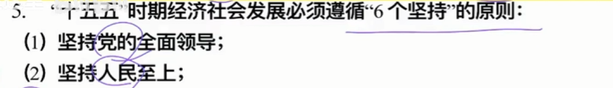

市场：需要 ←→ 供给

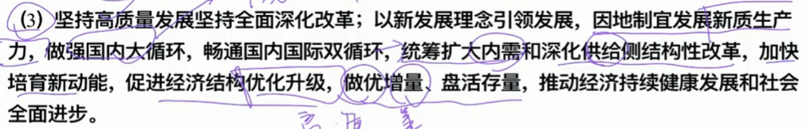

做优增量（质要做优）、盘活存量（变废地为宝地，避免经济滞胀）

（矛盾的统一性和斗争性原理，**因地制宜**——矛盾的普遍性+特殊性原理）

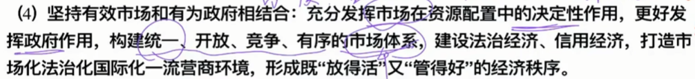

市场体系：基于**全国统一大市场**，不是某一个地区某一个领域的小循环（局部到全局）

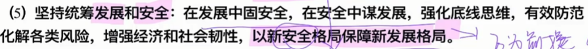

**安全和发展**互为前提，新安全格局**保障**新发展格局

底线：量变质变规律，适度，也可以是矛盾斗争性和统一性

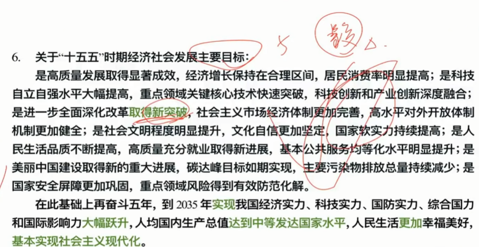

再奋斗五年之后：是对“十六五”规划的展望

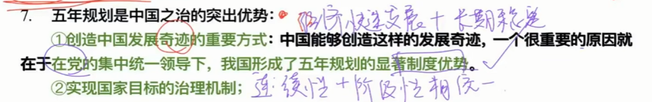

连续型和阶段性相统一

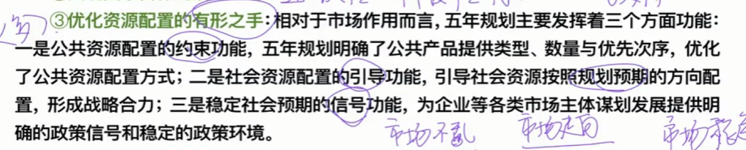

约束：市场不乱
引导：市场走向
信号：市场稳定

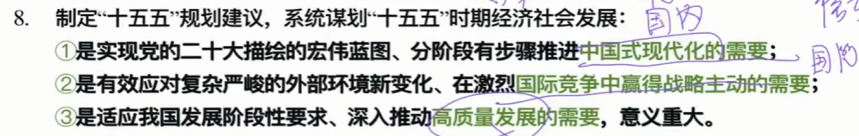

高质量发展是中国式现代化的必由之路

以高质量发展的确定性应对外部环境的不确定性

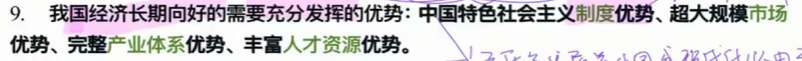

根本保障：中国特色社会主义制度

既有市场，又有供给

> 10+ 各方面的战略部署

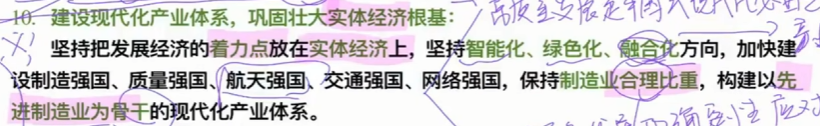

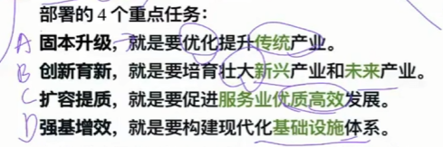

**实体经济**是根基，也是着力点，不可能有任何经济去代替实体经济

融合化：产业+技术融合

制造业**合理比重**，不能是提升或者是降低。现代化产业体系中，**先进制造业**是**骨干**

量很大的就要优化（传统产业，服务业）
量很小的就要壮大（新兴产业和未来产业）

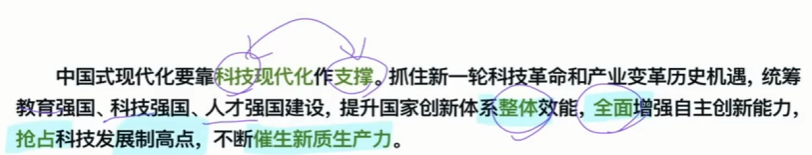

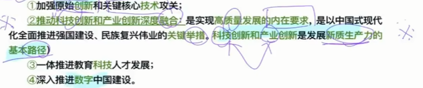

---

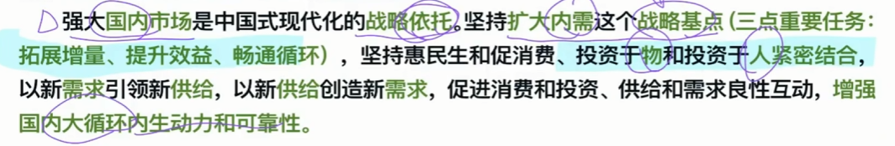

投资于人：人才资源

> 内需->消费->有效投资->供求->满足消费

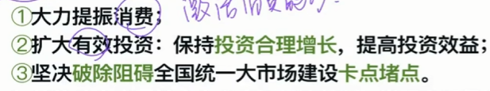

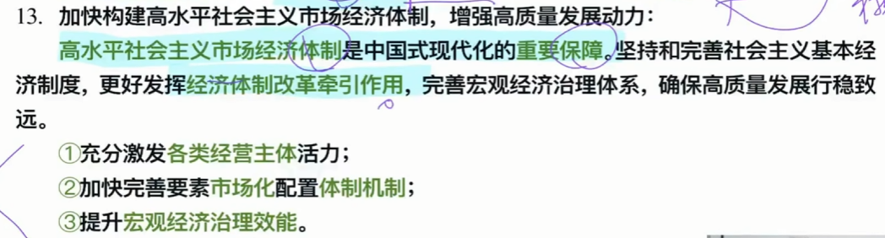

①：企业
②：市场决定
③：政府

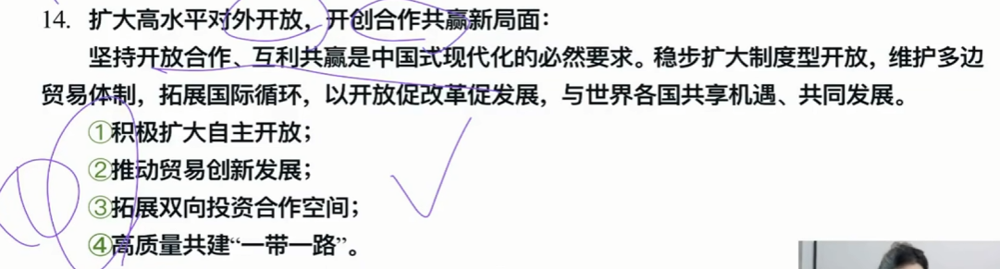

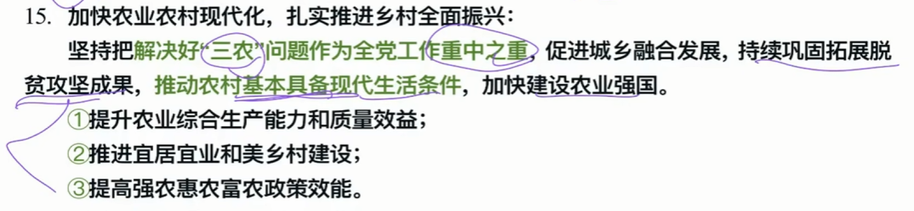

“三农问题”：农业，农村，农民（刚好对应三个层面）

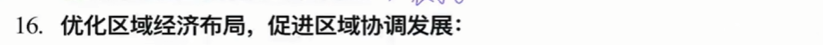

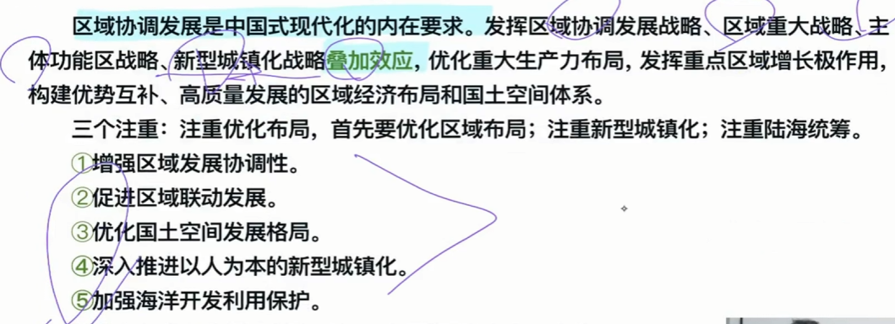

---

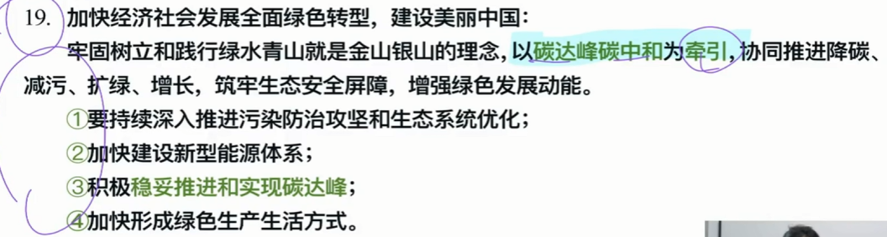

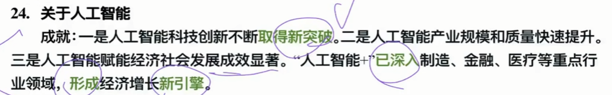
