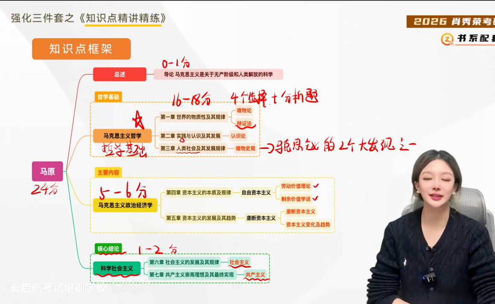
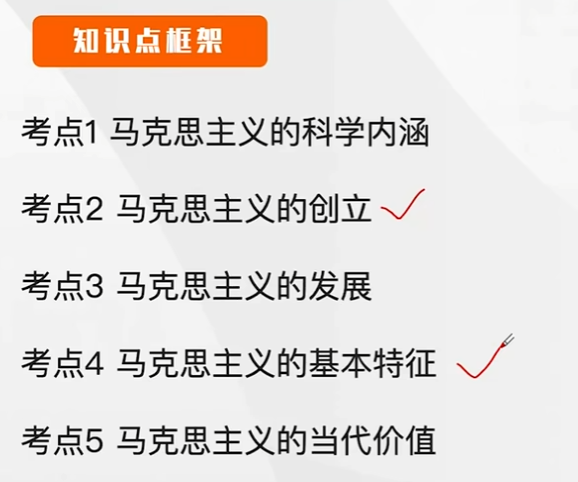

> 单选16个，每个1分（可能ABCD都对，但是要选择最符合题意的）
> 多选题17个，每个2分（至少有两个对的，多选少选都没分fuck）
> 材料分析题50分，每学科1题，每题至少两个问题
> 学科：马原，毛中特，新思想，史纲，思道法，时政

# 马克思主义原理 ~24分

## 导论

### 马克思主义的科学内涵（几乎不会出考点）

马克思主义理论体系的三个基本组成部分：
- 马克思主义哲学（哲学基础）
- 马克思主义政治经济学（主要内容）
- 科学社会主义（核心结论）

### 马克思主义的创立（重要）

#### 社会根源
**资本主义生产方式** 一方面带来了社会化大生产的迅猛发展，另一方面又造成了深重的社会灾难。第一，**社会两极分化，工作极端困苦。**第二，**周期性经济危机频繁爆发。**

> 活都是工人，无产阶级在干，但是钱被资产阶级拿走了

#### 阶级基础

**无产阶级**在反抗资产阶级剥削和压迫的斗争中，逐步走向自觉，并迫切渴望科学的理论指导

19世纪30~40年代法、英、德的三大工人运动（法国里昂工人的两次起义、英国宪章运动、德国西里西亚纺织工人起义）**标志着无产阶级作为独立的政治力量登上了历史舞台**。

> 缺少一个为无产阶级而生的理论指导

#### 思想溯源

**直接理论来源**：西欧三大先进思潮

- 德国古典哲学
- 英国古典政治经济学
- 英法空想社会主义

**自然科学前提**：三大科学发现

- 细胞学说
- 能量守恒与转化定律
- 生物进化论

#### 拓展与点拨

> 需要掌握到：这篇著作名称是什么，阐释的内容或者观点，其地位是什么

在家庭、学校和社会的影响下，马克思、恩格斯也曾接受过那个时代的 **唯心主义和资产阶级民主主义思想**，但是资本主义制度的弊端和劳动群众渴求解放的呼声，促使他们立志进行社会变革，并走向求索科学真理的道路。

马克思、恩格斯发表在 **《德法年鉴》** 上的论文表明，他们 **完成了从唯心主义向唯物主义，从革命民主主义向共产主义的转变，为创立马克思主义奠定了思想前提**。

马克思、恩格斯在巴黎会面，从此开始了毕生的合作。他们在巴黎合写了 **第一部著作《神圣家族》**

**1845年，马克思、恩格斯合作撰写了《德意志意识形态》，首次系统阐述了<u>历史唯物主义的基本观点，实现了历史观上的伟大变革</u>**

**共产主义者同盟** 是世界**第一个无产阶级政党**

**《共产党宣言》**的发表，标志着<u>马克思主义的公开问世</u>，是世界上**第一个无产阶级政党的纲领**

**《资本论》**是马克思主义最厚重，最丰富的著作，被誉为“**工人阶级的圣经**”

[简单了解]
马克思代表第一国际写出来著名的 **《法兰西内战》**，高度赞扬了巴黎工人的伟大创举，科学总结了巴黎公社的历史经验

[简单了解]
**《哥达纲领批判》**，进一步丰富了科学社会主义学说

恩格斯的 **《反杜林论》全面阐述了马克思主义理论体系**，被称为马克思主义的“百科全书”。

[简单了解]
恩格斯整理出版了《资本论》第二、三卷，写出了 **《家庭、私有制和国家的起源》《路德维西·费尔巴哈和德国古典哲学的终结》** 等著作，进一步发展了马克思主义理论

### 马克思主义的发展[简单把握]

**列宁** 是最开始对马克思主义进行丰富和发展的

**经济政治发展的不平衡已成为资本主义发展的绝对规律（原因），提出了社会主义革命可能在一国或数国首先发生并取得胜利的论断（一国胜利论）。<u>俄国十月革命的胜利，使社会主义从理想开始变为现实</u>**，从而开创了世界历史的新纪元。

### 马克思主义的基本特征

**1.科学的理论——科学性**

马克思主义是对自然、社会和人类思维发展本质和规律的 <u>正确反映</u>。马克思主义具有科学的世界观和方法论基础，即 <u>辩证唯物主义和历史唯物主义</u>，这是马克思主义的 **一个突出特征和理论优势，也是马克思主义科学性的重要体现**

**2.人民的理论——人民性**

**人民性是马克思主义的<u>本质属性</u>，人民至上是马克思主义的政治立场。马克思主义的人民性是以阶级性为深刻基础的，是无产阶级先进性的体现。**马克思主义政党把人民放在心中最高位置，一切奋斗都致力于实现最广大人民的根本利益。

**3.实践的理论——实践性**

马克思主义是从实践中来、到实践中去，在实践中接受检验，并随实践而不断发展的学说。 **从马克思主义的使命和作用来说，**它是直接服务于无产阶级和人民群众改造世界的实践活动的科学理论。**从马克思主义的内容来看，<u>实践观点是马克思主义首要的和基本的观点</u>**

**4.发展的理论——发展性**

马克思主义是不断发展的开放的学说，具有**与时俱进**的理论品质。

**马克思主义的基本特征，用一句话概括，就是 <u>科学性与革命性的统一</u>。**马克思主义科学理论在知道无产阶级和人民群众进行伟大社会革命的过程中，**其人民性、实践性和发展性集中地体现为革命性**

### 马克思主义的当代价值（重要）

- 观察当代世界变化的 **认识工具**
- 指引当代中国发展的 **行动指南**
- 引领人类社会进步的 **科学真理**

**马克思主义仍然是当今时代的真理。人类的未来仍然需要马克思主义的<u>指引</u>。**

> 这里的指引是一个共性的指引，并不是具体的指引
> 一旦出现了马克思主义给中国提供了个性的指引，现成的方案……都是错的