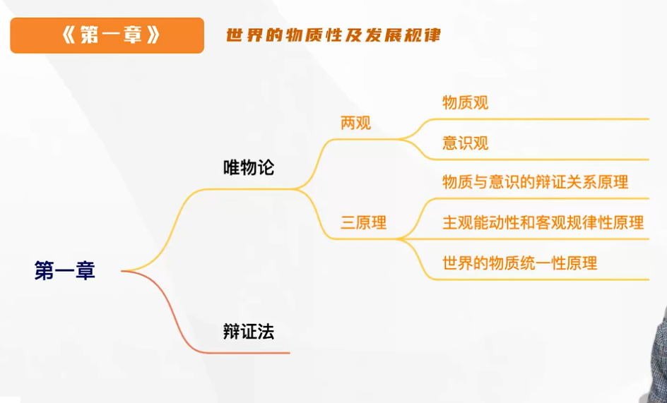
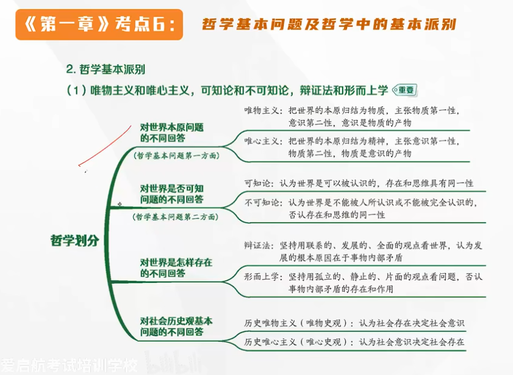

# 第一章 世界的物质性及发展规律

## 哲学基本问题及哲学中的基本派别

### 哲学基本问题

> 什么是哲学：系统化，理论化的世界观和方法论

哲学基本问题——存在和思维的关系问题（又称物质和意识的关系问题）

世界：
- **客观世界：存在=物质=客观**
- **主观世界：思维=意识=主观**

主观世界反映客观世界

### 哲学基本派别

**唯物和唯心主义，可知论和不可知论，辩证法和形而上学**

#### 世界本原问题的不同回答（何为第一性）
> 哲学基本问题第一方面

- **唯物主义**：意识是物质的产物√
- **唯心主义**：把物质的本原归结为精神，物质是意识的产物

唯心主义又分为主观唯心主义和客观唯心主义

- 主观唯心主义把**人**的感觉、观念作为世界的本原<u>（关键词：心、观念、感觉等）</u>[**问题：片面地夸大了人的感觉和经验**]
- 客观唯心主义把某种脱离物质、脱离任何个人的精神作为世界的本原<u>（关键词：理、理念、绝对观念等）</u>

（区别：观念是不是**人**的）

**并不是因为我们是唯物主义，就认为物质比意识更重要（两者都很重要，不要去区分重不重要）**

在讨论第一性的问题上，两者是 **对立关系**

#### 对于世界是否可知问题的不同回答
> 哲学基本问题第二方面

存在与思维是否具有 **同一性** 的问题

- **可知论**：世界是可以被认识的，存在和思维具有同一性√
- **不可知论**：认为世界是不能被人所认识或不能被完全认识的，否认存在和思维的同一性

在讨论是否具有同一性的问题的时候，物质和意识之间是一种 **联系关系**

- 只要是唯物主义，那都是 **可知论**，所有的唯物主义都坚持可知论
- 唯心主义可以是 **可知论+不可知论**

#### 对世界是怎样存在的不同回答

- **辩证法**：坚持用**联系的、发展的**观点看世界，认为发展的根本原因在于事物的**内部矛盾**
- **形而上学**：坚持用**孤立的、静止的**观点看问题，否认事物内部矛盾的存在和作用

唯物主义，唯心主义和辩证法，形而上学之间是 **可以交织的**

#### 对于社会历史观基本问题的不同回答
> 人类社会层面

- **历史唯物主义（唯物史观）**认为社会存在决定社会意识√
- **历史唯心史观（唯心史观）**认为社会意识决定社会存在

