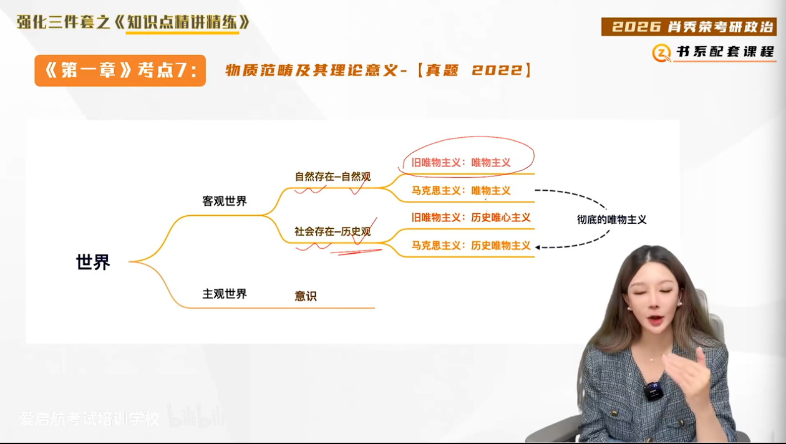
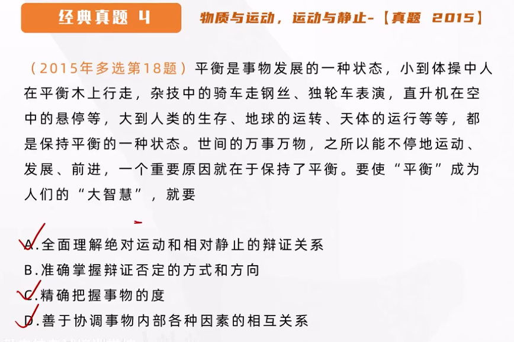
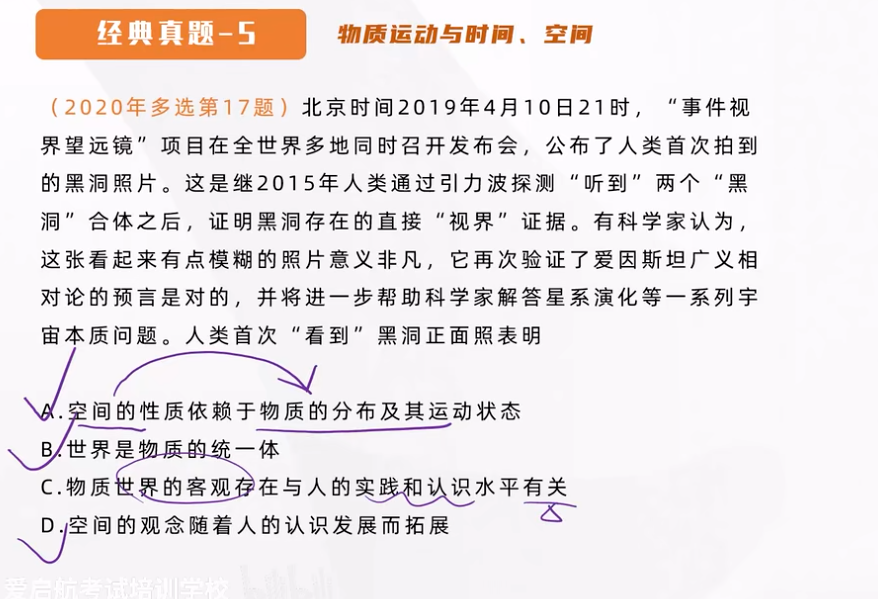
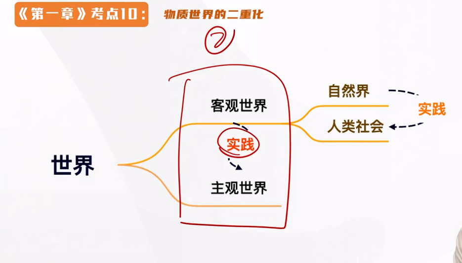
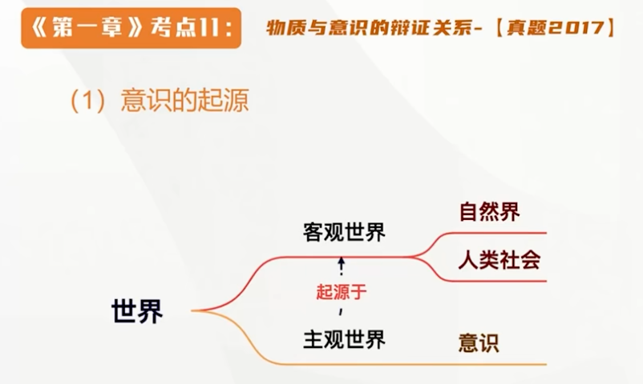
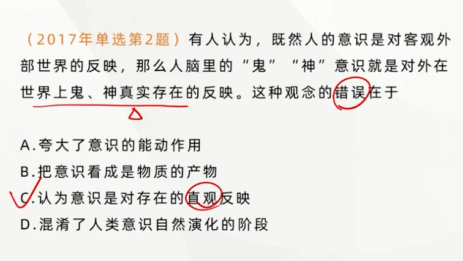

### 物质范畴及其理论意义 [物质观]
唯物主义也是在不断发展的

**古代朴素唯物主义**：<u>金、木、水、火、土</u>等 **具体的物质形态** （元素）

**近代形而上学唯物主义**：原子（微观结构层次）<u>将物质范畴建立在自然科学的基础上</u>（经典错误：以静止的眼光看待问题）**（机械唯物主义）**

**现代辩证唯物主义**：<u>客观实在</u>

物质一定是一个 **共性** 的存在，古代朴素唯物主义和近代形而上学唯物主义都是 **个性** 的表达。

---

#### 马克思主义物质观

**[初步概括]**
恩格斯指出：“物、物质无非是各种物的总和，而这个概念就是从这一总和中抽象出来的”（从个性和共性的关系中界定了物质的哲学范畴）

自然科学的物质结构范畴与物质哲学范畴的关系：**个性与共性**

**（个性和共性的关系=一般与个性的关系=普遍性和特殊性）**

**[全面科学的规定]**
列宁：物质是标志 <u>客观实在</u> 的哲学范畴。

物质是 <u>不依赖于人类的意识而存在</u>，<u>并能为人类的意识所反映</u> 的客观实在。这种**客观实在性**，是从自然存在和社会存在中抽象出的共同特性。
（**物质与意识的关系**）

（不一定需要是看得见摸得着的）

**物质最本质规定、唯一特性、共同特性——客观实在性**

---

#### 马克思主义物质范畴的理论意义

**体现了唯物主义自然观与历史观的统一，为彻底的唯物主义奠定了理论基础**。马克思主义的物质观解释了**自然与社会的物质性**，建立了说明自然历史过程的唯物主义原则，实现唯物主义自然观和历史观的辩证统一。

马克思主义在 **历史观** 上也是唯物主义（彻底的唯物主义）物质决定意识（未来详见第三章）

### 物质与运动，运动与静止 [运动观]

#### 物质与运动

- 物质的**存在方式，固有属性，根本属性**是**运动**。世界是物质的，而物质是运动的。**<u>运动</u>是标志<u>一切事物</u>和现象的<u>变化</u>及其过程的哲学范畴**

- **物质和运动不可分割**。一方面，**运动是物质的运动。物质是一切运动变化和发展过程的实在基础和承担者**。世界上没有离开物质的运动，任何形式的运动都有它的物质载体，**<u>设想无物质的运动，将导致唯心主义</u>**。**<u>另一方面，物质是运动着的物质，脱离运动的物质是不存在的。设想有不运动的物质，将会导致形而上学</u>**

#### 运动与静止

- 物质是运动的，没有不运动的物质，这说明运动是**普遍的、永恒的、无条件的**，因而是绝对的（“人不能两次踏进同一条河流”）。

- 但是，物质在运动过程中又有某种相对的静止。**相对静止是物质运动在一定条件下的稳定（特殊）状态，具体包括两种状态：空间的相对位置暂时不变和事物的根本性质暂时不变**。

#### 拓展与点拨

- 相对静止是事物存在和发展的必要条件；**是人们认识和利用事物的<u>前提</u>；是过去运动的记过和未来运动的<u>出发点</u>；是理解和衡量运动的<u>尺度</u>**

- **否认绝对运动，把相对静止绝对化，就会走向<u>形而上学不变论</u>；借口绝对运动，否认相对静止，就会导致<u>相对主义诡辩论</u>**（“人连一次也不能踏进同一条河流”）。

只见运动，不见静止：形而上学不变论
只见静止，不见运动：相对主义诡辩论

*动中有静，静中有动*

### 物质运动与时间、空间 [时空观]

#### 时间和空间的含义及特点：

- **时间**是指物质运动的持续性、顺序性，**特点是一维性**（不可逆性），即事件的流逝一去不复返；
- **空间**是指物质运动的广延性、伸张性，**特点是三维性**，即空间具有长、宽、高三方面的规定性。

> 当诗词体现出珍惜时光，都可以体现出时间一维性的特点

#### **时间和空间是运动着的物质的基本<u>存在</u>形式**

> （单独出现也对，即单独说时间或者空间都对）

- **物质运动与时间空间不可分割**。物质运动总是在一定的时间和空间中运行的，没有离开物质运动的“纯粹”时间和空间，也没有离开时间和空间的物质运动。**物质运动与时间和空间的不可分割证明了时间和空间的<u>客观性</u>**。具体物质形态的时空是<u>有限的</u>，而整个物质世界的时空是<u>无限的</u>。

> <u>时空的观念</u> 是人对于时间和空间的认识，不具有客观性。是主观的。

## 物质世界的二重化

> 只有通过实践，我们才能对世界产生认识

**人的实践活动是<u>自然界与人类社会</u>、<u>主观世界与主观世界相分化</u>的关键，也是它们统一的关键**。在实践活动中，人们始终在处理自然与社会、客观与主观的关系，力求克服二者的对立而达成它们的统一。

## 物质与意识的辩证关系[意识观]

- 意识的起源
- 意识的本质
- 意识的能动反作用

### 物质决定意识

人的意识是物质世界长期发展的产物，是社会实践的产物。物质与意识的关系是辩证统一的。

**意识是人脑的技能和属性，是客观世界的主观映像。物质对意识的决定作用表现在意识的起源和本质上。**

### 意识的起源

意识既起源于自然界，也起源于人类社会。

#### 意识是自然界长期发展的产物

它的形成经历了三个阶段：**由一切物质所具有的反应特性到低等生物的<u>刺激感应性</u>，再到高等动物的<u>感觉和心理</u>，最终发展为人类的意识。**

> 意识是为人类所特有的，只有人才具有意识。

#### 意识又是社会历史发展的产物

**社会实践，特别是劳动，在意识的产生和发展中起了决定性的作用：**劳动为意识的产生和发展提供了客观的需要和可能；在人们的劳动和交往中形成**的语言促进了意识的发展（语言是意识的物质外壳）**

> 社会实践，劳动起的是<u>决定性作用</u>，而语言起的是<u>促进作用</u>

### 意识的本质

**意识是物质的产物，但又不是物质本身（体现批判庸俗唯物主义的错误），意识是<u>人脑</u>这样一种特殊物质的机能和属性，是<u>客观世界</u>的<u>主观映像</u>，是客观内容和主观形式的统一。**马克思指出：“观念的东西不外是移入人的头脑并在人的头脑中改造过的物质的东西而已。

> 意识是人所特有的，只有人脑才能产生意识（但是人脑不是意识的源泉，客观世界，物质世界才是意识的起源）人脑要对客观世界才能产生意识，所以客观世界才是意识的源泉。
> 
> **鬼神不是物质，是不存在的（不能对虚幻物产生反应）**
> 
> **“人们所产生的反应是一模一样的”是错误的（直观反映论）**
> 
> 意识在内容层面是客观的（来源于客观世界），但是在形式层面是主观的

