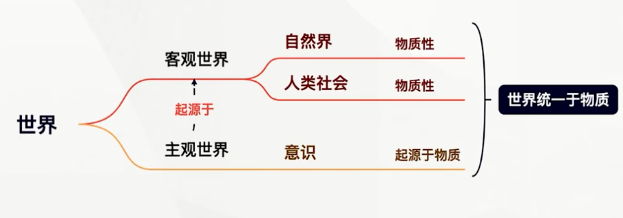
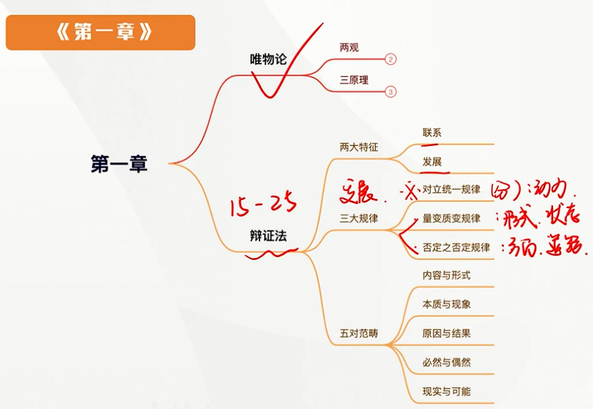
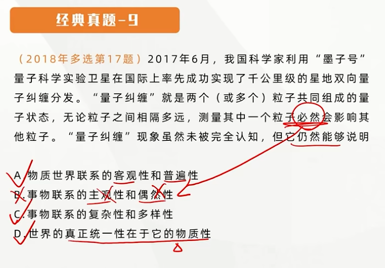
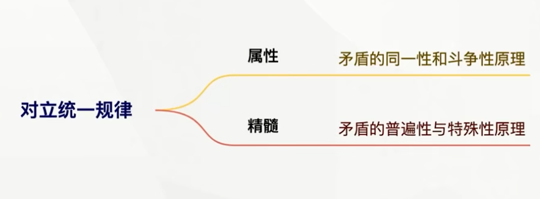

### 意识对物质具有反作用

[背下来，要出分析题的]
- **意识具有<u>目的性</u>和<u>计划性</u>**。人的整个实践过程，就是围绕意识活动所构建的目标和蓝图来进行的。
- **意识具有<u>创造性</u>**。
- **意识具有指导<u>实践</u>改造客观世界的作用**。
- **意识具有<u>调控人的行为和生理活动</u>的作用**。

## 主观能动性和客观规律性的辩证统一  [高考频]

> 主观能动性：意识  客观规律性：物质

**所谓规律，是指事物变化发展过程中本身所固有的内在的、本质的、必然的联系**。规律和必然性是同等程度的概念，代表着事物发展中必定如此、确定不移的趋势。**规律是客观的，是不以人们的意志为转移的**。

**规律是客观的，所以人不能创造、消灭、改变、完善规律，但可以认识规律，利用规律。**

---

### 正确认识和把握物质与意识的辩证关系，必须处理好主观能动性和客观规律性的关系

- 首先。**尊重客观规律**是正确发挥主观能动性的**前提**。 
- 其次，只有**充分发挥主观能动性**，才能正确认识和利用客观规律。**<u>实践</u>是客观规律性与主观能动性统一的基础。<u>坚持自信自立</u>**，突出强调和体现的就是要把尊重客观规律和激发创新创造活力贯通起来。

---

### 正确发挥主观能动性的前提和条件

- <u>**从实际出发**</u>是正确发挥人的主观能动性的 **前提**
- **<u>实践</u>**是正确发挥人的主观能动性的 **根本途径**
- 正确发挥人的主观能动性，还要依赖于一定的**<u>物质条件和物质手段</u>**

---

## 意识与人工智能 [重点]

---

> 人工智能的含义是人类智能的物化

### 人工智能与人类意识、人类智能的关系

**人工智能是人的意识能动性的一种特殊表现，是人的本质力量的对象化、现实化。人工智能的出现表明，人类意识已经发展到能够把意识活动 <u>部分地</u>（*不能全部地*） 从人脑中分离出来，物化为机器的物理运动从而延伸意识器官功能的新阶段。**但<u>即使是计算能力最强大、最先进的智能机器，也达不到人类智能的层级，**无法真正具有人的意识，不可能取代或超越人类智能**</u>

> 人工智能看似战胜了人类，但实际上是人类自己战胜了自己

|人类意识|人工智能|
|----|----|
|人类意识是**知情意**的统一体|只是对人类理性智能的模拟和扩展，**不具备**情感、信念、意志等人类意识形式|
|**社会性**是人的意识所固有的本质属性|不可能真正具备人类的**社会属性**|
|人类的**自然语言**是思维的物质外壳和意识的现实形式|**难以完全具备**理解**自然语言真实意义的能力**|
|人脑中总有 **许多东西（如潜意识）是无法被化约的**【重要】|能够获得人类意识中可以化约为数字信号的内容（**部分**）【重要】|

---

## 世界的物质统一性

---

### 世界的物质统一性原理

世界是统一的，世界的本原是一个。**包括自然界和人类社会在内的整个世界，其真正统一性在于它的物质性，世界统一于物质。**

**世界的物质统一性是多样性的统一。**

### 世界的物质统一性原理的重大意义

---

**世界的物质统一性原理是辩证唯物主义最基本、最核心的观点，是马克思主义的基石。**一切从实际出发，是世界的物质统一性原理在现实生活中和实际工作中的**生动体现**，是在坚持和发展中国特色社会主义伟大实践中想问题、办事情的 **根本立足点。**

> 一般来说做法是对的，包含这个原理的选项都对

## 事物的普遍联系和变化发展

---

### 事物的普遍联系

#### 联系的内涵：

联系是指 **事物内部各要素之间** 和 **事物之间**（外部） 相互影响、相互制约、相互作用 的关系。

联系一定是物质层面的

#### 联系的特点

联系具有客观性。**事物的联系是事物本身所固有的、不以人的意志为转移的。**联系的客观性要求我们从客观事物本身固有的联系出发去认识事物。坚持联系的客观性，就是在联系的观点上坚持了唯物论。

> 错误：主观性，客观的联系是无法被主观的思想所改变的。如果认为主观可以改变客观，那就是唯心主义。

联系具有普遍性。联系的普遍性有三层含义：
- **任何事物内部的不同部分和要素之间都是相互联系的**，也就是说，任何事物都具有内在的结构性。（事物内部必有联系）
- **任何事物都不能孤立存在**，都同其他事物处于一定的联系之中。（事物外部必有联系）
- 整个世界是相互联系的统一整体。从无机界到有机界，从自然界到人类社会，任何事物都处在普遍联系、相互作用中。

联系具有多样性。**世界上的事物是多样的，事物之间的联系也是多样的。**事物联系的主要方式有直接联系与间接联系、内部联系与外部联系、本质联系与非本质联系、必然联系与偶然联系等。

联系具有条件性。联系是矛盾着的事物的联系，联系是有条件的。 **条件是对事物存在和发展发生作用的诸要素的总和。对条件要唯物辩证地去看待。**
- 条件对事物发展和人的活动具有支持或制约作用；
- 条件是可以改变的；
- 改变和创造条件不是任意的，必须尊重事物发展的客观规律。

**联系完全可以是人为的，但不是所有的联系都是人为的**

事物的联系可以分为自在事物的联系与人为事物的联系。自在事物是在人产之前就存在或仍处在人的活动之外的事物，其联系毫无疑问是不以人的意志为转移的，具有客观性。人为事物的联系是在人类实践活动中形成的，具有“人化”的特点。但这种联系得以建立的根据及其形成后的实在联系，也是不以人的意识为转移的，同样具有客观性。

### 事物的变化发展

世界上的各种事物不仅是普遍联系的，而且是变化发展的，**事物的相互联系构成了运动、变化和发展**

**发展其实质是新事物的产生和旧事物的灭亡**。

- 新事物是指合乎历史前进方向、具有远大前途的东西；（并不是时间上新出现的事物）
> 新事物可以等于新生事物（同义词）

- 旧事物是指丧失历史必然性、日趋灭亡的东西。

- 新事物是不可战胜的

**就新事物与环境的关系而言**，新事物之所以新，是因为有新的要素、结构和功能，它适应已经变化了的环境和条件；

**就新事物与旧事物的关系而言**，新事物是在旧事物的“母体”中孕育成熟的，它既否定了旧事物中消极腐朽的东西，又保留了旧事物中合理的、适应新条件的因素，并添加了旧事物所不能容纳的新内容。这也正是新事物在本质上优越于旧事物、具有强大生命力的原因所在。<u>在社会历史领域</u>，新事物是社会上先进的、富有创造力的人们创造性活动的产物，**它从根本上符合人民群众的利益和要求，能够得到人民群众的拥护，因而必然战胜旧事物。**

## <u>对立统一规律</u>是事物发展的根本规律

### 唯物辩证法的实质和核心

**对立统一规律是唯物辩证法的实质和核心**。

- 从根本上回答了事物为什么会发展的问题
- 是三大规律的中心线索
- 提供了人们认识世界和改造世界的根本方法——矛盾分析方法

### 矛盾的同一性和斗争性及其在事物发展中的作用

#### （1）矛盾是辩证法的核心概念

> 矛盾是物质的矛盾
> 辩证矛盾（事物之间的矛盾） ≠ 逻辑矛盾（思维上的矛盾）

**对立统一规律又称矛盾规律**。矛盾是反映**事物内部或事物之间**对立统一关系的哲学范畴。对立和统一分别体现了矛盾的两种基本属性。矛盾的对立属性又称斗争性，矛盾的统一属性又称同一性。

#### （2）矛盾的同一性和矛盾的斗争性的含义

矛盾的**同一性**是指矛盾着的对立面相互依存、相互贯通的性质和趋势。（相对的）它有两个方面的含义：
- **矛盾着的对立面相互依存，互为存在的前提，并共处于一个统一体中；**
- **矛盾着的对立面相互贯通，在<u>一定条件</u>下可以相互转化。**

矛盾的**斗争性**是指矛盾着的对立面相互排斥、相互分离的性质和趋势（区别）（没有条件，绝对的）

由于矛盾的性质不同，矛盾的斗争形式也不同；即使同一性质的矛盾，在其不同的发展阶段上，斗争形式也不同。对于多种多样的斗争形式，可以区分为 **对抗性矛盾和非对抗性矛盾两种基本基本形式**

#### （3）矛盾的同一性和矛盾的斗争性的辩证关系

矛盾的同一性和矛盾的斗争性是相互联结、相辅相成的。没有斗争性就没有同一性，没有同一性也没有斗争性；**斗争性寓于（存在于）同一性之中，同一性通过斗争性来体现**

矛盾的同一性是有条件的、相对的，矛盾的斗争性是无条件的、绝对的。**矛盾的同一性和斗争性相结合，构成了事物的矛盾运动，推动着事物的变化发展**。

<u>同一性是以差别和对立为前提的，是包含差别和对立的统一。</u>

#### （4）矛盾的同一性和斗争性在事物发展中的作用

**所谓矛盾是事物发展的动力，是指矛盾着的对立面又斗争、又同一，由此推动事物的发展，或者说有条件的、相对的同一性和无条件的、绝对的斗争性相结合，构成了事物的矛盾运动，推动着事物的变化发展**。在矛盾推动事物发展中，矛盾的同一性和斗争性各有其作用。

- 矛盾的同一性在事物发展中的作用表现在：
  - 同一性是事物存在和发展的前提，在矛盾双方中，一方的发展以另一方的发展为条件，发展是在矛盾统一体中的发展。
  - 同一性使矛盾双方相互吸取有利于自身的因素，在相互作用中各自得到发展。
  - 同一性规定着事物转化的可能和发展的趋势。

- 矛盾的斗争性在事物发展中的作用表现在：
  - 矛盾双方的斗争促进矛盾双方力量的变化，造成双方力量发展的不平衡，为对立面的转化、事物的质变创造条件。
  - 矛盾双方的斗争是一种矛盾统一体向另一种矛盾统一体过度的决定性力量。矛盾双方的相互排斥和否定促使旧的矛盾统一体破裂，新的矛盾统一体产生。（发展）

- 矛盾的斗争性和同一性**在事物发展过程中是相互结合共同发生作用的**。

#### （5）矛盾的同一性和斗争性原理的方法论意义

- 必须善于把二者结合起来，**在斗争性中把握同一性，在同一性中把握斗争性。**（合二为一和一分为二）
- **要正确把握和谐事物对事物发展的作用**。**和谐是相对、有条件的**。社会的和谐、人与自然的和谐。都是在不断解决矛盾的过程中实现的。
- **运用矛盾的同一性和斗争性辩证关系原理指导实践，还要大力发扬斗争精神**。

> 和谐并不是没有矛盾，而是矛盾双方进入了平衡的状态

### 拓展与点拨

矛盾推动着事物的发展，说明事物发展的根本原因不在于事物外部，而在于**事物内部的矛盾性**。**事物的内部矛盾是事物发展的内因**，它是事物变化的根据，规定是事物发展的方向。外因是事物变化的条件，它能够影响事物的状况和发展进程，**但它必须通过内因而其作用**。