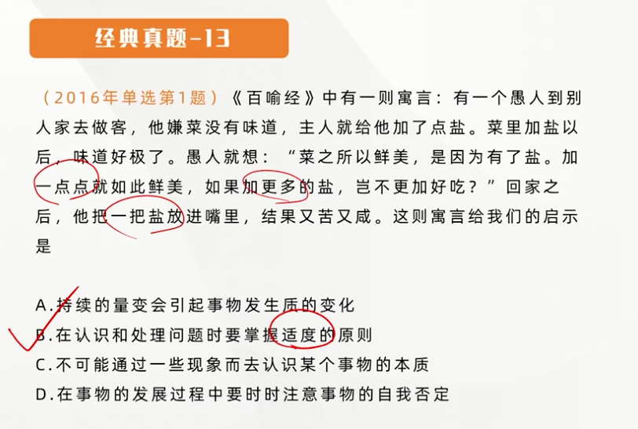

## 矛盾的普遍性与特殊性原理

### 矛盾的普遍性和特殊性及其相互关系

**矛盾无处不在（空间），无时不有（时间），有对矛盾的普遍性的形象表述。其含义是：矛盾存在于一切事物中，存在于一切事物发展过程的始终。**旧的矛盾解决了，又产生新的矛盾，事物始终在矛盾中运动。

> 矛盾的普遍性是无条件的，绝对的

---

### 矛盾的特殊性[重要]

**矛盾的特殊性是指各个具体事物的矛盾、每一个矛盾的各个方面在发展的不同阶段上各有其特点。**

**矛盾的特殊性<u>决定</u>了事物的不同性质。**只有具体分析矛盾的特殊性，才能认清事物的本质和发展规律，并采取正确的方法和措施去解决矛盾，推动事物的发展。

> 为什么事物与事物之间不一样，就是因为矛盾的特殊性

#### 事物是由多种矛盾组成的

**主要矛盾**是矛盾体系中处于支配地位、对事物发展起决定作用的矛盾。**次要矛盾**是矛盾体系中处于从属地位、对事物发展起次要作用的矛盾。

**不仅如此，每一对矛盾中，处于支配地位、起着主导作用的一方，是矛盾的主要方面；**处于被支配地位、不起主导作用的一方的则是矛盾的次要方面。

**事物的性质是由主要矛盾的主要方面所决定的。**

#### 要坚持“两点论”和“重点论”的统一

**两点论**是指分析事物的矛盾时，不仅要看到矛盾双方的对立，而且要看到矛盾双方的统一；不仅要看到矛盾体系中存在主要矛盾、矛盾的主要方面，而且还要看到次要矛盾、矛盾的次要方面。

**重点论**是指要着重把握主要矛盾、矛盾的主要方面，并以此作为解决问题的出发点。

**“两点论”和“重点论”的统一要求我们，看问题既要全面地看，又要看主流、大势、发展趋势。**

#### 矛盾的普遍性和特殊性的辩证关系

**矛盾的普遍性与矛盾的特殊性是辩证统一的关系**。矛盾的普遍性即矛盾的共性，矛盾的特殊性即矛盾的个性。矛盾的共性是无条件的、绝对的，矛盾的个性是由条件的、相对的。任何显示存在的事物的矛盾都是共性和个性的有机统一，<u>共性寓于个性之中</u>，没有离开个性的共性，也没有离开共性的个性。

> 寓于：永远都是**无条件性**的寓于有**条件性**的当中

**矛盾的共性和个性、绝对和相对的道理，是关于事物矛盾问题的精髓，是正确理解矛盾学说的关键**

人的识别的一般规律就是由认识个别上升到认识一般，再由认识一般到认识个别的辩证发展过程。

---

### 扩展与点拨

矛盾解决的形式是多种多样的：

- 矛盾一方克服另一方
- 矛盾双方同归于尽
- 矛盾双方形成协同运动的新形式
- 矛盾双方融合成一个新事物

用不同的方法解决不同的矛盾是马克思主义的一个重要原则。

#### 矛盾的普遍性和特殊性辩证关系原理的意义

**矛盾的普遍性和特殊性辩证关系原理是马克思主义基本原理同各国实际相结合的哲学基础**。

---

## 量变质变规律

### 事物存在的质、量、度

- **质是一事物区别于其他事物的内在规定性**
- **量是事物的规模、程度、速度等可以用数量关系表示的规定性。事物的量和质是统一的，量和质的统一在度中得到体现。（量对事物的规定性是一种<u>外在规定性</u>）**
- **度是<u>保持事物质的稳定性的数量界限</u>，即事物的限度、幅度和范围。**度的两端叫关节点或临界点，超出度的范围，此物就转化为他物。度这一哲学范畴启示我们，**在认识和处理问题时要掌握<u>适度的原则</u>**，防止“过”或“不及”。

**质和事物的存在是<u>直接同一的</u>**。事物丧失了自己的质，它就不再是自身而变成他物。

量和事物是不可分离的，**但量和事物的存在不是直接同一的，在一定范围内**，量的增减不影响事物的存在。

**区分质是认识量的前提，考察量是认识质的深化。**

---

### 事物发展的量变和质变及其辩证关系

- **量变是事物数量的增减和组成要素排列次序的变动**。（不显著）是保持事物的质相对稳定性的不显著变化，体现了事物发展渐进过程的连续性。
- **质变是事物性质的<u>根本变化</u>**，是事物由一种质态向另一种质态的<u>飞跃</u>，体现了事物发展渐进过程和连续性的<u>中断</u>。
- **区分量变和质变的<u>根本标志：事物的变化是否超出度**
- 量变和质变的辩证关系：
  - **量变是质变的<u>必要</u>准备**
  - **质变是量变的<u>必然</u>（确定不移的趋势）结果，并为新的量变开辟道路**，单纯的量不会永远持续下去，**量变达到一定程度必然会引起质变**
  - **量变和质变是相互渗透的**。一方面，在总的量变过程中有<u>阶段性和局部性的部分质变</u>；另一方面，在质变过程中也有<u>旧质在量上的收缩和新质在量上的扩张</u>。**量变和质变是相互依存、相互贯通的，**量变引起质变，在新质的基础上，事物又开始新的质变，如此交替循环，构成了事物的发展过程。**量变质变规律体现了事物发展的渐进性和飞跃性的统一。**

### 量变和质变规律原理的方法论意义

---

## 否定之否定规律 [难]

### 事物发展过程中的肯定和否定

事物的发展是通过其**内在矛盾运动**以**自我否定**的方式而实现的。**任何事物内部都包含肯定的方面与否定的方面**

**否定之否定规律就是要揭示事物自己发展自己的完整过程及本质**

**肯定因素**是**维持现存事物存在**的因素，**否定因素**是**促使现存事物灭亡**的因素。

---

### 辩证否定观的基本内容

- **否定是事物的<u>自我</u>否定、<u>自我</u>发展**，是事物**内部**矛盾运动的结果。
- **否定是事物<u>发展</u>的环节**
- **否定是新旧事物<u>联系</u>的环节**
- **辩证否定的实质是“<u>扬弃</u>”**，即新事物对旧事物既批判又继承，既克服其消极因素又保留其积极因素。

---

### 形而上学否定观（错误）
- 否定是外在的否定，主观任意的否定
- 否定是绝对的否定，是不包含肯定的否定。这旧既隔断了事物的联系，又使发展中断。

---

### 辩证否定观对于人们的认识和实践活动具有重要的知道意义

辩证否定观要求我们对待一切事物都要采取科学分析的态度，既要把握住它的现存状态又要把握它的发展趋向，反对简单地肯定一切或否定一切（形而上学否定观）。

---

### 否定之否定规律及其意义

#### 否定之否定规律原理

**事物的辩证否定不是一次完成的，而是经历事物自我发展的两次否定、三个阶段，即“肯定——否定——否定之否定”的有规律的过程**。第一次否定使矛盾得到初步解决，而处于否定阶段的事物仍然具有片面性，还要经过再次否定，即否定之否定，实现对立面的统一，使矛盾得到根本解决。

> 团结→批评（第一轮否定）→团结（否定之否定，否定批评）

**其中，否定之否定阶段仿佛是向原来出发点的“回复”，但这是在更高阶段的“回复”。事物的发展呈现出周期性，不同周期的交替使事物的发展呈现出<u>波浪式前进或螺旋式上升</u>的总趋势。**（重要）

> 干扰：线性上升，直线上升 ×

**否定之否定规律揭示了事物发展的前进性与曲折性的统一。**道路是曲折性的，但是方向是前进性的。