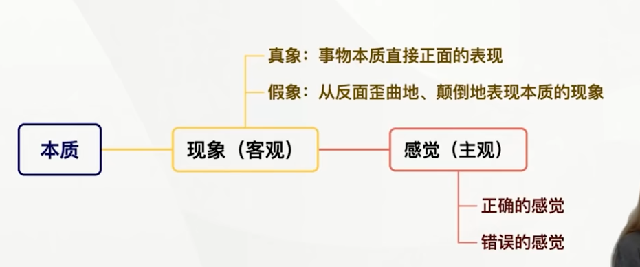

> 五对范畴

**联系和发展是通过一系列基本环节得以实现的。内容与形式、<u>本质与现象</u>、原因与结果、<u>必然与偶然</u>、<u>现实与可能</u>构成了联系和发展的基本环节**，它们从不同方面、在不同程度上体现着世界的普遍联系和变化发展。

---

## 内容与形式

- **内容与形式是从构成要素和表现方式上反映事物的一堆范畴。**
  - **内容**指构成事物的**一切要素的总和**；
  - **形式**指**把诸要素统一起来的结构或表现内容的方式**。

- **任何事物都是内容与形式的统一。**
  - **内容决定形式，形式反作用于内容。一方面，内容是事物存在的基础，对形式具有决定作用。**有什么样的内容，就有什么样的形式；内容发生了变化，其形式也要发生相应的变化。
  - **另一方面，形式对内容具有反作用。**适合内容的形式，对内容的发展起积极的**推动**作用；不适合内容的形式，对内容的发展起**消极的阻碍作用**。**形式对内容的反作用表明，形式具有相对独立性**。这种相对独立性使得内容与形式的关系中，<u>**同一内容可以通过多种形式来体现**</u>。
  
  > 同样的形式也可以表现不同内容
  
- 方法论意义。注重事物的内容，又要积极利用合适的形式去促进内容的发展。

---

## 本质与现象（事物的内在联系和外在表现）

- **本质是<u>事物</u>（物质的，客观层面的）的根本形式，是构成事物的诸要素之间的<u>内在联系</u>；现象是外部的外部联系和表面特征，是事物本质的<u>外在表现</u>。**

|本质|现象|
|-----|-----|
|一般的、普遍的|个别的、具体的|
|相对稳定的|多变易逝的|
|深藏于事物**内部**|表面的、**外显**的|
|通过**理性思维**才能把握|直接为人的**感官所感知**|

- 本质与现象又是相互依存的
  - **本质决定现象**，现象的存在和变化归根到底依赖于本质；
  - **现象决定本质**，本质总是通过一定的现象表现自己的存在。本质与现象的相互依存表明：**不表现为现象的本质和不表现本质的现象都是不存在的**。
- **任何现象都从一定的方面表现着本质，<u>即使假象也是本质的表现</u>。现象有真象和假象之分，真象是事物本质直接正面的表现，假象则是从反面歪曲地、颠倒地表现本质的现象。<u>真象和假象都是客观的现象，而错觉是主观的</u>。错觉并不都是由假象引起的**。

> 真象也可以引发错觉，并不是一一对应的。

- **科学的任务就在于准确辨别真象假象，透过现象把握本质**

---

## 原因与结果（事物之间引起和被引起的关系）

- **原因**：引起某种现象的现象
- **结果**：被某种现象所引起的现象
- **因果关系是有时间顺序的联系，总是原因在前因果在后，但并不是任何<u>前后相继</u>的现象都存在因果联系，还必须看是否存在<u>引起与被引起</u>的关系。**（“在此之后”不等于“因此之故”）

---

- **原因与结果是相互区别的。在一个具体的因果关系中**，原因就是原因，结果就是结果，原因在前，结果在后，二者不能混淆和颠倒。
- **原因与结果是相互依存和相互转化的**。在事物因果联系的长链中，任何原因都必然引起一定的结果，没有“无果之因”；任何结果都是由一定的原因引起的，没有“无因之果”；**一种现象在一中联系中是原因，在另一种联系中则可能是结果，反之亦然。**

> 在一个具体的因果关系中相互区别，在长链中相互转化

**原因和结果的关系是<u>复杂多样</u>的，有一因多果、同因异果、一果多因、异因同果、多果多因、复合因果。**

> 错误：只能导致一个结果，只有一个原因

---

## 必然与偶然（事物产生、发展和衰亡过程中的不同趋势）

---

- **必然与偶然是揭示事物产生、发展和衰亡中不同趋势的一对范畴**
  - **必然是指事物联系与发展中确定不移的趋势，在一定条件下具有不可避免性**
  - **偶然是指事物联系与发展中不确定的趋势**
- **必然与偶然相互依存**
  - **没有脱离偶然的必然**。现实事物的发展，不通过偶然而只表现为纯粹必然的情况是不存在的。**必然总是伴随着偶然，<u>要通过偶然表现出来</u>，并为自己开辟道路**。
  - **另一方面，没有脱离必然的偶然**。在似乎是偶然起支配作用的地方，实际上是**必然起着决定性作用**，并制约着偶然的作用形式及其变化。
- **必然与偶然相互转化。相对于某一过程来说是必然的东西，对另一过程就可能成为偶然的东西，反之亦然。**在事物的产生、发展和衰亡的过程中，包含必然性因素和偶然性因素的相互转化。比如在生物进化中，某个基因变异会导致新物种的产生，这是偶然转化为必然；旧物种的基本性状在新物种中表现为返祖现象，这是必然转化为偶然。
- **我们要重视必然性，同时要充分估计各种偶然因素的作用，善于敏锐识别和<u>把握机遇</u>（偶然），从而在实践中达到预期的目标。**

---

## 现实与可能（事物的过去、现在和将来的关系）

---

- **现实是指相互联系着的实际存在的事物的综合。**
- **可能是指包含在事物中、预示事物发展前途的种种趋势，是潜在的尚未实现的东西。**
- **现实和可能相互区别（对立）**。
- **现实与可能相互转化**。现实蕴藏着未来的发展方向，会不断产生新的可能；可能包含着发展成为现实的因素和根据，一旦主客观条件成熟，可能就会转化为现实。发展就是现实与可能相互转化的过程。
- **方法论意义**：一方面立足现实，对可能性做出全面的分析和预判；另一方面着眼长远，防止坏的可能变为现实，同时善于创造条件，促使好的可能获得实现。

---

### 拓展与点拨

可能有两种形式：**现实的可能和抽象（非现实）的可能**。二者的区别在于，**现实中的根据和条件是否充分**。**而可能性和不可能**的区别在于，现实中有无根据和条件。这里要注意区分抽象的可能与不可能。

> 不可能性是与现实不可转化的。

---

## 唯物辩证法的本质特征和认识功能

---

### 唯物辩证法是主观辩证法和客观辩证法的统一

> 主观辩证法反映客观辩证法

#### 客观辩证法与主管辩证法的含义

唯物辩证法既包含客观辩证法又包含主观辩证法，是二者的有机统一

#### 矛盾分析法是认识事物的根本方法 [分析题]

矛盾分析方法是对立统一规律在方法论上的体现，在唯物辩证法的方法论体系中居于核心地位。

---

## 学习唯物辩证法，不断增强思维能力

---

### 辩证思维能力

**提高辩证思维能力，要求我们客观地而不是主观地、联系地而不是孤立地、发展地而不是静止地、全面地而不是片面地、系统地而不是零散地观察事物。**

在对立中把握统一，在统一中把握对立。

### 历史思维能力

**历史、现实、未来是相通的，历史是过去的现实，现实是未来的历史**。

### 系统思维能力

系统具有**整体性、结构性、层次性和开放性四个基本特征**。
系统思维能力就是自从事物相互联系的各个方面及其结构和功能进行系统思考的能力,激素是全面系统地分析和处理问题的能力。提高系统思维能力，就是要坚持系统观念，用系统思维的方法分析和处理问题。

### 战略思维能力

### 底线思维能力

### 创新思维能力