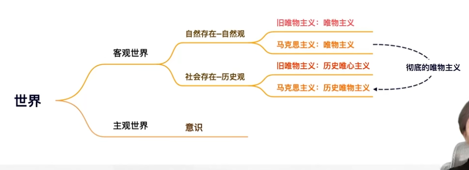
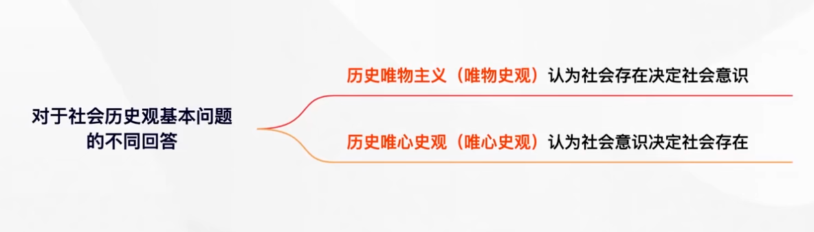
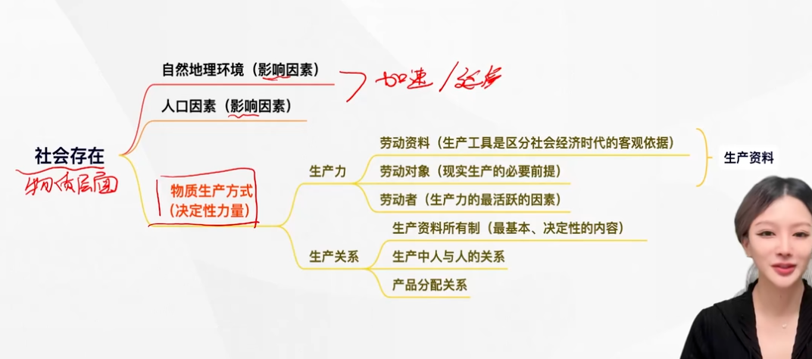
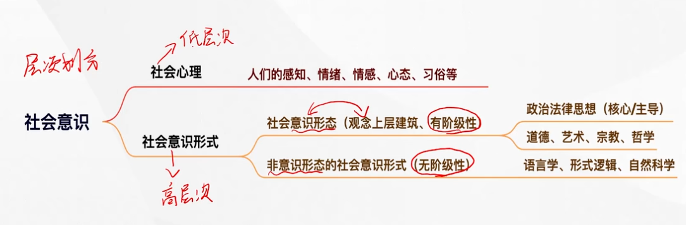

# 第三章 人类社会及其发展规律

---

## 历史观的基本问题

**哲学基本问题在历史观中的贯彻和表现就是历史观的基本问题，即社会存在与社会意识的关系问题。**

##  两种根本对立的历史观

> 唯物史观和唯心史观

唯心史观至多考察了人的活动的思想动机，而没有进一步考究思想动机背后的物质动因和经济根源，因而从社会意识决定社会存在的前提出发，把社会历史看成精神发展史，**根本不懂得社会历史的客观规律，也不懂得<u>人民群众</u>在社会历史发展中的决定作用**（唯心史观认为英雄创造历史，英雄史观）。

> 历史应该是广大的人民群众创造的，坚持人民群众史观

**马克思科学地解决了社会存在与社会意识的关系问题，创立了唯物史观**。

---

### 两种根本对立的历史观两大分歧点

- **社会意识与社会存在谁决定谁**
  - 唯心史观：社会意识是第一性
  - 唯物史观：社会存在是第一性 
- **历史创造者问题**
  - 唯心史观：英雄史观
  - 唯物史观：人民群众创造历史

---

## 社会存在与社会意识及其辩证关系

---

### 社会存在

#### 自然地理环境

**是人类社会存在和发展永恒的，必要的条件，是人们生活和生产的自然基础。自然环境地理的作用要受社会发展状况的制约，特别是受物质资料生产方式的制约**

马克思认为，应当合理的调节人与自然之间的物质变换，在最无愧于和最适合人类本性的条件下进行这种物质变换。

#### 人口因素

人口因素也是重要的社会物质生活条件。对生产发展和社会进步**起加速或延缓的作用**无论是自然地理环境还是人口因素，**都不能脱离社会生产而发生作用，都不能决定社会的性质和社会形态的更替**

#### 物质生产方式

物质生产方式是人们为获取物质生活资料而进行的生产活动的方式。是生产力和生产关系的统一体。物质生产方式是社会存在和发展的基础及决定力量。**在人们的社会物质生活条件中，生产方式是社会历史发展的决定力量。**

---

### 社会意识

**社会意识是社会存在的反映，是社会生活的精神方面**

社会意识的分类

- **根据不同的主体**，社会意识可以分为**个体意识**和**群体意识**。

- **根据不同的层次**，社会意识可以分为**社会心理（低层次的，盲目的，不系统的）**和**社会意识形式（高层次的，系统的，自觉的）**
  - 社会意识形式又根据<u>**是否具有阶级性**</u>分为**意识形态（等同于观念上层建筑）**和**非意识形态**

### 社会存在和社会意识的辩证关系

社会存在决定社会意识，社会意识是社会存在的反映，并反作用于社会存在

#### 社会存在决定社会意识

- 社会存在是社会意识内容的客观来源，社会意识是社会物质生活过程及其条件的主观反映
- 社会意识是人们进行社会物质交往（实践）的产物
- 社会意识是具体的、历史的

#### 社会意识既依赖于社会存在，又具有相对独立性

- 社会意识与社会存在发展具有**不完全同步性**（有时超前，有时落后）和**不平衡性**
- 社会意识内部各种形式之间存在**相互影响**且各自具有**历史继承性**
- 社会意识对社会存在**具有能动的反作用**，这是社会意识相对独立性的**最**突出表现

> 先进的社会意识起积极的促进作用；落后的社会意识起消极的阻碍作用

---

### 社会存在和社会意识辩证关系原理的意义

- **它在人类思想历史上第一次正确回答了社会历史观的基本问题。**
- **它对于推进社会发展包括社会文化建设具有重要指导意义。**

---

## 社会基本矛盾及其运动规律之一：生产力与生产关系的矛盾运动及其规律

### 生产力

生产力是人类在生产实践中形成的改造和影响自然以使其适合社会需要的物质力量。**生产力具有客观现实性和社会历史性。**

**生产力具有复杂的系统结构**

- **劳动资料**，也称**劳动手段**，其中最重要的是生产工具。**生产工具是区分社会经济时代的客观依据（物质标志）**。

> 各种经济时代的区别，不在于生产什么，而在于怎样生产，用什么劳动资料生产（马克思）

- **劳动对象**，劳动对象是现实生产的必要前提。

> 劳动资料+劳动对象=生产资料

- **劳动者**，劳动者是生产力中**最活跃**的因素。（也可以称为生产力中的首要因素，最基本的要素）

### 科学技术是生产力中的重要因素

> 科学技术生产工具是区分社会经济时代的客观依据不是基本要素，基本要素只有劳动者，劳动对象和劳动资料
> 科学技术可以**渗透到**基本要素当中

科学技术是先进生产力的集中体现和主要标志，是**第一生产力**

区别：

科学技术：日益成为**<u>生产发展</u>**（易错）的决定性因素。
物质生产方式：是**社会存在和发展**的基础及决定力量。

---

### 生产关系

---

生产关系是人们在物质生产过程中形成的不以人的意志为“转移的经济关系，实质是人们的利益物质关系。**生产关系是社会关系中最基本的关系。**（不是所有关系的总和）

政治关系、家庭关系、宗教关系等其他社会关系，**都受生产关系的支配和制约。**

生产关系包括**生产资料所有制关系（生产资料归谁所有）**、**生产中人与人的关系**和**产品分配关系**。在生产关系中，**生产资料所有制关系是最基本的**，它**是人们进行物质资料生产的前提**，**是区分不同生产方式、判定社会经济结构性质的客观依据**。

> 生产资料所有制：
> - 生产资料公有制
> - 生产资料私有制

#### 生产关系作为生产中人与人之间的关系，不是物

分析生产关系必须透过“物”看到“物”后面的**人与人的关系**。生产关系是一种**客观的物质的社会关系**。生产关系虽然是一种人和人的关系，但它是在物质生产过程中结成的关系，**是不以人的意志为转移的**。

---

### 生产关系一定要适合生产力状况的规律（人类社会发展的基本规律）

---

#### 生产力与生产关系的相互关系

在社会生产中，**生产力是生产的物质内容，生产关系是生产的社会形式**，二者的有机统一构成社会的生产方式。生产力决定生产关系，生产关系又可以反作用于生产力。

**生产力状况决定生产关系的性质**，有什么样的生产力，就会产生什么样的生产关系

**生产力的发展决定生产关系的变化**，生产关系是生产力发展需要的产物，只有当它为生产力提供足够的发展空间时才能够存在。

**生产关系对生产力具有能动的反作用**。当生产关系适合生产力发展的客观要求时，对生产力的发展起推动作用；当不适合时，会阻碍生产力的发展。**生产关系对生产力反作用的实际过程和情形是十分复杂的。**

#### 生产力与生产关系的矛盾运动规律

生产力与生产关系的相互作用是一个过程，表现为二者的矛盾运动。这种矛盾运动中内在的、本质的、必然的联系，就是**生产关系一定要适合生产力状况，亦称生产力与生产关系的矛盾运动规律。**

**生产关系一定要适合生产力状况的规律是社会形态发展的普遍规律**

#### 生产力与生产关系矛盾运动规律的原理具有极为重要的理论意义和现实意义

**理论意义**：**第一次科学地确立了生产力发展是“社会进步的最高标准”**，并且把生产力与生产关系矛盾运动的规律作为判断时代变革的客观依据。

**现实意义**（略）

