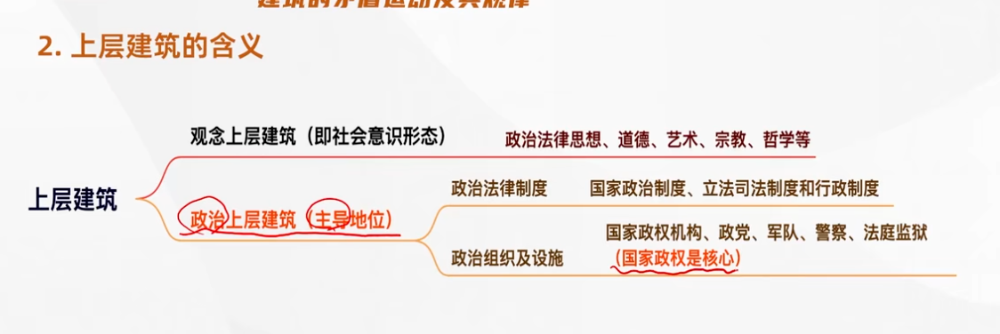
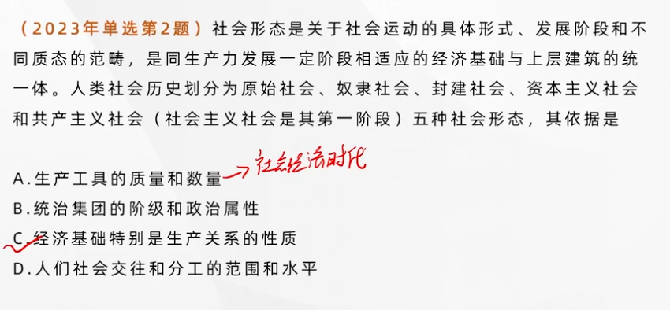
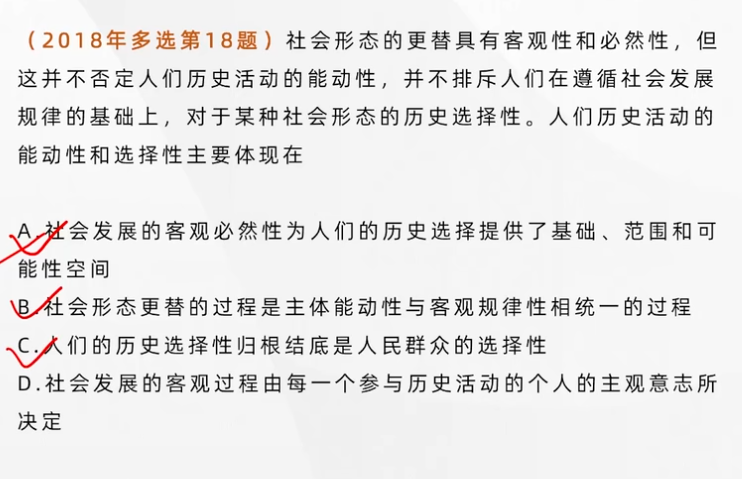
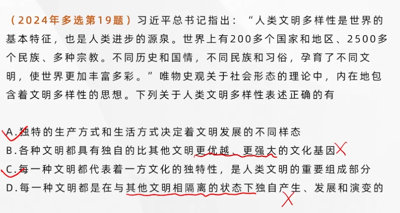
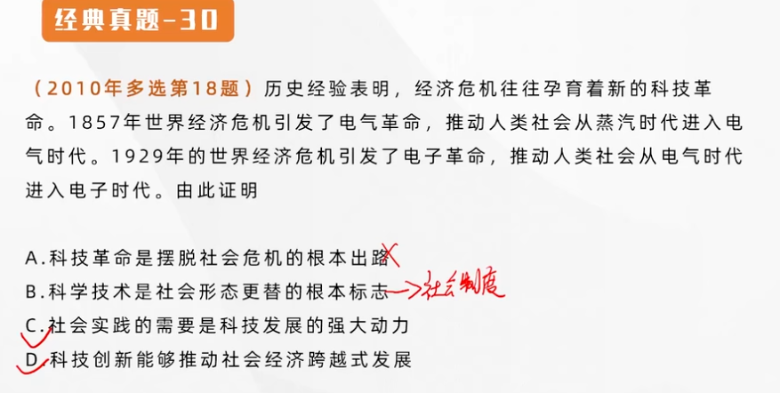
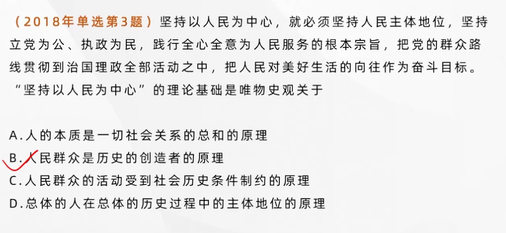
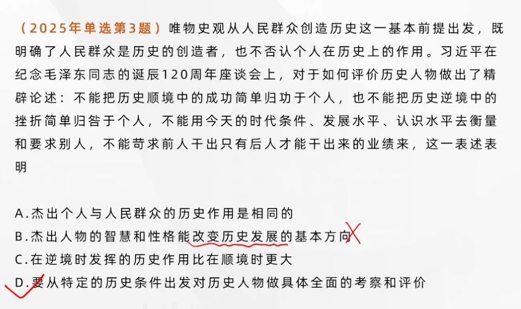

## 社会基本矛盾及其运动规律之二：经济基础与上层建筑的矛盾运动及其规律

---

### 经济基础的含义

经济基础是指**由社会一定发展阶段的生产力所决定的<u>生产关系</u>的总和**。

- **社会的一定发展阶段上往往存在多种生产关系，但决定一个社会性质的是其中占<u>支配地位</u>的生产关系。**
- 经济基础与经济体制具有内在联系。

### 上层建筑的含义

#### 国家的起源和实质

**在整个上层建筑中，政治上层建筑居主导地位，国家政权是政治上层建筑的核心**。国家不是从来就有的，而是社会发展到一定历史阶段的产物，是阶级矛盾不可调和的产物。**国家的实质是一个阶级统治另一个阶级的工具**。国家和社会完全统一之日，也是国家消亡之时。国家的消亡是一个长期的历史过程。

> 国家是历史范畴

---

### 上层建筑一定要适合经济基础状况的规律

经济基础与上层建筑是辩证统一的。经济基础决定上层建筑，上层建筑反作用于经济基础，二者相互影响、相互作用。

#### 经济基础决定上层建筑

- **经济基础是上层建筑赖以产生、存在、发展的物质基础。**
- **经济基础的性质决定上层建筑的性质。**
- **经济基础的变更必然引起上层建筑的变革，并决定其变革的方向。**

#### 上层建筑对经济基础具有反作用

**上层建筑为自己的经济基础的形成和巩固服务，确立或维护在社会中的统治地位。**

- 当它为适合生产力发展要求的经济基础服务时，就成为推动社会发展的进步力量；
- 当它为落后的经济基础服务时，就称为阻碍社会发展的消极力量。

#### 经济基础与上层建筑之间的内在联系构成了上层建筑一定要适合经济基础状况的规律

> 生产力和生产关系是更根本，起决定作用的矛盾

---

### 人类普遍交往与世界历史的形成发展

---

### 社会进步与社会形态

---

#### 社会形态的内涵

社会形态是关于社会运动的具体形式、发展阶段和不同质态的范畴，**是同生产力发展一定阶段相适应的经济基础与上层建筑的统一体**。经济基础是社会的“**骨骼系统**”；上层建筑是社会的“**血肉系统**”。**社会形态包括社会的经济形态、政治形态和意识形态，是三者具体的、历史的统一。社会制度能够集中体现社会形态的性质，所以人们在日常生活中往往用社会制度来指代社会形态。**

---

### 社会形态更替

---

#### 社会形态更替的统一性和多样性

**经济基础**是**划分社会形态的客观依据**。

五种社会形态的更替，是社会历史运动的**一般过程和一般规律**，表现了社会形态更替的统一性。

**某些民族可以实现跨越，但其跨越的方向、跨越的限度是受总体历史进程制约的。**

---

### 社会形态更替中的 <u>必然性</u>（客观规律） 与 <u>选择性</u>（主观能动）

**社会形态更替归根到底是社会基本矛盾运动的结果，其中，生产力的发展具有最终的决定意义。**

人民群众发挥历史选择性。

---

## 文明及其多样性

---

### 文明及其演进

文明是人类创造的所有**物质成果、精神成果和制度成果**的总和，**是<u>标志社会进步程度</u>的范畴**，反映了**人类社会实践活动**的积极成果。

### 文明的多样性

文明没有高低优劣之分，要尊重和保护文明多样性，以文明交流超越文明隔阂、文明互鉴超越文明冲突、文明共存超越文明优越，共同绘就人类文明美好画卷。

---

### 社会基本矛盾在历史发展中的作用

---

#### 社会基本矛盾

社会基本矛盾是贯穿社会发展过程始终，对社会历史发展起**根本推动作用的矛盾**。

**生产力和生产关系、经济基础和上层建筑**的矛盾是社会基本矛盾。

---

### 社会基本矛盾在历史发展中的作用

---

- **生产力是社会基本矛盾运动中最基本的动力因素，是人类社会发展和进步的最终决定力量。**
- **社会基本矛盾特别是生产力和生产关系的矛盾，是“一切历史冲突的根源”，决定着社会中其他矛盾的存在和发展。**
- **社会基本矛盾具有不同的表现形式和解决形式，并从根本上影响和促进社会形态的变化和发展。**

**社会历史基本矛盾是其他一切社会矛盾的根源，规定和制约着社会主要矛盾的存在和发展，社会主要矛盾是社会基本矛盾的具体体现。**

**社会主要矛盾不是一成不变的，它在一定的条件下会发生转化。**

- **社会基本矛盾**是社会发展的**根本动力**
- **阶级斗争**是社会基本矛盾在阶级社会中的直接表现，是阶级社会发展的**直接动力**
- 社会革命是推动社会发展特别是社会形态更替的重要动力
- 改革是推动社会发展的又一重要动力
- 科学技术是社会发展的重要动力

---

### 阶级斗争、社会革命在社会发展中的作用

---

### 改革在社会发展中的作用（推动社会发展的又一重要动力）

---

**改革是一定社会为了解决社会基本矛盾而对生产关系和上层建筑进行的深刻的改变和革新，它是社会制度的自我调整和完善，是同一种社会形态发展过程中的量变和部分质变，是推动社会发展的又一重要动力。**

> 社会制度和社会形态在改革这一过程中没有发生改变

---

### 科学技术在社会发展中的作用

---

#### 科技革命是推动经济和社会发展的强大杠杆

科技创新可以推动社会经济**跨越式的发展**

在生产方式、生活方式和思维方式产生了剧烈的影响

#### 正确把握科学技术的社会作用

科学技术是一把双刃剑.

- 科学技术的发展可以为人们创造出更多物质财富，对社会发展有巨大的**推动作用**
- **科学技术在运用于社会时所遇到的问题也越来越突出**

**首要的就是有合理的社会制度保障科学技术的正确运用。**始终坚持使科学技术为人类社会的健康发展服务，让科技为人类造福。

> 是什么：杠杆作用，双刃剑
>
> 为什么：为什么是一把双刃剑，正面和反面
>
> 怎么办：合理的社会制度来保障其正确运用

---

### 文化在社会发展中的作用

---

文化是推动社会发展的重要力量

文化为社会发展提供**思想指引，精神动力，凝聚力量**。

---

### 两种历史观在历史创造者问题上的对立

---

> 谁是历史的创造者

唯心史观：**英雄史观**，个人意识的体现，抹杀人民群众的历史作用，宣扬少数英雄人物创造历史。

唯物史观：**群众史观**，历史的创造者不是个别英雄，而是人民群众。

---

### 唯物史观考察历史创造者问题的方法论原则

---

#### 唯物史观立足于现实的人及其本质来把握历史的创造者

现实的人及其活动式社会历史存在和发展的前提。所谓现实的人，**是基于自身需要和社会需要而从事一定实践活动、处于一定社会关系中、具有能动性的人**。

人的本质属性是**社会属性**，而不是自然属性；人的本质属性表现在各种社会关系中；**人的本质是变化发展的**，而不是永恒不变的。这一观点强调了个人与社会的统一。

#### 唯物史观立足于整体的社会历史过程来探究谁是历史的创造者

**历史是无数个追求者自己目的的人的活动的合力。**

社会历史就其整体而言，**是一定群体的认识活动和实践活动及其产物的演进过程，是以一定的物质生产方式为基础的社会形成和演进过程**。

#### 唯物史观从社会历史发展的必然性入手来考察和说明谁是历史的创造者

#### 唯物史观从人与历史关系的不同层次上考察设施历史的创造者

> 总之，一个人和每一个人都不能单独地创造整个社会的历史，可以创造自己的历史
> 只有**人民群众**才是起决定性作用

**“人们创造自己的历史”不是“人人创造历史”**

---

### 人民群众在创造历史中的决定作用

人民群众从质上来说是指一切对社会历史发展起**推动作用**的人（阻碍发展的人不是人民群众）。人民群众是一个**历史范畴**，在不同的历史时期，人民群众有着不同的内容，包含不同的阶级、阶层和集团。但其中**最稳定的主体部分始终是从事物质资料生产的劳动群众**。

人民群众是社会历史实践的主体，是历史的创造者。

- **人民群众是社会物质财富的创造者**
- **人民群众是社会精神财富的创造者**
- **人民群众是社会变革的决定力量**。人民群众创造历史的作用是同社会基本矛盾运动推动社会前进的过程相一致的。人民群众的总体意愿和行动代表了历史发展的方向，**人民群众的社会实践**最终决定历史发展的结局。

> recall:
> 物质生产方式是社会历史发展的决定力量
> 生产力是人类历史发展的最终决定力量

---

### 人民群众创造历史的活动要受到一定社会历史条件的制约

经济条件对于人民群众创造历史的活动有着首要的、决定性的影响。

---

---

### 个人在社会历史中的作用

---

#### 杰出人物的历史作用

个人分为**普通个人**和**历史人物**（影响更大）

**杰出人物**是历史人物中**推动历史发展作出重要贡献或其重要作用的人。**但是，不管什么样的历史人物，在历史上发挥什么样的作用，**都要受到社会发展客观规律的制约，而<u>不能决定和改变历史发展的总进程和总方向</u>。**（个人无法决定历史）

#### 辩证地理解和评价个人的历史作用

**任何历史人物的出现都体现了必然性和偶然性的统一**，历史人物的作用性质 **取决于他们的思想，行为是否符合客观发展规律，是否符合人民群众的意愿**。

#### 评价历史人物的科学方法

- **历史分析方法**：历史分析方法要求从特定的历史背景出发，根据当时的历史条件，对历史人物的是非功过进行具体的，全面的考察。判断历史人物的历史功绩，要看历史人物与其前辈相比提供了什么新的东西。
- **阶级分析方法**：把历史人物置于一定的阶级关系中，同他们所属的阶级联系起来加以考察和评价。

#### 群众、阶级、政党、领袖的关系：

他们是一个有机整体——**群众是划分为阶级的；阶级通常是由政党领导的；政党是由领袖来主持的。**

