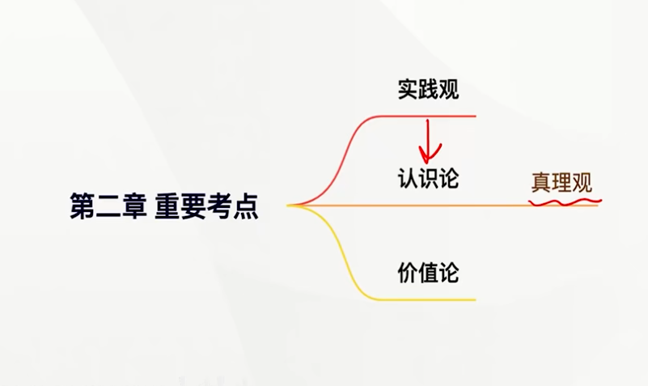

# 第二章 实践与认识及其发展规律

> 实践是物质的，认识是意识的

---

## 科学的实践观

马克思在**《关于费尔巴哈的提纲》这个包含新世界观天才萌芽的第一个文件中，<u>系统论述了实践的观点，揭示了科学实践观的基本内容。</u>**

### 实践的本质

**实践是<u>人类能动地改造世界</u>的<u>社会性</u>的<u>物质</u>活动。**

> 实践和意识都是为人所独有的

### 实践的基本特征

- 实践具有**客观实在性**，实践本质上是**客观的、物质的活动** 
  - 构成实践活动的诸要素，即客观的主体、客体和中介都是可感知的客观实在
  - 实践的水平、广度、深度和发展过程，都受着客观条件的制约和客观规律的支配
  - 实践能够引起客观世界的某种变化，可以把人脑中观念的存在变为现实的存在，**实践的这一特征把它同人的主观认识活动区别开来（实践高于认识）（直接现实性）**
- 实践具有**自觉能动性**，与动物本能的、被动的适应性活动不同，人的实践活动是一种由目的、有意识的活动。目的性是能动性的主要表现。人的实践活动结束时得到的结果，在这个过程开始时作为目的在实践者头脑中以观念的形式存在着，目的决定着实践者的行为。所以**实践是人的自觉能动的活动**。
- 实践具有**社会历史性**。实践从一开始就是社会性的活动。**<u>实践的社会性决定了它的历史性</u>（变化）。实践是历史发展着的实践**。

---

## 实践的基本结构

### 实践活动的三项基本要素

实践的<u>主体、客体和中介</u>（缺一不可）是实践活动的三项基本要素，三者的有机统一构成实践的基本结构。

- **实践主体**是**具有一定主体能力、从事现实社会实践活动**的人。是实践活动中自主性和能动性的因素。
- **实践客体**是指实践活动所指向的对象。

> 实践客体与客观存在的事物不完全等同，实践客体并不是指一切客观事物。

- **实践中介**是指各种形式的工具、手段以及运用、操作这些工具、手段的程序和方法。实践的中介系统可以分为两个子系统。
  - **物质性工具系统**：人的肢体延长、感官延伸、体能放大
  - **语言符号系统**：主体思维活动得以进行的现实形式
  正是依靠这些中介系统，实践的主体和客体才能够相互作用。

### 实践的主体和客体相互作用的关系

**实践的主体和客体相互作用的关系，包括时间关系、认识关系和价值关系，其中实践关系是<u>最根本</u>的关系。**

### 拓展与点拨

**主体客体化**：是人通过实践使自己的本质力量作用于客体，形成了世界上本来不存在的对象物。**它是人的体力和智力的物化体现，实际上，人类一切实践活动的结果都是主体客体化的结果。**

**客体主体化**：**是客体从客观对象的存在形式转化为主体生命结构的因素或主体本质力量的因素，客体失去客体的形式，变成主体的一部分**。例如，主体把物质工具如电脑、汽车等作为自己身体器官的延伸包括在主体的活动中。