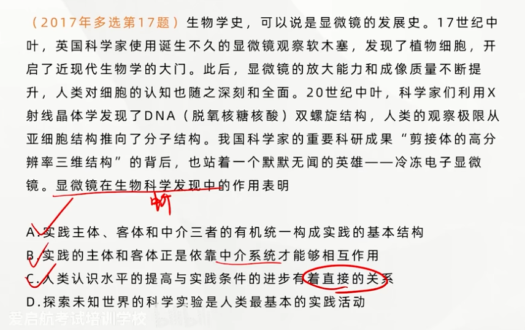
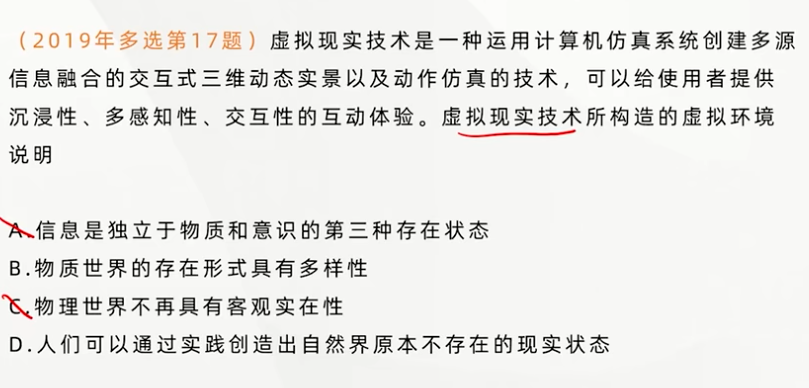

## 实践形式的多样性

---

### 实践形式大致可以分为三种基本类型

- **物质生产实践是人类最基本的实践活动**。它解决人与自然的矛盾，满足人们的物质生活资料和生产劳动资料的需要，同时生产和再生产社会的基本经济关系，由此决定着社会的基本形式和面貌
- **社会政治实践**是处理各种政治关系的实践，主要指人们的政治活动。在阶级社会中，社会政治实践具有鲜明的阶级性
- **科学文化实践**是创造精神文化产品的时间活动。**不是一个纯粹的意识活动**

> 一种活动是否被称为实践活动，**关键是看它是否超出了纯粹的意识活动，是否改变了除实践主体的意识状态之外的其他存在物的状态**。

---

### 三种实践类型的联系

现代信息技术的发展使得当今社会开始存在一种新的实践形式，即**虚拟实践**。其实质是主体和客体之间通过数字化中介系统在虚拟空间进行的双向对象化的活动，具有**交互性、开放性、间接性等特点。虚拟实践是实践活动的派生形式，同时又对现实的实践活动产生重大影响**。

> **虚拟实践不是实践的基本形式**。

**实践是认识的<u>来源</u>（唯一来源）。认识的内容是在实践活动的基础上产生的发展的**。一个人只是的获得，不外直接经验和间接经验两部分。就知识的本源来说，任何知识都不能离开直接经验。一切真知都是从直接经验发源的。从根本上说，实践是认识的源头活水。但是，这并不意味着事事都必须要去直接经验，一个人的多数知识还是来自间接经验，是从书本和传授中得来的（不要去必要直接经验和间接经验）

> 直接经验和间接经验都很重要，不要比较
> 认识并不**总是**落后于实践，**认识是具有相对独立性的**。有的时候我们的认识可以超前于实践。

**实践是认识发展的动力（根本动力）**
- 首先，实践的需要推动认识的产生和发展。**推动人类的科学发现和技术发明，推动人类的思想进步和理论创新**
- 其次，实践是认识发展的动力，还表现在实践为认识的发展**提供了手段和条件**，如经验资料、实验仪器和工具等
- 最后，最为重要的一点是，实践改造了**人的主观世界**，锻炼和提高了**人的认识能力**（直接关系）

**实践是认识的目的（根本目的）**
认识活动的目的并不在于认识活动本身，**其最终目的是为了实践服务，指导实践，以满足人们生活和生产的需要**

**实践是检验认识真理性的<u>唯一</u>标准**
认识是否具有真理性，既不能从认识本身得到证实，也不能从认识对象中得到回答，只有在实践中才能得到验证。

---

## 认识的本质

---

**两种认识的区别**

- 唯心主义**先验论**（从思想和感觉到物的认识路线）
  - 主观唯心：认识是主观自生的
  - 客观唯心：认识是上帝的启示或某种客观精神的产物

- 唯物主义**反映论**（从物到感觉和思想的认识路线）
  - 旧唯物主义：“照镜子”式的**直观反映论**（消极被动，认识不具有能动性，人并不是主动进行认识的，而是有客体将认识烙印在人脑中的）
    - **离开实践**
    - **离开辩证法**
  - 辩证唯物主义：实践基础上的**能动反映论**
    - 引入**实践**的观点
    - 把**辩证法**应用于反映论考察认识的发展过程

---

### 认识的本质

**认识是主体在实践基础上对客体的能动反映**。认识的反应特性是人类认识的基本规定性。人的认识不论表现形式多么抽象和复杂，归根结底是对客观现象的反映。反映的摹写性表明了反映的客观性。

**认识作为能动反映具有<u>创造特性</u>**。<u>人类思维</u>探寻把握本质的抽象活动，鲜明体现了认识的能动性和创造性。

**在人的认识活动中，反映特性与能动的创造特性是不可分割的。**反映和创造不是人类认识的两种不同的本质，而是同一本质的两个不同的方面。**人的认识是反映性或摹写性与创造性的统一。**

---

### 认识的过程

人的认识过程是一个在实践基础上不断深化的发展过程。**既表现为实践基础上由感性认识到理性认识（第一次飞跃），再从理性认识到实践（第二次飞跃）的具体认识过程；又表现为从实践到认识，再从认识到实践的循环往复和无限发展的总过程**。、

#### 从实践到认识

认识运动的辩证过程，首先是从实践到认识的过程，即从实践中产生感性认识，然后能动地发展到理性认识。这是认识活动的第一次飞跃。

|**感性认识（初级阶段）**|**理性认识（高级阶段）**|
|---|---|
|**感觉器官**直接感受到|运用**抽象思维**|
|事物的**现象**、各个方面和外部联系|事物的**本质**、全体和内部联系以及规律|
|感觉、知觉、表象|概念、判断、推理|
|**直接性、具体性现象**但**不深刻**|**抽象性、间接性、深刻**但可能脱离现实|

---

**感性认识和理性认识的辩证关系**

- **理性认识依赖于感性认识**
- **感性认识有待于发展和深化为理性认识**
- **感性认识和理性认识相互渗透、相互包含**

片面强调理性认识——唯理论
片面强调感性认识——经验论

---

**从感性认识向理性认识的飞跃**

- 投身**实践**，深入调查，获取十分丰富和合乎实际的**感性材料**。这是实现由感性认识上升到理性认识的**基础**。
- 经过**思考**的作用，利用理论思维和科学抽象，将丰富的感性材料加以**去粗取精、去伪存真、由此及彼、由表及里**的处理加工，形成概念和理论的系统。

---

#### 从认识到实践（更重要）

**必要性和重要性**

从实践到认识，认识的过程还没有完成。要实现一个完整的认识过程，还必须由认识再回到实践中去，实现认识的第二次能动飞跃。**从认识到实践的飞跃，是更为重要的飞跃**，意义更加重大，**其必要性和重要性在于两个方面：一是认识世界的目的是改造世界。二是认识的真理性只有在实践中才能得到检验和发展。**

**实现由认识到实践的条件**

需要经过一定的中介环节（包括确定实践目的，形成实践理念……）

> 认识在指导实践
> 当正确认识在指导实践时会使其顺利
> 错误认识会使其失败

---

## 认识过程中的理性因素和非理性因素

**理性因素**是指人的理性直观、理性思维等能力。它在认识活动中的作用主要有**指导作用、解释作用和预见作用等**。
**非理性因素**主要指认识主体的情感和意志（包括冲动、欲望、本能等）。从广义上看，还包括认识能力中具有不自觉、非逻辑性等特点的认识形式，如联想、想想、猜测、直觉等。非理性因素对于人的认识能力和认识活动具有**激活、驱动作用**。

我们既要重视非理性因素的积极作用，又要注意防止非理性因素对人类认识的消极影响。

---

## 实践与认识的辩证运动及其规律

---

### 实践与认识的辩证运动极其规律

从实践到认识、从认识到实践，实践、认识、再实践、再认识，**循环往复以至无穷**。这是认识辩证运动发展的基本过程，也是认识运动的总规律，表明认识是一个反复循环和无限发展的过程，这个过程既不是封闭式的循环，也不是直线式的发展，往往充满了曲折以至反复。是一个**波浪式前进和螺旋式上升**的过程。

---

### 认识和实践的具体的历史的统一

---

主观必须统一于客观，认识必须统一于实践。

**具体的统一**：主观认识要同一定时间、地点、条件下的客观实践相符合。
**历史的统一**：主观认识要同特定历史发展阶段的客观实践相符合。

---

## 真理的客观性

---

### 真理的含义

真理是标志**主观与客观相符合的哲学范畴，是对客观事物及其规律的正确反映**。这个定义表明，**真理的内容是客观的，形式是主观的。**（真理属于意识范畴）

---

### 真理的客观性

**真理是客观的，凡真理都是客观真理。**
客观性是真理的本质属性（内容层面），但是真理的形式又是主观的。

> 错误：
> 真理是“观念与主体感觉相符合”；“真理是思维与它的先验形式相一致”

---

### 真理的一元性

**真理的客观性决定了真理的一元性。真理的一元性是指在同一条件下对于特定的认识客体的真理性认识只有一个，它不因主体认识的差别和变化而改变。**

认识是多元的，但真理是一元的。

真理在内容上的一元性与形式上的多样性的统一。

---

## 真理的绝对性和相对性

真理既具有绝对性，又具有相对性，**它们是同一客观真理的两种属性，这是真理问题上的辩证法。任何真理都是绝对性和相对性的统一，二者相互联系、不可分割。**

### 真理的绝对性和相对性的含义

**真理的绝对性**

**一是指任何真理都标志着主观与客观相符合**，都包含着不依赖于人和人意识的客观内容，都同谬误有原则的界限。这一点是绝对的，无条件的。在这个意义上，承认了真理的客观性也就是承认了真理的绝对性。

**二是人类认识按其本性来说，能够正确认识无限发展这的物质世界，认识每前进一步，都是对无限发展着的物质世界的接近，这一点也是绝对的、无条件的。**

**真理的相对性是指人们在一定条件下对客观事物及其本质和发展规律的正确认识总是有限度的、不完善的。**

**一是从客观实践的整体来看**，任何真理都只是对客观世界的某一阶段、某一部分的正确认识，人类已经达到的认识的广度总是有限度的。

**二是就特定事物而言**，任何真理都只是客观对象<u>一定方面、一定层次和一定程度</u>的正确认识，认识反映事物的**深度**是有限度的，或是近似性的，因而，**认识有待深化**。任何真理都只能是主观对客观事物近似正确即相对正确的反映。

> 真理的相对性指的并不是一种错误

---

### 真理的绝对性和相对性及其辩证关系

从真理的两重性上看，**两者相互依存**，任何真理即使绝对的，又是相对的。**二者相互包含。绝对之中有相对，相对之中又有绝对，真理的<u>绝对性</u>通过真理的<u>相对性</u>表现出来**。任何真理的相对性之中都包含着真理绝对性的颗粒。

**从真理的发展上看，人类的认识是一个不断深化的过程，永远处在由真理的相对性走向绝对性，接近绝对性的转化和发展过程中**。

> 无数相对的真理之总和，就是绝对的真理

---

### 真理的绝对性与相对性根源于人类认识世界的能力的无限性与有限性、绝对性与相对性的矛盾

### 承认真理是绝对性和相对性的辩证统一，就必须以科学的态度对待一切真理，反对割裂二者辩证关系的绝对主义和相对主义

**绝对主义**：在实际工作中表现为教条主义和思想僵化
**相对主义**：在实际工作中表现为可知论和诡辩论

---

### 马克思作为客观真理，是绝对性和相对性的统一

---

真理的相对性并不是推翻以前的真理，而是在深度、完成程度上进行深化和拓展。**已经确定的真理是不能被推翻的**。

---

## 真理与谬误

### 真理与谬误的对立统一关系

#### 真理和谬误相互对立

**在确定的对象的范围内，真理和谬误的对立是绝对的**，与对象相符合的认识就是真理，与对象不相符合的认识就是谬误，**二者存在着原则界限**。在确定的条件下，一种认识不能既是真理又是谬误。

#### 真理与谬误的对立又是相对的

**它们在一定条件下能够相互转化**。真理与谬误的对立只是在**非常有限的范围内**才具有绝对的意义，**超出这个范围**，二者的对立就是相对的。

**真理在一定条件下会转化为谬误**
这是因为一方面，真理是具体的，另一方面，真理又是全面的

**谬误在一定条件下能够向真理转化**
正视错误，反省错误，修正错误，获得真理；**在批判谬误中发展真理，是谬误向真理转化的另一种形式**（反面教员）。

> 在同样的范围内，同样的条件下，真理不可能直接变成谬误，因为真理不可以被推翻

---

## 真理的检验标准

---

### 实践之所以能够作为检验真理的唯一标准，是由真理的本性和实践的特点决定的

- **真理的本性在于主观与客观相符合**。所谓检验真理，就是检验人的主观认识同客观实际是否相符合以及符合的程度。
- **从实践的特点看，实践具有直接现实性。**实践的直接现实性的品格，是实践能够成为检验真理的唯一标准的主要根据。

> 观念到现实  主观到客观

---

### 在实践检验真理的过程中，逻辑证明可以起到重要的<u>补充</u>作用

逻辑证明是探索真理、论证真理的方式，是正确思维和表达的必要条件，也是建立科学理论体系的重要途径

> 逻辑证明只能起到补充作用

---

### 实践标准的确定性与不确定性

**实践标准的确定性即绝对性，由时间标准的客观性和唯一性所决定**

**实践标准的不确定性即相对性，是指实践作为检验真理标准的条件性。**一方面，**任何实践都会受到主客观条件的制约**。另一方面，**实践是社会的、历史的实践**。不可能绝对地、永恒地、一劳永逸地予以确证。

**实践是检验真理的唯一标准，但实践对真理的检验不可能一次完成，实践检验真理应该是一个永无止境的发展过程**。实践对真理的检验，是人类社会历史的实践对真理的检验。实践不断发展，真理也不断发展，在发展的实践中不断验证认识的真理性。**这就是实践检验真理的辩证发展过程。**

---
