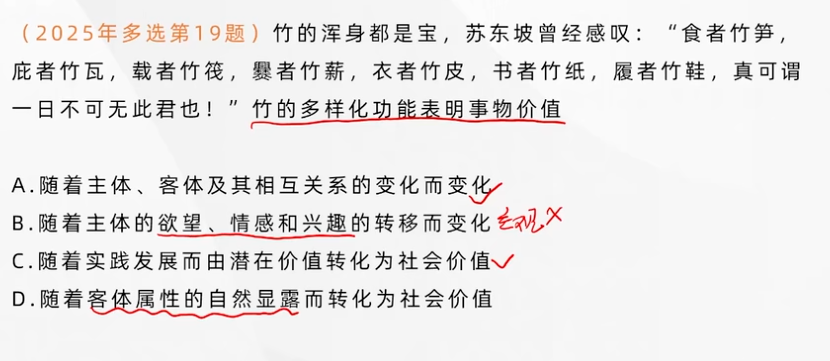
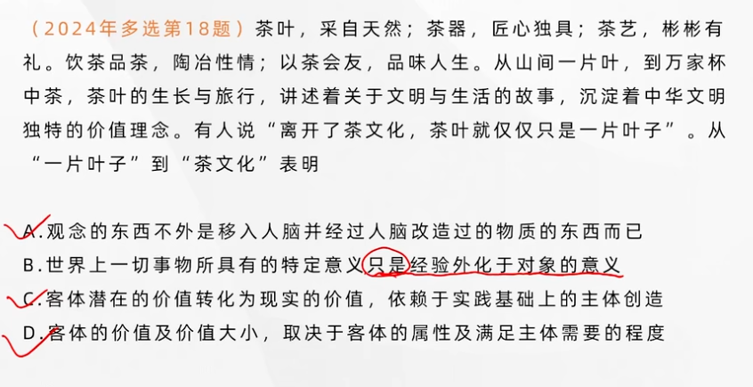
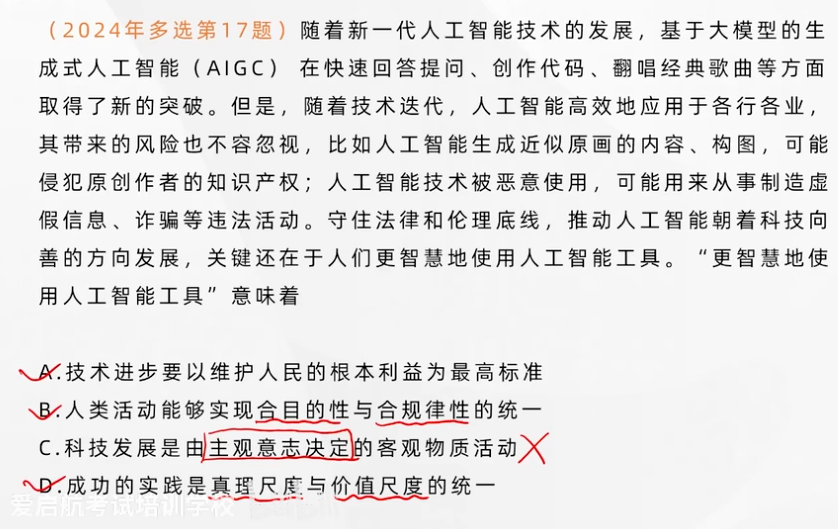
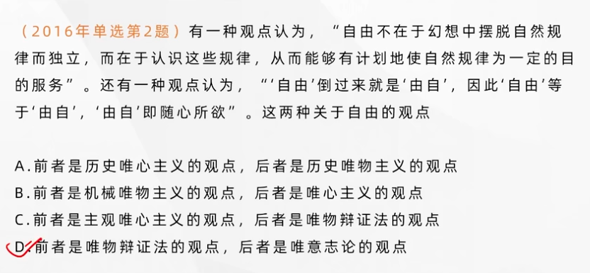

## 真理与价值的辩证统一

---

### 价值及其基本特性

#### 哲学上的价值的含义

价值是反映**主体和客体之间意义关系**的哲学范畴。**是客体对个体、群体乃至整个社会的生活和活动所具有的意义。**

#### 价值的基本特性

价值具有**主体性**。价值直接与主体相联系，始终以主体为中心。

- **价值关系的形成依赖于主体的存在**。同一客体可能对不同主体具有不同的价值。
- **价值关系的形成依赖于主体的创造**。使客体潜在的价值转化为现实的价值。

> 主体性 != 主观性，不以人的意志为转移

价值具有**客观性**。这是指在一定条件下客体对于主体的意义不依赖于主体的主观意识而存在。

- **主体的存在和需要**是客观的
- **客体的存在、属性及作用**是客观的。

价值具有**多维性**。这是指每个主体的价值关系具有多样性，**同一客体相对于主体的不同需要会产生不同的价值。**

价值具有**社会历史性**，主体和客体的**不断变化**决定了价值的社会历史性。

---

### 价值评价及其特点

---

价值评价是主体对客体的价值以及价值大小所作的评判或判断，因而也被称作价值判断。

#### 价值评价的基本特点

**评价以主客体之间的价值关系为认识对象**。主体的意向、愿望和要求包含在其中，追求“应该怎样”，**以求“善”和“美”为认识目的**。

> 注意区分追求真理不是求“善”和“美”，而是以求“真”为认识目的

**评价结果与评价主体直接相关，受主体意志的影响。**

> 对于真理，不能说“它对谁来说是真理”；对于价值，则必须说“它对谁来说有价值”。

**评价结果的正确与否依赖于对<u>客体状况</u>和<u>主体需要</u>的认识**。

**价值评价有科学和非科学之分。评价结果有正确与错误之分**。对于任何主体而言，是否推动社会历史进步，是否符合社会发展趋势，是否维护、满足了最广大人民的需要和根本利益，是价值评价的**最高标准**，是判断特定主体实际需要是否合理的**最高尺度**。

---

### 真理与价值在实践中的辩证统一

---

#### 实践的真理尺度和价值尺度

**实践的真理尺度**是指在实践中人们必须遵循正确反映客观事物本质和规律的真理。**实践的价值尺度**是指实践中人们都是按照自己的尺度和需要去认识世界和改造世界。**任何成功的实践都是真理尺度和价值尺度的统一，是合规律性和合目的性的统一。**（两者是相等的）

#### 真理与价值在实践中的辩证统一关系

**一方面，价值尺度必须以真理为前提**。脱离了真理尺度，价值尺度就偏离了合理的、成功的轨道。**另一方面，人类自身需要的内在尺度，推动着人们不断发现新的真理。**脱离了价值尺度，真理就缺失了主体意义。

真理由相对向绝对转化，人的需要和利益也日益多元。**真理尺度与价值尺度是否达到了具体的、历史的统一，必须通过实践来验证**。

---

## 认识世界的根本目的在于改造世界

---

### 认识世界和改造世界及其辩证关系

**认识世界和改造世界是人类创造历史的两种基本活动**（也是人与世界关系的主要的两个方面）

认识世界和改造世界是相互依赖，相互制约的辩证统一关系。

**主观和客观的矛盾是人类认识和实践活动中的基本矛盾，也是人类认识世界和改造世界的根本动力。认识世界和改造世界统一的基础是实践**。

---

## 认识世界和改造世界的过程是从必然走向自由的过程

---

### 自由是对必然的认识和对客观世界的改造

必然性即规律性，（客观规律）**自由**是表示人的活动状态的范畴，是指人在活动中通过认识和利用必然所表现出的一种自觉自主的状态。自由是对必然的认识和对客观世界的改造。

**任性不是自由，物质不能获得自由**

**自由是有条件的。一是认识条件，二是实践条件。**

**只有利用必然改造世界，达到了预想的目的，自由才能真正实现。**

**必然与自由的关系**贯穿于人类存在和发展的始终，并称为人类存在和发展的永恒矛盾，因此也是人类存在和发展的永恒动力。

---

##  坚持守正创新、实践理论创新和实践创新的良性互动

**守正是创新的前提和基础，创新是守正的目的和路径。**

人类的创新活动具有丰富的内容和表现，其中主要是理论创新和实践创新两个基本方面。

- 实践创新为理论创新提供不竭的动力源泉。
- 理论创新为实践创新提供科学的行动指南。
- 要奴隶实现理论创新和实践创新的良性互动。