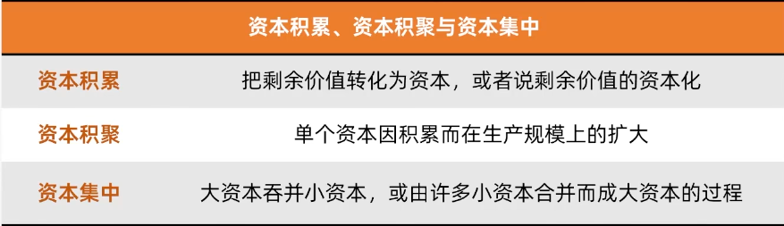
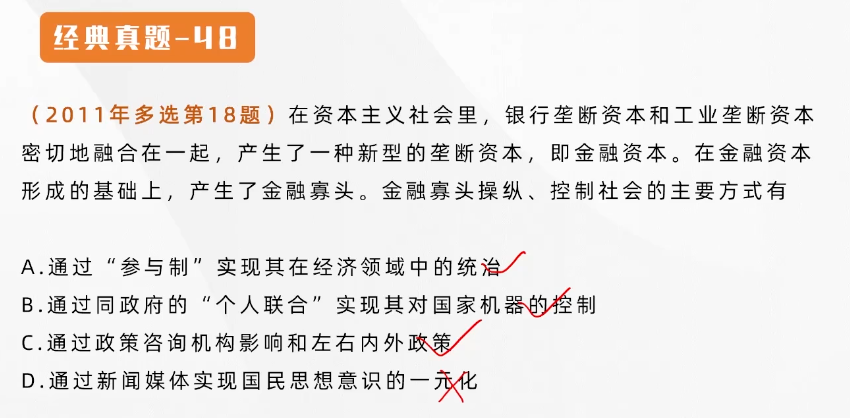
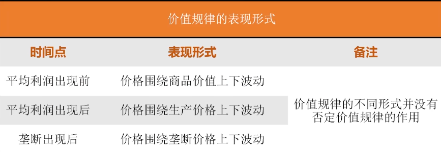
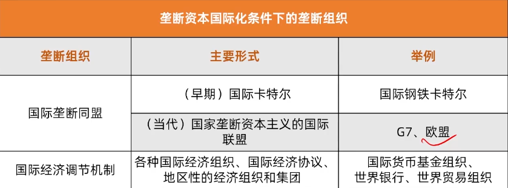
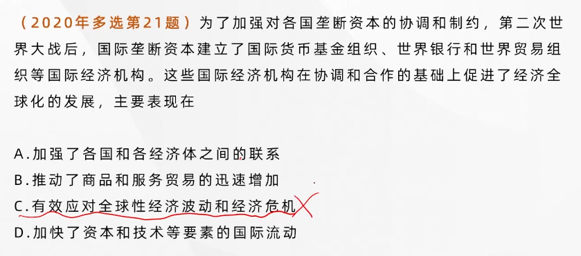
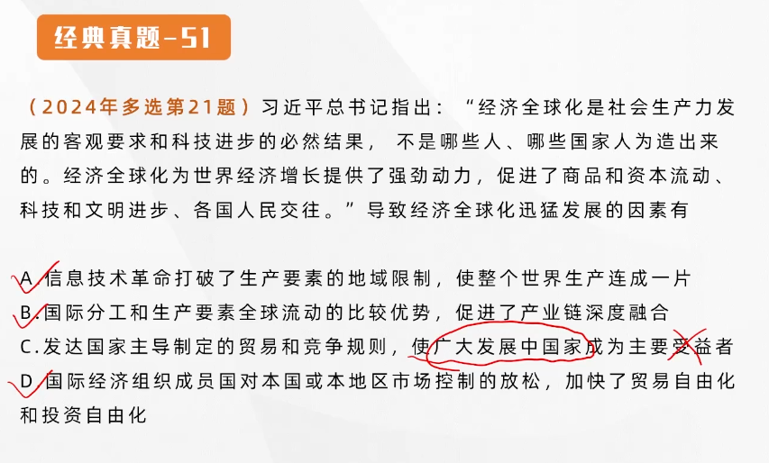
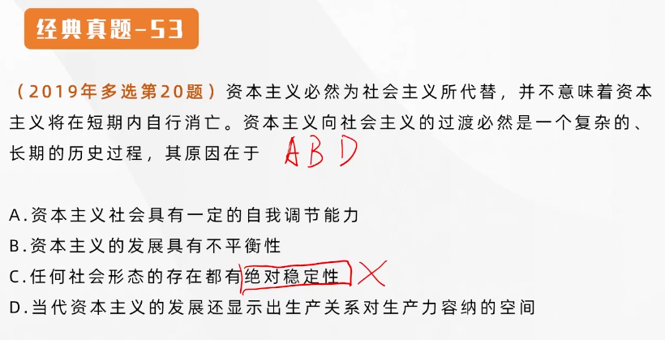

## 第五章 资本主义的发展及其趋势

### 资本主义从自由竞争到垄断

#### 资本主义发展的两个阶段

资本主义的发展经历了两个阶段：

- **自由竞争** 资本主义
- **垄断** 资本主义

垄断资本主义的发展包括 **私人垄断资本主义** 和 **国家垄断资本主义两种形式**

**私人垄断资本主义** 是在 **生产集中** 和 **资本集中** 的基础上形成的

**生产集中** 是指生产资料、劳动力和商品的生产日益集中于少数大企业的过程（生产规模扩大）

**资本集中** 是指大资本吞并小资本，或由许多小资本合并成大资本的过程，其结果是越来越多的资本为少数资本家支配（资本规模扩大）

生产集中和资本集中是资本家 **追求剩余价值** 的过程

#### 垄断的形成、本质及垄断组织

**垄断** 是指少数资本主义大企业为了获得高额利润，通过相互协议或联合，对一个或几个部门商品的生产、销售和价格，进行操纵和控制。

垄断的产生有以下原因：

- 当生产集中发展到相当高的程度，极少数企业就会联合起来，操纵和控制本部门的生产和销售，实行垄断，以获得 **高额利润**
- 企业规模巨大，**形成对竞争的限制**，也会产生垄断
- 激烈竞争的各方为了避免两败俱伤，也会达成妥协，联合起来形成垄断

**垄断** 是通过一定的垄断组织形式实现的。垄断组织是指在一个或几个经济部门中占据垄断地位的大企业联合。最简单的、初级的垄断组织形式是 **短期价格协定**

垄断的本质是一样的，即 **通过联合实现独占和瓜分商品生产和销售市场，操纵垄断价格，以㩴取<u>高额垄断利润</u>**

垄断不能消除竞争的原因：

- 垄断 **没有消除产生竞争的经济条件** （生产资料是私有的，所以竞争必然存在）
- 垄断 **必须通过竞争来维持**
- 社会生产是复杂多样的，任何垄断组织都 **不可能把包罗万象的社会生产都包下来**

同自由竞争相比，垄断条件下的竞争具有一些 **新特点**：

- 在竞争目的上，自由竞争主要是为了获得更多的利润或者超额利润，而垄断条件下的竞争则是为了获取 **高额垄断利润**，并不断巩固和扩大自己的垄断地位和统治权力
- 在竞争手段上，垄断条件下的竞争除了采取各种形式的经济手段外，还采取 **非经济手段**，使竞争变得更加复杂、激烈
- 在竞争范围上，垄断时期国际市场上的竞争越来越激烈，不仅经济领域的竞争多种多样，而且还扩大到经济领域以外

垄断条件下的竞争，**不仅规模大、时间长、手段残酷、程度激烈，而且具有更大的破坏性**

#### 金融资本与金融寡头

金融资本是由 **工业垄断资本** 和 **银行垄断资本** 融合在一起而形成的一种垄断资本。金融资本形成的主要途径：

- 金融联系
- 资本参与
- 人事参与

在金融资本形成的基础上，产生了 **金融寡头**

金融寡头是指 **操纵国民经济命脉**，并在实际上 **控制国家政权** 的少数垄断资本家或垄断资本家集团

他们在经济领域中的通知主要是通过“**参与制**”实现的。在政治上 **金融寡头对国家机器的控制，主要是通过同政府的“个人联合”来实现的**。还可以通过 **建立政策咨询机构** 等方式对政府的政策施加影响。

---

---

#### 垄断利润和垄断价格

垄断资本的实质在于 **获取垄断利润**。垄断利润的形成，**关键在于垄断组织在经济生活中起了决定性作用**。

垄断利润的来源，垄断资本所获得高额利润，**归根到底来自于无产阶级和其他劳动人民所创造的剩余价值**。

垄断利润主要是通过垄断组织制定的 **垄断价格** 来实现的

垄断价格包括 **垄断高价（卖的高）** 和 **垄断低价（进货低）** 两种形式，之间的差额就是垄断利润

垄断组织操纵价格带来的结果是抑制了市场上价格的自由波动，垄断价格 **一定时期内背离生产价格和价值**。但是从全社会看，垄断价格 **既不能增加也不能减少整个社会所生产的总量**，商品的价格总额仍然等于 **商品的价值总额**。

垄断价格的产生没有否定价值规律。它是价值规律在垄断资本主义阶段作用的具体体现。

---

### 垄断资本主义的发展

---

#### 国家垄断资本主义的形成、主要形式和作用

国家垄断资本主义是 **国家政权和私人垄断资本** 融合在一起的垄断资本主义。

原因：

- **社会<u>生产力的发展</u>**，要求资本主义生产资料在更大范围内被支配
- **<u>经济波动</u>和<u>经济危机</u>的深化**
- **<u>缓和社会矛盾、协调利益关系</u>的需求**

**国家垄断资本主义的主要形式**：

- 国家所有并直接经营企业
- 国家与私人共有、合营企业
- 国家通过多种形式参与私人垄断资本的再生产过程
- **宏观调节**，国家运用财政政策、货币政策等 **经济手段**，对社会总供给和总需求进行调节。
- **微观规制**（法律手段）

#### 国家垄断资本主义的双重作用

国家垄断资本主义对资本主义的经济发展产生了积极的作用

国家垄断资本主义实质都是 **私人垄断资本利用国家机器来为其发展服务的手段**，是 **私人垄断资本为了维护垄断统治和获取高额垄断利润，而与国家政权相结合的一种垄断资本主义形式**。

#### 金融垄断资本的发展

- 金融自由化和金融创新
- **金融自由化与金融创新是金融垄断资本得以形成和壮大的<u>重要制度条件</u>**
- 金融自由化和金融创新推动资本主义经济的金融化程度不断提高
  - 促使由工业垄断资本与银行垄断资本融合而成的金融寡头发生分化
  - 以大银行和非银行金融机构为主体的 **金融垄断资本脱离实体经济** 独立发展
- **虚拟经济越来越<u>脱离</u>实体经济**

#### 垄断资本向世界范围的扩展及其后果

垄断资本向世界范围扩展的动因：

- 将国内过剩的资本输出，以便在国外谋求高额利润
- 将部分非要害技术转移到国外，取得在别国的垄断优势，㩴取高额垄断利润
- 争夺商品销售市场
- 确保原材料和能源的可靠来源

**垄断资本向世界范围扩展的基本形式**：

- **借贷资本输出**
- **生产资本输出**
- **商品资本输出**

从输出资本的主体看：

- 私人资本输出
- 国家资本输出

> 根本赢家一定是输出国

**国际垄断同盟的产生**。在这样的背景下，各个资本主义国家的垄断组织通过订立协议建立起国际垄断资本的联盟。

早期：国际卡特尔

当代：国家垄断资本主义的国际联盟（欧盟等）

---

#### 垄断资本主义的基本特征和实质

帝国主义是资本主义的最高阶段，五个特征

- 垄断组织在经济生活中起 **决定性作用**
- 在金融资本的基础上形成金融寡头的通知
- 资本输出有了特别重要的意义
- 瓜分世界的资本家国际垄断同盟 **已经形成**
- 最大资本主义大国 **已** 把世界上的领土 **瓜分完毕**

这些特征集中体现了帝国主义的形式，还是为了获取 **高额垄断利润**

---

### 经济全球化及其影响

---

#### 经济全球化的表现

- **生产全球化**
- **贸易全球化**
- **金融全球化**

#### 经济全球化的动因

#### 经济全球化的影响

（有积极影响）

- **发达国家与发展中国家在经济全球化过程中的地位和收益不平等、不平衡，使发展中国家总体上处于更为不利的地位**（主要受益人一定是发达国家）
- **加剧了发展中国家资源短缺和环境污染**
- **一定程度上增加经济风险**

---

### 第二次世界大战后资本主义的变化及其实质

---

#### 变化的主要表现（高频，重要）

- **生产资料所有制的变化**

  - 在资本主义发展的初期，**私人资本所有制** 是占主导地位的
  - 19世纪末20世纪初，**私人股份资本所有制** 占主导地位
  - 第二次世界大战后，国家资本所有制形成并发挥重要作用，**法人资本所有制** 崛起并成为居主导地位的资本所有制形式

  > 法人是企业法人和机构法人，是企业主要出资人，企业股票高度集中于少数法人股东之手。
  >
  > **使公司资本的所有权和控制权重新趋于合一**

- **劳资关系和分配关系的变化**，这些制度主要有：

  - **职工参与决策**
  - **终身雇佣**
  - **职工持股**

- **社会阶层和阶级结构的变化**

  - **资本家的地位和作用已经发生很大变化**
  - **<u>高级职业经理</u>**（不是资本家）**成为大公司经营活动的实际控制者**
  - **知识型和服务型劳动者的数量不断增加**，劳动方式发生了新变化

- **经济调节机制和经济危机形态的变化**

  - 从20世纪70年代起，西方国家普遍走上 **强化市场调节，弱化政府干预** 的道路（经济调节机制）
  - 去工业化和产业空心化日趋严重，产业 **竞争力下降**；
  - 经济高度 **金融化**，**虚拟经济与实体经济严重脱节**
  - 财政严重债务化，债务危机频繁爆发
  - 两极分化和社会对立家具
  - 经济增长乏力，周期性危机和结构性危机交织在一起
  - 金融危机频发，全球经济屡受打击

- **政治制度的变化**

  - 政治制度出现 **多元化** 趋势，公民权利有所扩大
  - 普遍加强了 **法治建设**，以便协调社会各阶级、阶层的利益
  - **改良主义政党** 在政治舞台上的影响日益扩大

#### 变化的原因和实质

- **科学技术革命和生产力的发展**，是资本主义发生变化的 **根本推动力量**
- **工人阶级争取自身权利和利益的斗争**
- **社会主义制度初步显示的优越性**
- **主张改良主义的政党对资本主义制度的改革**

资本主义生产关系的根本性质没有发生变化，没有克服资本主义的根本矛盾。

---

### 当代资本主义变化的新特征

---

**科技创新加速资本主义生产方式变化**

- **产业结构** 的调整
- **生产组织和劳动形式** 的变化
- **新经济形态** 的出现

**国际金融垄断资本主义影响日益体现**

国际金融资本的垄断成为当代资本主义 **最突出、最鲜明、最主要的特征**

- 金融垄断寡头化
- 金融垄断国际化
- 经济虚拟化，产业空心化

**社会阶级层次结构呈现复杂性、多样化**

**发达资本主义国家凭借经济、科技、文化传播等超级优势，在世界范围内推行霸权主义和强权政治**

---

### 世界大变局下资本主义的矛盾与冲突

---

**世界进入新的动荡变革期**

- **经济发展失调**
- **政治体制失灵**
- **社会融合机制失效**

归根结底在于资本主义制度本身，在于资本主义的基本矛盾

---

### 资本主义的历史地位和发展趋势

---

#### 资本主义为社会主义所代替的历史必然性

