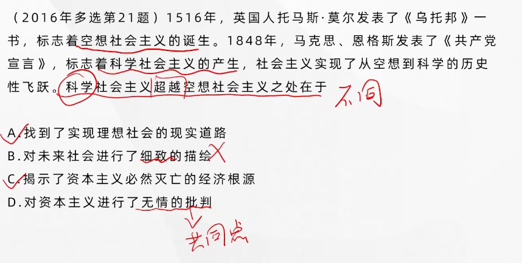
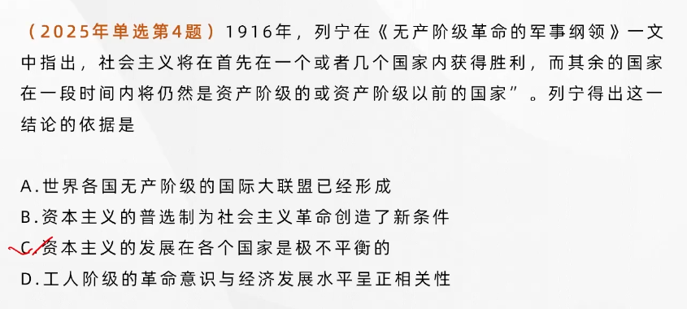
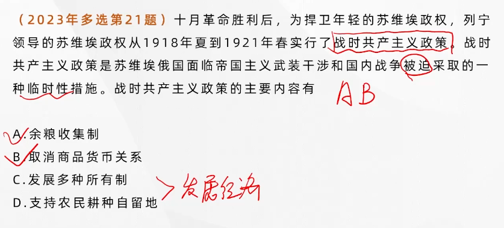
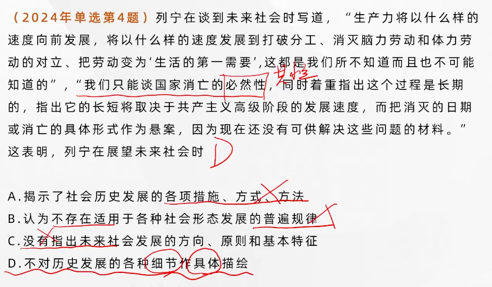
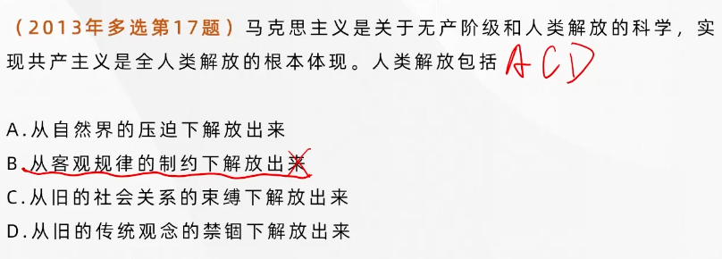
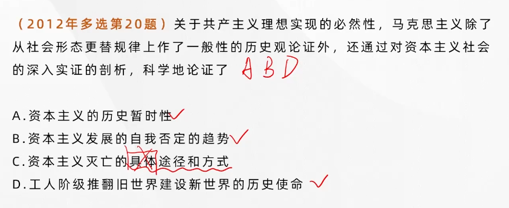

## 第六章 社会主义的发展及其规律

### 社会主义从空想到科学

#### 空想社会主义的历史贡献与时代的局限

- 他们对资本主义旧制度的辛辣批判，包含着许多切中要害的见解
- 他们对社会主义新制度的描绘，闪烁着诸多天才的火花

缺陷：

- 未能解释资本主义必然灭亡的经济根源
- 要求埋葬资本主义却看不到埋葬资本主义的力量
- 憧憬取代资本主义的理想社会，找不到通往理想社会的现实道路

---

### 社会主义在苏联的实践

---

战时共产主义时期：

- 余粮收集制
- 取消商品货币关系

新经济政策时期：

- 用粮食税制取代余量收集制
- 允许私人自由贸易，恢复商品货币关系，允许私人小工业企业发展，采取一些国家资本主义的形式来发展生产

---

