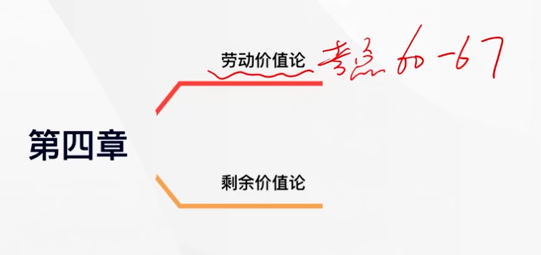
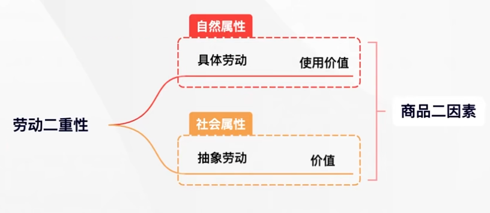
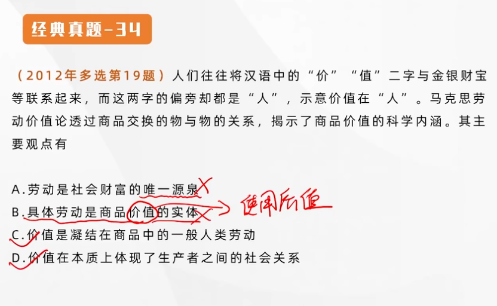
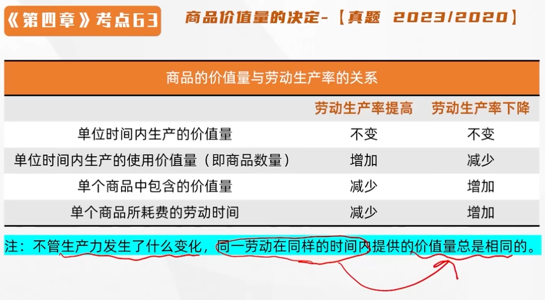
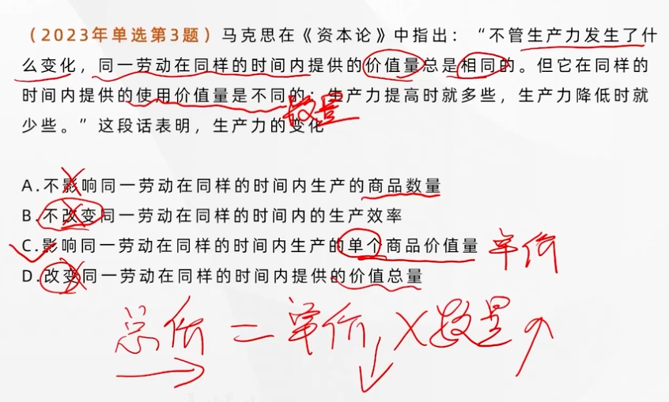
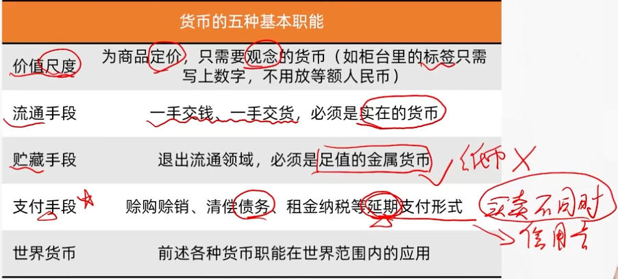
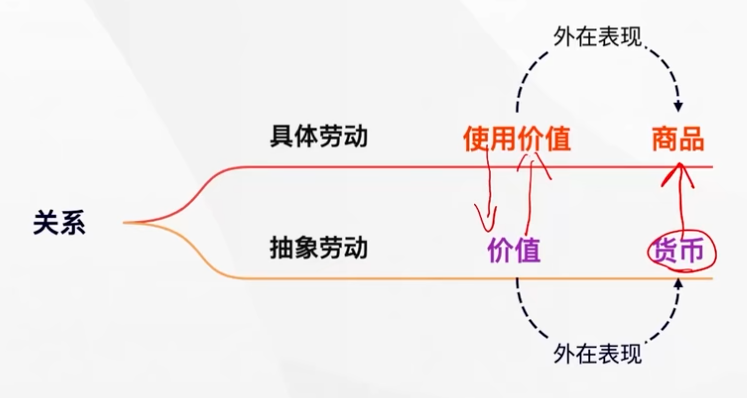
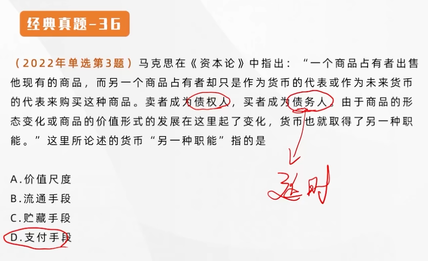

## 第四章 资本主义的本质及其规律

---

---

### 商品经济产生的历史条件

商品经济是以**交换**为目的而进行生产的经济形式。

**商品经济得以产生的社会历史条件**：

- **存在社会分工**
- **生产资料和劳动产品属于不同的所有者**

**以生产资料私有制和个体劳动为基础**，**以换取自己所需要的使用价值为目的**，是一种**简单商品经济**。

**自然经济：自给自足的经济**

自然经济以**使用价值**为生产目的

---

### 商品的二因素——使用价值和价值

---

使用价值是指商品能满足人的某种需要的 **有用性**。反映的是人与自然之间的物质关系，是商品的 **自然属性**，是一切劳动产品所 **共有的属性**。使用价值构成社会财富的物质内容。**使用价值是交换价值的物质承担者**。

**价值是凝结在商品中无差别的一般人类劳动，即人的脑力和体力的消费。价值是商品所特有的社会属性。（人与人的关系）**商品的价值在质上是相同的，因而它们 **可以相互比较**。**价值是交换价值的基础，交换价值是价值的表现形式**。商品的价值是劳动创造的，商品交换实际上是商品<u>生产者之间相互交换劳动</u>的关系。**商品的价值在本质上体现了生产者之间一定的社会关系**。

**使用价值既是交换价值的物质承担者，也是价值的物质承担者。**

---

商品是**用来<u>交换</u>、能<u>满足人某种需要</u>**的劳动产品。具有**使用价值和价值**两个因素或两种属性，是**使用价值和价值的矛盾统一体**。

> 不是具有使用价值的东西都可以用来交换，比如无处不在的空气（没有劳动）

---

### 商品的价值和使用价值的对立统一关系

统一性：**作为商品**，必须同时具有使用价值和价值两个因素。使用价值是价值的物质承担者，价值寓于使用价值之中。

对立性：（**主体是人**）商品的使用价值和价值是相互排斥的，二者不可兼得。要获得商品的价值，就必须放弃商品的使用价值；要得到商品的使用价值，就不能得到商品的价值。

---

### 生产商品的劳动的二重性

---

#### 具体劳动和抽象劳动

**具体劳动**是指生产一定**使用价值**的具体形式的劳动，也被马克思称为**有用劳动**。

**抽象劳动**是指撇开一切具体形式的、无差别的一般人类劳动。**即人的脑力和体力的耗费**。

**生产商品的具体劳动创造商品的使用价值，抽象劳动形成商品的价值。具体劳动和抽象劳动是同一劳动的两种规定。**

**正是劳动的二重性决定了商品的二因素**。

---

#### 具体劳动和抽象劳动的对立统一关系

具体劳动和抽象劳动**不是各自独立存在的两种劳动或者两次劳动**，它们在时间上和空间上是**统一**的。

另一方面，它们反映劳动的**不同属性**，具体劳动反映自然属性，抽象劳动反映社会属性。

抽象劳动是 **价值的唯一源泉**，具体劳动是使用价值（社会财富）的源泉，**但不是唯一源泉**。

---

### 商品价值量的决定

---

> 社会必要劳动时间  平均时间

决定商品价值量的不是生产商品的**个别劳动时间**，而是**社会必要劳动时间**。

#### 商品的价值量与劳动生产率的关系

**劳动生产率指的是劳动者生产使用价值的效率**。商品的价值量与生产商品所耗费的**社会必要劳动时间**成**正比**。与**劳动生产率**成**反比**。

不管生产力发生了什么变化，同一劳动在同样的时间内提供的价值量总是相同的。

$$
总价=数量\times单价
$$

---

#### 形成商品价值量的劳动以简单劳动为尺度

**简单劳动**是指**不需要经过专门训练和培养**的一般劳动者都能从事的劳动。

**复杂劳动**是指**需要经过专门训练和培养**，具有一定文化知识和技术专长的劳动者所从事的劳动。

在**以私有制为基础的商品经济条件**下，复杂劳动换算为简单劳动，**不是商品生产者自觉计算出来的，而是在商品<u>交换过程中自发实现</u>（不是强制性的规定，而是社会过程所决定的，自发形成的，大家都认可的比例）的**。

---

### 价值形式的发展与货币

---

> 货币：（一般等价物，衡量一切商品）

#### 货币的本质和职能

货币是在长期交换过程中形成的固定充当**一般等价物**的**商品**。是商品经济内在矛盾发展的产物，货币的本质体现一种 **社会关系**

#### 货币的五种基本职能

**货币代表的是价值所在，商品代表的是使用价值。**

> 货币的出现没有根本上解决矛盾，反而为经济危机埋下了伏笔

---

