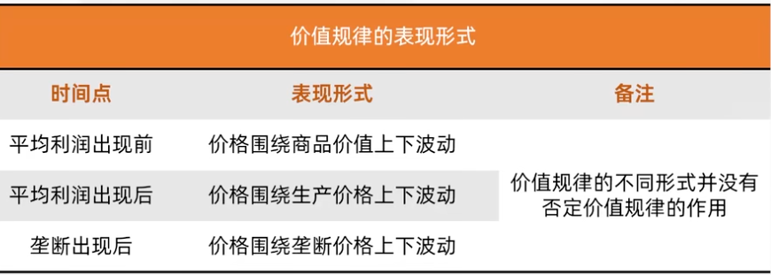
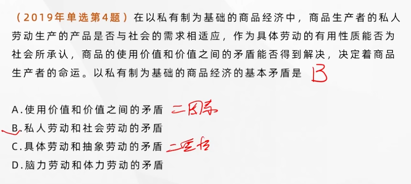
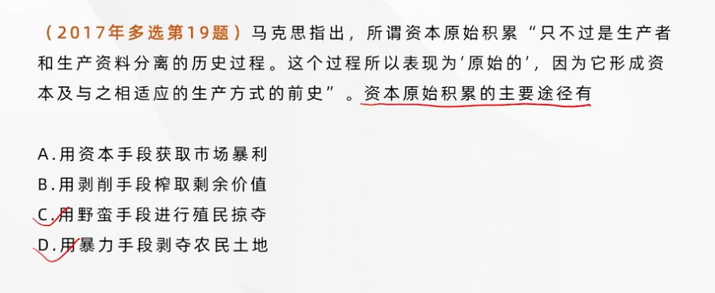
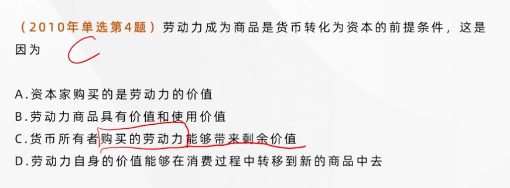
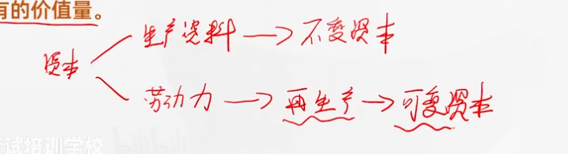
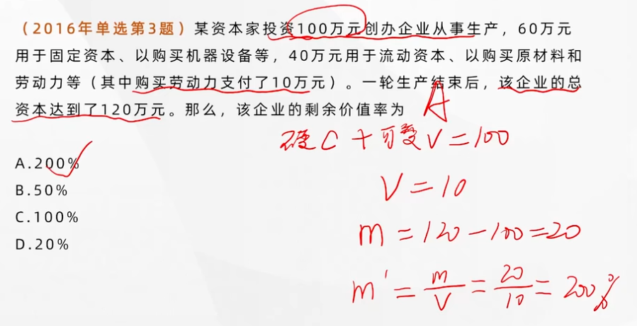
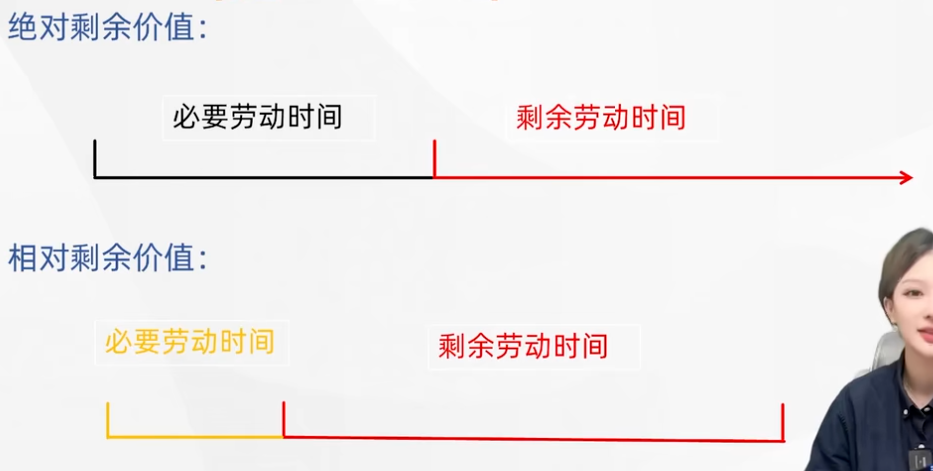
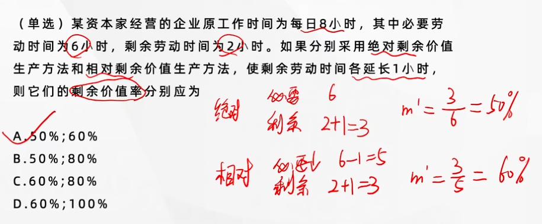
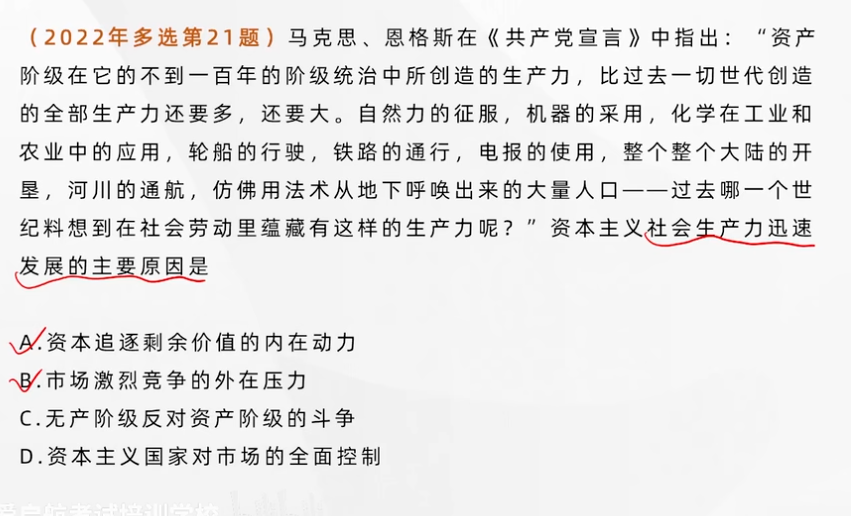

## 价值规律及其作用

---

**商品的价值量由生产商品的社会必要劳动实践决定，商品交换以价值量为基础，按照<u>等价交换</u>的原则进行。价值规律贯穿于商品经济的全部过程，它既支配商品生产，又支配商品流通。**

#### 价值规律的表现形式

商品的价格围绕商品的价值**自发波动**（有一定的随机性和不确定性）

在商品经济条件下，商品是按照**由社会必要劳动时间所决定的社会价值**进行交换的。那些劳动生产率较高、个别劳动时间低于社会必要劳动时间，从而商品的个别价值低于社会价值的生产者，就可以获得更多收入（商品的个别价值低于社会价值但按照社会价值出卖），在竞争中就处于有利地位

#### 价值规律的作用

- 价值规律的作用是自发的
  - 自发地调节生产资料和劳动力在社会各生产部门之间的分配比例
  - 自发地刺激社会生产力的发展
  - 自发地调节社会收入的分配
- 价值规律在对经济活动进行自发调节的时候也会造成一些消极的后果
  - 导致社会资源浪费
  - 阻碍技术进步
  - 导致收入两极分化

---

### 以私有制为基础的商品经济的基本矛盾

---

**私人劳动和社会劳动**是以私有制为基础的商品经济的基本矛盾

#### 私人劳动和社会劳动

在以私有制为基础的商品经济中，商品生产者的劳动具有**两重性**：**既是具有社会性质的社会劳动，又是具有私人性质的私人劳动**。商品生产者的劳动的社会性质是由**社会分工**决定的。商品生产者的劳动的私人性质是由**生产资料私有制**决定的。

>  私人劳动转化为社会劳动的关键：**交换**

在商品经济条件下，私人劳动要转化为社会劳动，就必须用自己的产品相交换，交换是解决私人劳动和社会劳动矛盾的唯一途径。

#### 私人劳动和社会劳动的矛盾构成私有制基础上商品的经济矛盾

私人劳动和社会劳动的矛盾贯穿商品经济发展的始终，决定着商品经济的各种内在矛盾及其发展趋势。

- 私人劳动和社会劳动的矛盾决定着商品经济的本质及发展过程。 **交换是解决私人劳动和社会劳动之间矛盾的 <u>唯一途径</u>**
- 私人劳动和社会劳动的矛盾 **是商品经济其他一切矛盾的基础**
- 私人劳动和社会劳动的矛盾 **决定着商品生产者的命运**

私有制商品经济条件下商品世界的拜物教性质产生的必然性：**掩盖了商品经济的本质，妨碍人们透过物的外表认识商品、价值以及货币的实质。**（认为商品本身有一种神秘的力量，是错误的）

#### 资本经济的基本矛盾

在资本主义制度下，这种矛盾进一步发展成资本主义和基本矛盾，即**生产社会化**（社会劳动）和**生产资料资本主义私人占有**（私人劳动）之间的矛盾。

---

### 马克思劳动价值论的理论和实践意义

---

**劳动二重性理论成为“理解政治经济学的枢纽”**

马克思劳动价值论揭示了私有制条件下商品经济的基本矛盾，为从物与物的关系背后揭示人与人的关系提供了理论依据

马克思劳动价值论揭示了商品经济的一般规律，对理解社会主义市场经济具有指导意义

---

### 资本主义经济制度的产生

---

> 剩余价值论

#### 资本主义生产关系（资产阶级和无产阶级）的产生

资本主义产生的途径有两个：

- 从**小商品经济**中分化出来
- 从**商人和高利贷者**转化而来

#### 资本的原始积累

以**暴力手段**使生产者与生产资料**相分离**，资本迅速集中于**少数人手中**，资本主义得以迅速发展的历史过程。

原始积累的途径主要有两个：

- 用暴力手段剥夺**农民的土地**
- 用暴力手段掠夺**货币财富**（包含殖民掠夺）

#### 资本主义所有制的确立

资本家和工人的关系变成**雇佣劳动关系**，资本主义所有制决定的**资本与雇佣劳动**之间**剥削与被剥削**的关系，反映了资本主义经济制度的本质。

资本家与雇佣工人的关系不是完全占有，也不是人身依附，**是基于劳动者人生自由基础上的“平等”，剥削带有一定的隐蔽性**。

---

---

### 劳动力成为商品与货币转化为资本

---

资本主义经济制度的形成是以**劳动力成为商品**为前提条件。

#### 劳动力成为商品的基本条件

- 劳动者在法律上是 **自由人**，能够把自己的劳动力当做自己的商品来支配
- 劳动者 **没有任何生产资料，没有生活资料来源**，因而不得不依靠出卖劳动力为生

**劳动力成为商品**，标志着**简单商品生产发展到资本主义商品生产**的新阶段。

形式上是“自由”，“平等”的买卖关系，而实质上是**资本家支配和剥削工人**的雇佣劳动关系。

#### 劳动力成为商品的特点与货币转化为资本

劳动力的价值，是由**生产、发展、维持和延续劳动力所需的生活必需品的价值**决定的。它包括三部分：

- 维持**劳动者本人**生存所必须的生活资料的价值；
- 维持**劳动者家属**的生存所必须的生活资料的价值；
- 劳动者接受**教育和训练**所支出的费用；

劳动力商品在 **使用价值**（等同于劳动）上有一个很突出的特点，就是 **它的使用价值是价值的源泉**，在消费过程中能够**创造新的价值**，而且**这个新的价值比劳动力本身的价值更大**。而一旦货币购买的劳动力带来**剩余价值**，货币也就变成了资本。

> 纯粹的消费中，货币还是货币，但是如果用来剥削就变成了资本

#### 资本的本质

资本是能够带来**剩余价值的价值**。剩余价值是由**雇佣工人的剩余劳动**创造的。但资本不是物，而是一定的、社会的、属于一定历史社会形态的生产关系。

---

### 生产剩余价值是资本主义生产方式的绝对规律

---

#### 资本主义生产过程的二重性

资本主义生产过程是 **劳动过程** 和 **价值增殖过程** 的统一

资本主义劳动过程是 **生产使用价值** 的过程。由于资本主义劳动过程的要素都被资本家所占有，这就决定了资本主义劳动过程的两个特点：

- 工人在资本家的监督下 **劳动**（资本家使用 劳动 的 使用价值）
- 劳动的成果或者产品全部归资本家所有

**价值增殖过程** 是 **剩余价值的生产过程**，这是资本主义生产过程的 **主要方面**。所谓价值增殖过程，是**超过劳动力价值的补偿这个一定点而延长了的价值形成过程**。

#### 剩余价值的实质

在价值增殖的过程中，雇佣工人的劳动分为两部分：

- 必要劳动，用于再生产劳动力的价值
- 剩余劳动，用于无偿地为资本家生产剩余价值

资本家购买的劳动力，在生产过程中创造了超过补偿劳动力的价值，从而形成了剩余价值，**这是价值形成过程抓变为价值增殖过程的关键**。（剩余劳动是剩余价值的 **唯一源泉**）

#### 不变资本和可变资本的区分及其意义

- 不变资本是 **以生产资料形态存在** 的资本。生产资料的价值通过工人的具体劳动被转移到新产品中。其转移的价值量 **不会大于它原有的价值量**。
- 可变资本是 **用来购买劳动力** 的资本。可变资本的价值在生产过程中 **不是被转移到新产品中去的，而是通过工人的劳动再生产出来的**。在生产过程中，工人所创造的新价值 **不仅包括相当于劳动力价值的价值，而且还包括一定量的剩余价值**。

#### 剩余价值率

剩余价值率是**剩余价值与可变资本**的比率；是**剩余劳动与必要劳动**的比率；是**剩余劳动时间与必要劳动时间**的比率；

> 体现工人受剥削的程度

$$
m=剩余价值~\\
c=不变资本~Constant\\
v=可变资本~Variable\\
m'=剩余价值率=\frac mv
$$

---

#### 绝对剩余价值、相对剩余价值和超额剩余价值

资本家提高对工人的剥削程度的方法是多种多样的，最基本的方法有两种，即 **绝对剩余价值** 的生产和 **相对剩余价值** 的生产

- **绝对剩余价值** 是指在必要劳动时间不变的条件下，**由于延长工作日的长度或提高劳动强度** 而生产的剩余价值。
- **相对剩余价值** 是指在工作日长度不变的条件下，通过 **缩短必要劳动时间而相对延长剩余劳动时间** 所生产的剩余价值。缩短必要劳动时间是 **通过全社会劳动生产率的提高** 实现的。全社会劳动生产率的提高是资本家追逐 **超额剩余价值** 的结果。

**超额剩余价值** 是指 **个别企业** 由于 **提高劳动生产率** 而 **使商品的个别价值低于社会价值的差额**。其后果导致生产效率普遍提高，**整个资本家阶级普遍获得更多的相对剩余价值**。

---

#### 生产自动化条件下剩余价值的源泉

资本主义条件下的生产自动化只是意味着剩余价值生产所使用的生产工具更先进了，不论是机器人、自动化生产线，还是“无人工厂”，**在本质上依然是物化劳动或不变资本的实物形式。**它们在参加产品的生产时，只是**把原有的价值转移到产品中去，而不创造价值，更不能创造剩余价值**。资本主义条件下的生产自动化是资本家获取高额剩余价值的手段，**而雇佣工人的剩余劳动仍然是这种剩余价值的唯一源泉**。

