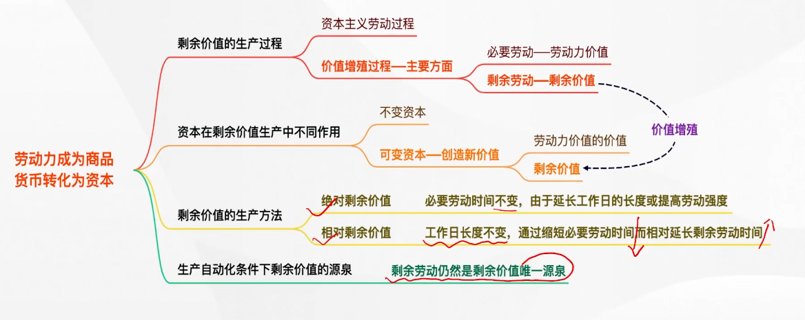

---

### 资本积累

---

把剩余价值转化为资本，或者说剩余价值的资本化就是 **资本积累**

资本主义简单再生产就其实质而言，是 **物质资料再生产和资本主义生产关系再生产的统一**。

资本主义再生产的特点是 **扩大再生产**，资本积累是资本主义扩大再生产的源泉。

- 抽象劳动是价值的唯一源泉；具体劳动是使用价值的源泉，但不是唯一源泉
- 劳动力商品的使用价值（即劳动）是价值的源泉
- 雇佣劳动者的剩余劳动是剩余价值产生的唯一源泉
- 资本积累是资本主义扩大再生产的源泉
- 剩余价值是资本积累的源泉

#### 资本积累的本质、源泉和后果

资本积累的本质，就是资本家不断地利用无偿占有的工人创造的剩余价值来扩大自己的资本规模，从而进一步扩大和加强对工人的剥削和统治。

资本积累的源泉是剩余价值，资本积累规模的大小取决于

- 资本家对工人的剥削程度
- 劳动生产率的高低
- 所用资本和所费资本之间的差额
- 资本家预付资本的大小

后果：资本积累不但是 **社会财富占有两极分化** 的重要原因，而且是资本主义社会 **失业现象** 产生的根源

#### 资本有机构成

**资本技术构成** 从自然形式上看，总是由一定数量的生产资料和劳动力构成的。在生产资料和劳动力之间存在着一定的比例， **这个比例取决于生产技术的发展水平。这种<u>由生产的技术水平所决定的生产资料和劳动力之间的比例</u>，叫做资本的技术构成**。（**数量** 层面）

**资本价值构成**：从价值形式上看，资本分为不变资本和可变资本，这两部分资本价值之间的比例，叫做资本的价值构成（**价值** 层面）

**资本有机构成**：由资本的技术构成决定并反映技术构成变化的资本价值构成，叫做资本的有机构成，通常用 C：V 来表示，其中 C 为不变资本，V 为可变资本（也是一种特殊的资本价值构成，但是 **只反映技术水平影响**）

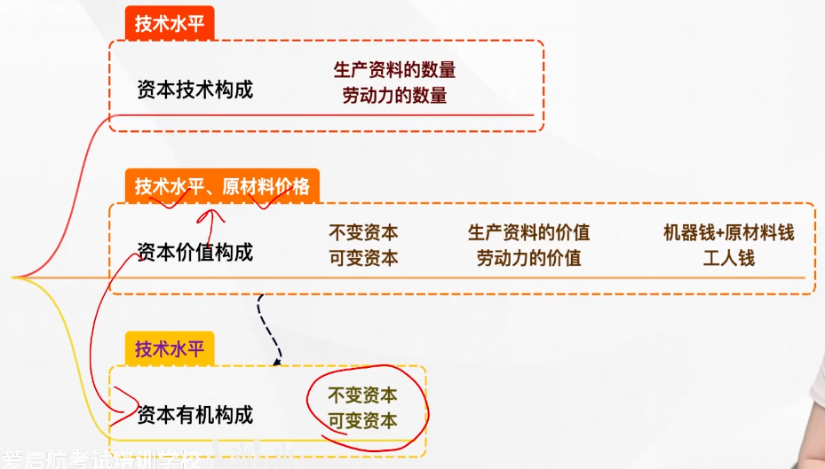

> 所有的资本有机构成都是资本价值构成，但是不是所有的资本价值构成都是资本有机构成

掌握：

- 资本 **有机构成的比例公式** $=\frac cv$
- **哪些因素的影响** 会导致构成变化

当原材料价格发生变化时，只有资本价值构成才发生变化

而技术发生变化时，资本技术，价值，有机构成都会发生变化

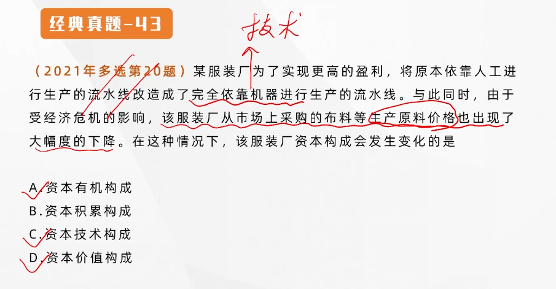

#### 相对过剩人口

在资本主义生产过程中，**资本有机构成的提高是一般趋势**（机器，生产越来越自动化），这是由资本的 **本性** 决定的。资本主义生产的唯一动机和直接目的就是 **追求剩余价值**。

所谓相对过剩人口，就是劳动力供给超过了资本的需要。

相对过剩人口基本上有三种形式：

- 流动的过剩人口
- 潜在的过剩人口
- 停滞的过剩人口

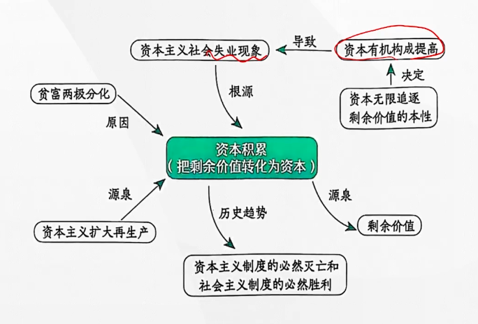

---

### 资本的循环周转与再生产

---

#### 资本循环及其职能形式

首先详尽地分析了 **个别资本** 的运动

产业资本循环的三个阶段和采取的三种职能形式。资本循环是 **资本从一种形式出发，经过一系列形式的变化，又回到原来出发点的运动**。产业资本在循环过程中要经历三个不同的阶段，与此相联系的是资本依次执行三种不同的职能。

第一个阶段是 **购买阶段**，即生产资料与劳动力的购买阶段，它属于商品的流通过程，产业资本 **执行的是【货币资本】的职能。**

第二个阶段是 **生产阶段**，即生产资料与劳动力按比例结合在一起从事资本主义生产的阶段，产业资本 **执行的是【生产资本】的职能**。

第三个阶段是 **售卖阶段**，即商品资本向货币资本的转化阶段，在此阶段，产业资本 **执行的是【商品资本】的职能**。

通过商品售卖不仅要实现商品的价值，还要实现 **剩余价值**

#### 产业资本运动的基本前提条件

- 产业资本的三种职能形式必须在 **空间** 上并存
- 产业资本的三种职能形式必须在 **时间** 上继起

#### 资本周转及其速度

资本在运动中时增殖的，必须不断地、周而复始地循环，才能不断地带来剩余价值。**这种<u>周而复始，不断反复</u>着的资本循环，就叫做资本的周转。**

影响资本周转快慢（速度）的关键因素有两个：

- **资本周转时间**（资本周转时间与资本周转时间成反比）
- **生产资本的固定资本和流动资本的构成**（区别在于周转方式的不同，固定资本占的比重大，整个资本周转速度就慢；相反，流动资本占的比重大，整个资本周转速度就快）

> 固定资本：每次生产过程中，固定资本的损耗程度是逐渐转移到新产品中去的（不是一次性完全损耗，而是要 **多次** 生产，如机器，厂房等）
>
> 流动资本：**一次生产 **过程中就 **完全** 损耗，例如原材料，**劳动力**

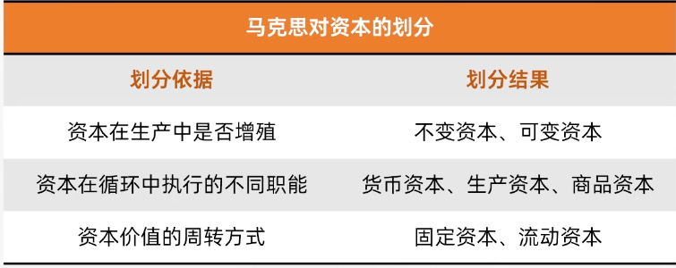

---

#### 社会再生产的核心问题及实现条件

**社会再生产的核心问题** 是社会总产品的 **实现问题**，即 **社会总产品的价值补偿**（把该卖的卖出去） 和 **实物补偿问题**（把该买的买回来）。

分析社会再生产的两个基本理论前提。马克思将社会总产品在 **物质** 上划分为 **两大部类**，在 **价值** 上划分为 **三个组成部分**。社会总产品就是**社会在一定时期所生产的全部物质资料的总和**

社会总产品在 **价值形态** 上又叫 **社会总价值**，c（不变资本）+v（可变资本）+m（剩余价值）

社会总产品在 **物质形态** 上，划分为两个部类：

- 由生产 **生产资料** 的部门构成，其产品进入 **生产消费领域**
- 由生产 **消费资料** 的部门构成，其产品进入 **生活消费领域**

#### 社会再生产的实现条件

要求生产中所耗费的资本 **在价值上得到补偿**，同时还要求实际生产中 **所耗费的生产资料和消费资料得到实物的替换**。

只有两大部类的生产不仅在规模上而且在结构上保持一定的 **比例**，社会总产品的价值补偿和实物替换才能正常实现，社会再生产才能顺利进行。

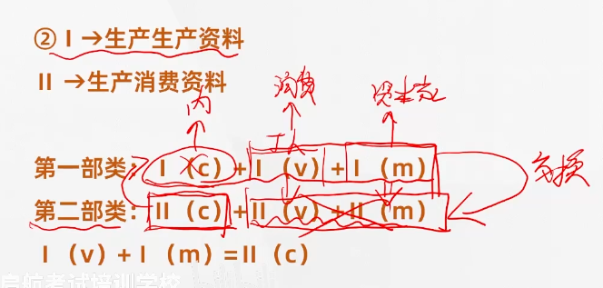

要满足：
$$
I(v)+I(m)=II(c)\implies 顺利
$$
但是各个部门的生产是根据供需关系盲目生产的，因此常常此等式不成立

**经济危机** 实际上是 **资本主义条件** 下以 **强制的方式** 解决社会再生产的实现问题的途径，这种解决方式虽然最终也能够使社会再生产慢慢平衡，却是以社会经济生活的严重混乱甚至瘫痪以及社会资源和财富的极大浪费为代价的。

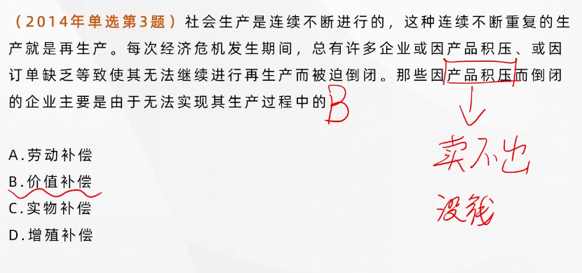

---

### 工资与剩余价值的分配

---

#### 资本主义工资的本质和形式

在资本主义制度下，工人的工资是 **劳动力的价值或价格**，这是资本主义工资的本质。工资表现为“**劳动**（劳动力的使用价值）的价格”或者工人全部劳动的报酬。

劳动力的使用价值产生的价值实际包含了：劳动力的价值+剩余价值

工资表现为“劳动的价格”是一种 **假象** 的表现，工人只获得了劳动力的价值，**剩余价值被资本家无偿占有**。

资本主义工资的形式主要有两种：**计时工资** 和 **计件工资**，除此之外，资本家还建立了各种形式的血汗工资制度，例如19世纪末20世纪初流行的“泰罗制”和“福特制”

在当代资本主义国家，工人的实际工资 **呈现不断提高的趋势**，但是与工人创造的剩余价值的增长幅度相比，实际工资提高的幅度还是较小的。

#### 剩余价值转化为利润

在现实的资本主义经济生活中，资本家并不是把剩余价值看做可变资本的产物，而是把它看作全部预付资本的产物或增加额，**剩余价值便取得了利润的形态**。

> 资本家认为他们瓜分的是利润

**利润和剩余价值本来是同一个东西**，所不同的是，剩余价值是对可变资本而言，利润是对全部预付资本而言。剩余价值是利润的本质，利润是剩余价值的转化形式。

利润率是剩余价值与全部预付资本的比率，**反映的是预付总资本的增殖程度，<u>掩盖</u>了资本家对工人的剥削**。

剩余价值率$m'=\frac {m}{v}$，利润率$p'=\frac{m}{(c+v)}$，因此 **利润率总是小于剩余价值率**

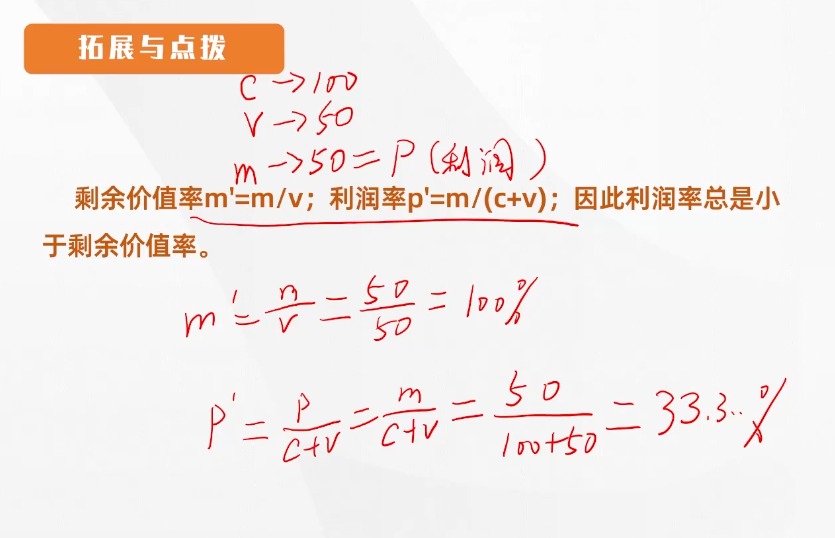

#### 平均利润率与剩余价值的瓜分

**利润平均化**：资本主义为了 **得到尽可能高的利润率和尽可能的利润**，不同生产部门的资本家之间 **必然展开激烈的竞争**，大量资本必然从利润率低的部门转投到利润率高的部门，从而导致 **利润平均化**。在利润率平均化的过程中，形成了社会的平均利润率，按照平均利润率来计算和获得的利润，叫做 **平均利润**。

资本家之间在瓜分剩余价值上固然有一定程度的利害冲突，**但在加长对工人阶级的剥削以榨取更多的剩余价值这一点上，有着共同的阶级利益**。

> 利润平均化是不同部门资本家之间竞争的结果（宏观）

利润转化为平均利润，价值也就转化为生产价格，**生产价格** 是 **商品价值** 的转化形式，**是生产成本与平均利润之和**。

> 生产价格其实就是商品的价值所在，等于生产成本+平均利润

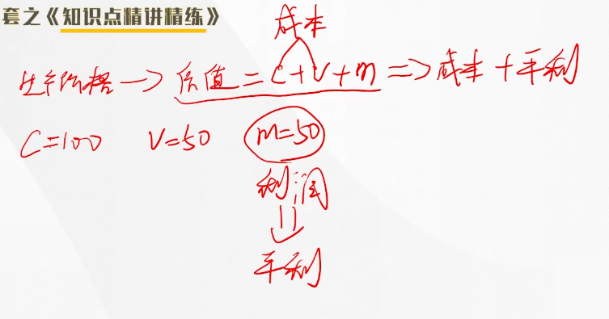

在价值转化为生产价格的条件下，价值规律作用的 **形式发生了变化**。

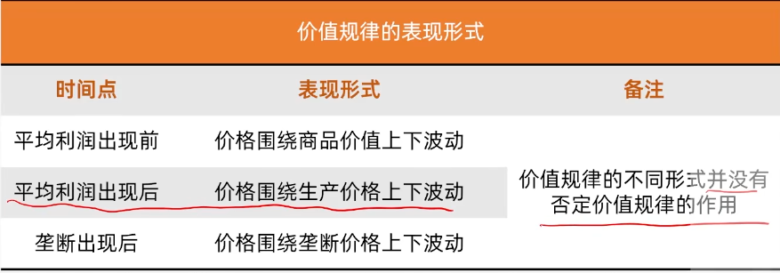

---

### 马克思剩余价值理论的意义

---

剩余价值是 **马克思经济学说的核心内容和基石**

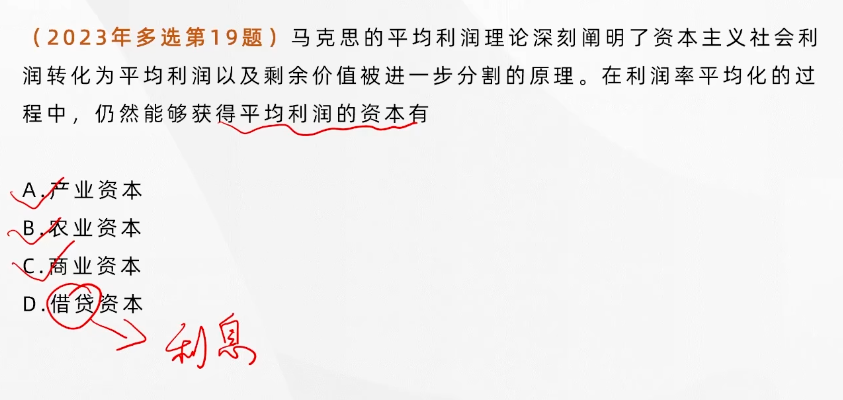

#### 资本主义基本矛盾

**生产社会化** 和 **生产资料资本主义私人占有** 之间的矛盾，是资本主义的基本矛盾，这是生产力和生产关系之间的矛盾在资本主义社会的具体体现

#### 资本主义经济危机的本质特征、根本原因、具体表现和周期性

**生产过剩** 是资本主义经济危机的本质特征

**生产相对过剩**：相对于劳动人民 **有支付能力** 的需求来说，社会生产的商品显得过剩，而不是与劳动人民的 **实际需求** 相比的绝对过剩。

经济危机的抽象的一般的可能性，首先是由货币作为 **流通手段** 和 **支付手段**（买卖不同时） 引起的

资本主义经济危机爆发的 **根本原因** 是 **资本主义的基本矛盾**，主要体现在以下两个方面：

- **生产无限扩大趋势** 与 **劳动人民有支付能力的需求相对缩小** 的矛盾（生产相对过剩）
- **单个企业内部生产的有组织性** 和 **整个社会生产的无政府状态** 之间的矛盾

资本主义经济危机周期性爆发的特点，使社会资本再生产也呈现出周期性的特点，一般包括四个阶段，即：**危机、萧条、复苏和高涨**。其中危机阶段是周期的 **基本阶段**，资本主义的再生产不一定都经过这四个阶段，但是一定会经过危机阶段。

资本主义基本矛盾运动的阶段性决定了资本主义经济危机的周期性。

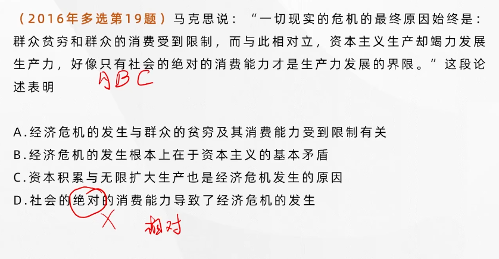

**资本主义上层建筑包括资本主义政治上层建筑和观念上层建筑，前者集中体现为资本主义政治制度，后者主要体现为资本主义意识形态**