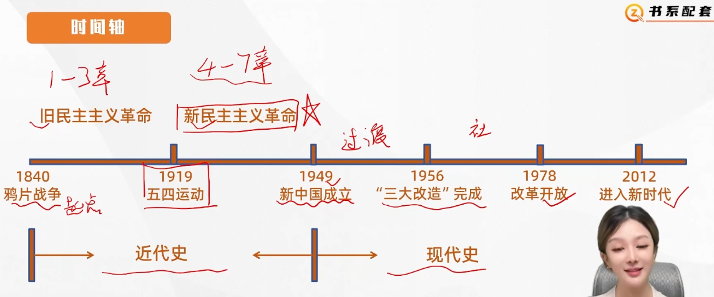
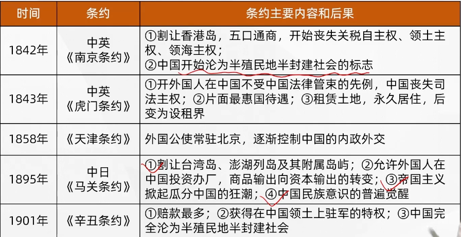
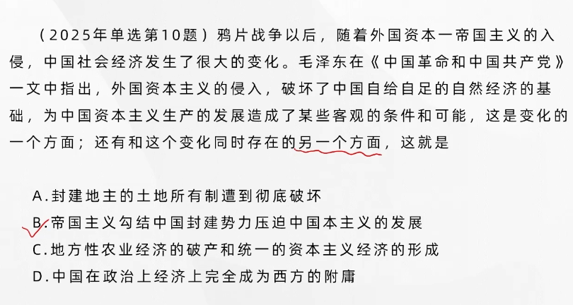
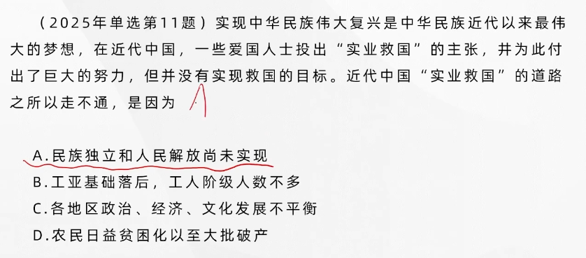
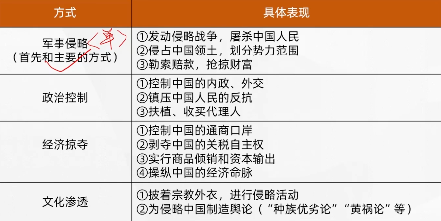
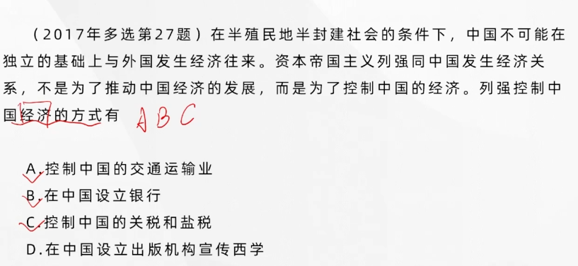
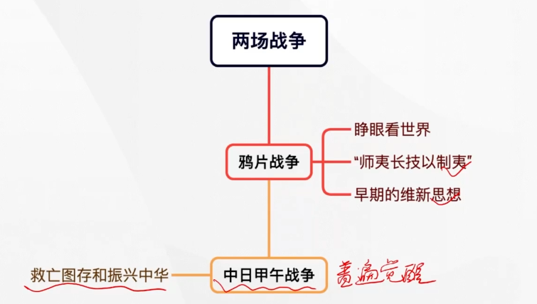

# 中国近现代史纲要~20分

## 第一章 进入近代后中华民族的磨难与抗争（重点）

**中国近代以来的变化**
**反侵略斗争**
**民族意识觉醒**

### 鸦片战争：中国近代史的起点

英国发动战争，为了殖民扩张；为了摆脱经济危机与转移国内人民的视线；为了打开中国市场，尤其是为了保护罪恶的鸦片贸易，1840年4月，英国议会通过对华战争的决定。

#### 战争结果

中国战败，1842年8月，**被迫签订<u>中国近代史上第一个不平等条约</u>——中英《南京条约》**（又称《江宁条约》）

1843年7月和10月，中英签订**《五口通商章程》**和**《虎门条约》**作为《南京条约》的附件

1844年7月，**中美**签订**《望厦条约》**；1844年10月，**中法**签订**《黄埔条约》**】

> 以上都是中国近代史上的第一批不平等条约

1895年中日签订《马关条约》

1901年签订《辛丑条约》，完全沦为半殖民地半封建社会

#### 鸦片战争及第一批不平等条约的后果

- 破坏了中国的主权和领土完整
- 破坏了中国的领海主权
- 破坏了中国的司法主权
- 破坏了中国的关税主权

中国的**社会性质（国情）开始发生质的变化**（最基本的依据），从封建社会逐步成为**半殖民地半封建社会**。中国人民逐渐开始了**反帝反封建的资产阶级民主革命**。正因为如此，鸦片战争就成为中国近代史的起点。

---

### 近代中国社会的半殖民地半封建性质

---

认识近代中国社会的性质是认识中国近代一切社会问题和革命问题的最基本的依据。

#### 中国半殖民地社会形成的原因

- 中国已经**丧失了完全独立的地位**，在相当程度上被**殖民地化**了
- 近代中国还有一定的主权，所以被称为**半殖民地**

#### 中国半封建社会形成的原因

- 外国资本主义的入侵逐渐使中国的农业与家庭手工业相分离，破坏了中国自给自足的自然经济的基础，**中国出现了资本主义生产关系**，中国已经不是完全的封建社会了
- 中国的民族资本主义经济虽然有了某些发展，但是并没有也不可能成为中国社会经济的主要形式。这样，中国的经济既不再是完全的封建经济，也不是完全的资本主义经济，而成为**半殖民地半封建的经济**了

---

### 近代中国社会阶级关系变动

---

#### 旧阶级的变化

- 统治阶级——**地主阶级**：有些地主从乡村迁往城市成为**城居地主**；一部分地主转化为资本家
- 被统治阶级——**农民阶级**：不少自耕农失去土地，向贫农或雇农转化；有些农民破产或失去土地后流入城市，成为产业工人的后备军

#### 新阶级的产生

- **工人阶级**（新生产力的代表）：它的来源主要是城乡破产事业的农民、手工业者和城市贫民。身受帝国主义、封建势力、资产阶级三重压迫，受到的剥削最深。是近代**中国最革命的阶级**。
- **资产阶级**
  - 一部分是**官僚买办资本家**（官僚：与**封建势力**勾结，买办：帮助**外国资本**在中国从事贸易活动的中间人，依靠帝国主义；是我们革命对象所在）。
  - 一部分是民族资本家，始终未能在中国社会经济中占主要地位，在政治上表现出**两面性**（革命性、动摇性）

**中国的工人阶级先于中国资产阶级产生。**

---

### 近代中国的社会主要矛盾和两大历史任务

---

**主要矛盾**：

- 帝国主义和中华民族的矛盾（民族矛盾）
- 封建主义和人民大众的矛盾（阶级矛盾）

**相互关系**：两对主要矛盾是相互交织的，而**帝国主义和中华民族的矛盾是最主要的矛盾**

这两对主要矛盾及其斗争贯穿整个中国半殖民地半封建社会的始终，并对中国近代社会的发展变化起着决定性作用。

**两大历史任务**：

- 推翻帝国主义、封建主义联合统治的半殖民地半封建的社会制度，**争取民族独立，人民解放**；（反帝，反封建的革命运动）
- 改变中国经济落后的面貌，实现国家富强和人民幸福。

两大历史任务中、前一个任务为后一个任务**扫清障碍**，为实现中华民族伟大复兴的中国梦**创造必要前提**

---

### 西方列强对中国进行侵略的方式和具体表现

---

---

### 抵御外来侵略的斗争历程

---

- **三元里人民的抗英斗争**，1841年5月，三元里人民在广州北郊英勇抗击英国侵略军，迫使侵略军撤出广州。是中国近代史上中国人民**第一次大规模的反侵略武装斗争**
- **爱国官兵的反侵略斗争**。

> 绝不是**因为某一次斗争就杜绝了外部侵略**

---

### 义和团运动与列强瓜分中国图谋的破产

---

#### 边疆危机和瓜分危机

- **边疆危机**，帝国主义列强从侵占中国周边邻国发展到蚕食中国边疆地区，使中国陷入**边疆危机**
- **瓜分危机**，帝国主义列强对中国的争夺和瓜分的图谋，**在1894年中日甲午战争爆发后达到高潮**。由此，德俄英法日等国于1898年至1899年竞相租借港湾和划分势力范围，**掀起了瓜分中国的狂潮**

#### 列强瓜分中国图谋的破产

- **义和团运动**使帝国主义侵略者不敢为所欲为地瓜分中国，在粉碎帝国主义列强瓜分中国的斗争中发挥了重大的历史作用。
- 帝国主义不能实现灭亡和瓜分中国的原因
  - **帝国主义列强之间的矛盾和相互制约**是一个**重要的原因**（外因）
  - 中国民族进行的**不屈不挠的反侵略斗争**，是**根本的原因**（内因）
  - **中国长期以来一直是一个统一的大国**也是原因之一

---

### 反侵略战争的失败及其原因

---

**内部因素：**

- **根本原因和最重要的原因**是**社会制度的腐败**
- **经济技术的落后**

---

### 民族意识的觉醒

---

#### 师夷长技以制夷的主张和早期的维新思想

明确提出了“师夷长技以制夷”的思想，主张学习外国先进的军事和科学技术来抵御外国侵略

早期的唯心思想——**吸纳西方的政治，经济学说**。他们具有比较强的**反对外国侵略、追求独立富强的爱国思想**，以及具有一定程度**反对封建专制的民主思想**。《盛世危言》（郑观应）提出大力发展民族工商业，同西方国家进行“商战”，设立议院，实现“**君民共主**”制度等主张。**这些主张具有重要的思想启蒙的意义**。

#### 救亡图存和振兴中华

当中华民族面临生死存亡的关头时，中国人才开始有了**普遍的民族意识的觉醒**

1895年，严复写了《**救亡决论**》一文，响亮地喊出了“**救亡**”的口号，用**“物竞天择”“适者生存”**的社会进化论思想，为这种危机意识和民族意识提供了理论依据。1898年有人绘制的一幅《时局图》，更是形象地表现了当时中国面临的被瓜分危局。

因此，孙中山在《兴中会章程》中喊出了“**振兴中华**”这个时代的最强音。

---

