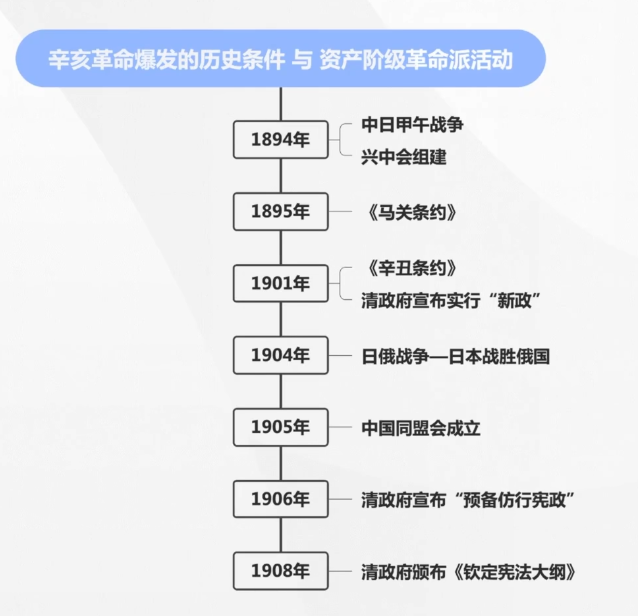
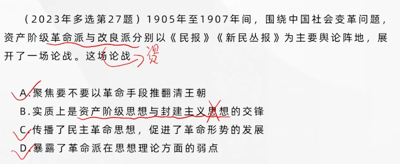
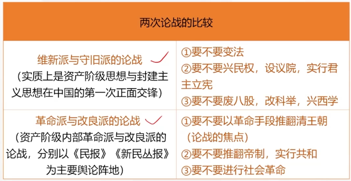
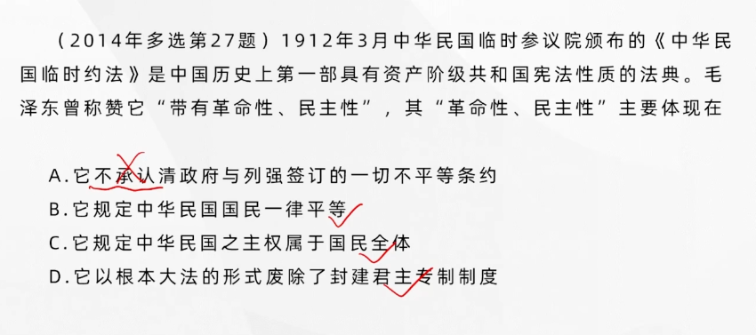
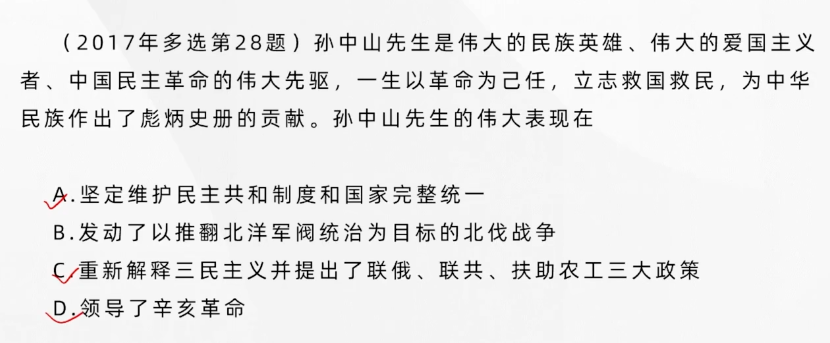
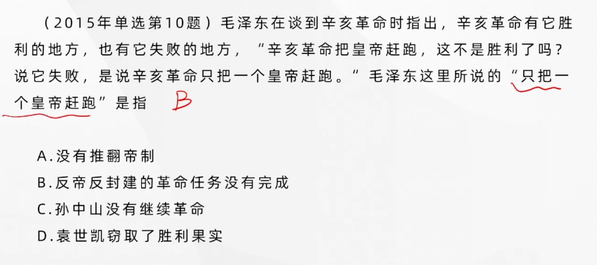

## 第三章 辛亥革命与君主专制制度的终结

### 辛亥革命爆发的历史条件

#### 民族危机加深，社会矛盾激化

**民族危机加深**：**《辛丑条约》**赔偿银两；日俄两国为了争夺在华利益与在中国东北进行战争，清政府却宣称“局外中立”。中国的民族危机进一步加深了。

> 辛丑条约的签订标志了清政府已经完全放弃抵抗外国侵略者的念头，甘当“洋人的朝廷”

**社会矛盾激化**：在一些运动中，资产阶级开始成为主要的角色。

#### 清末“新政”及其破产

**清末“新政”的推行**：为了摆脱困境，清政府于1901年4月成立督办政务处，宣布实行“新政”。迫于内外压力，清政府又于1906年宣布“预备仿行宪政”，并于1908年颁布了《钦定宪法大纲》，指定了一个仿效日本实行君主立宪的方案，但又规定了9年的预备立宪期限。

**清末“新政”的破产**：主要原因在于，清政府**改革的根本目的**是**延续其反动统治**。

#### 资产阶级革命派的阶级基础和骨干力量

资产阶级革命派的骨干力量是一批资产阶级和小资产阶级知识分子，成为了辛亥革命的中坚力量。

---

### 资产阶级革命派的活动

---

#### 孙中山于资产阶级民主革命的开始

1894年11月孙中山建立了第一个革命团体**兴中会**，立誓“驱除鞑虏，恢复中国，创立合众政府”，在**《中国问题的真解决》**一文中提出要推翻清政府的统治。

#### 资产阶级革命派的宣传与组织工作

- **章炳麟**发表了**《波康有为论革命书》**，反对康有为的保皇观点
- **邹容**写了**《革命军》**
- **陈天华**写了**《警世钟》《猛回头》两本小册子**

**中国同盟会**的建立及其纲领。同盟会以**《民报》**为机关报，确定了葛冰纲领。这是**近代中国第一个领导资产阶级革命的全国性政党**，它的成立标志着**中国资产阶级民主革命进入了一个新的阶段**

---

### 三民主义的提出

---

同盟会的政治纲领是“**驱除鞑虏，恢复中华，创立民国，平均地权**”。

孙中山将同盟会的纲领概括为三大主义，即**民族主义、民权主义、民生主义**，后被称为三民主义。

#### 民族主义（驱除鞑虏，恢复中华）

以革命的手段推翻**清朝政府**（鞑虏指的是满清专政政府）

建立中华民族“**独立的国家**”

但是同盟会纲领中的民族主义没有从正面鲜明地提出**反对帝国主义**的主张，放走了中国人民的最大敌人。

> 没有明确反帝
>
> 反封不彻底（没有反对汉族的军阀，官僚地主）

#### 民权主义

民权主义的内容是“创立民国“，要通过**政治革命**，推翻清政府的统治，建立**资产阶级民主共和国**。忽略了广大劳动群众在国家中的地位，因而难以使人民的民主权利得到真正的保证。

#### 民生主义

对应“平均地权”，也就是孙中山所说的**社会革命**，主张核定全国土地的地价。但是孙中山的“平均地权”并非将土地所有权分给农民，**没有正面触及土地所有制，不能满足广大农民的土地要求，在革命中难以成为发动广大工农群众的理论武器**。

#### 局限性

民族主义：没有明确反帝，反封不彻底

民权主义：人民的民主权利难以得到真正的保证

民生主义：没有满足人民的土地要求

孙中山的三民主义学说，**初步描绘出了中国还不曾有过的资产阶级共和国方案，是一个比较完整而明确的资产阶级民主革命纲领**

---

### 关于革命和改良的辩论（都是资产阶级利益）

---

#### 论战的主要内容

围绕中国**究竟是采用革命手段还是改良方式**这个问题，**革命派与改良派**分别以**《民报》《新民丛报》为主要舆论阵地**，展开了一场大论战

- 要不要以**革命手段**推翻清王朝，这是双方论战的焦点（民族主义）
- 要不要**推翻帝制**，实行共和（民权主义）
- 要不要进行**社会革命**（民生主义）

#### 论战的重大意义

通过这场论战，**划清了革命与改良的界限，传播了民主革命思想，促进了革命形势的发展**。

同时也暴露了革命派在思想理论方面的弱点。
这些理论和认识的局限不可避免地会影响辛亥革命的进程和结局

---

### 辛亥革命的爆发与清王朝覆灭

---

同盟会成立后发动的第一次武装起义是“**萍浏醴起义**”，其中影响最大的是**广州起义**（史称**黄花岗起义**）

**保路风潮**，清政府宣布“铁路干线收归国有”，**借“国有”名义把铁路利权出卖给帝国主义，同时借此“劫夺”商股**。这激起了湖北、湖南、广东、四川四省的保路风潮，其中以四川为最烈。

**武昌首义**，由于革命形势已经成熟，湖北新军中的共进会和文学社两个革命团体决定联合行动，在**武昌**举行武装起义。武昌城投枪声一响，**拉开了中国完全意义上的近代民族主义革命的序幕**

各地响应，1912年1月1日成立中华民国临时政府，清帝被迫退位，封建君主专制制度终于覆灭（**但没彻底推翻封建主义**）

> 经济还是封建土地所有制

---

### 中华民国的建立

---

1912年1月1日，孙中山在南京宣誓就职，改国号为**中华民国**，成立中华民国临时政府。

南京临时政府是一个**资产阶级共和国性质的革命政权**

- **资产阶级革命派**在这个政权中占有领导和主体的地位
- 指定的决策集中代表和反映了**中国民族资产阶级**的愿望和利益，在相当程度上也符合中国人民的利益

#### 南京临时政府的局限性

- 企图用**承认清政府与列强所订的一切不平等条约和一切外债，来换取列强承认中华民国**

#### 《中华民国临时约法》

中华民族临时约法是中国历史上**第一部具有资产阶级共和国宪法性质的法典**

以根本大法的形式废除了两千多年来的封建君主专制制度，**确认了资产阶级共和国的政治制度**，带有鲜明的**革命性、民主性和进步意义**

“中华民国之主权属于国民全体”

**注意：《中华民国约法》是袁世凯炮制的**

---

### 辛亥革命的历史意义

---

辛亥革命是一次比较完全意义上的**资产阶级民主革命**

推翻了封建势力的政治代表，帝国主义在中国的代理人清王朝的统治，**沉重打击了中外反动势力**，使中国反动统治者在政治上乱了阵脚

**结束了中国延续两千多年的封建君主专制制度**，建立了中国历史上第一个**资产阶级共和政府，使民主共和的观念开始深入人心**

> 区别，戊戌维新运动只是有利于民主思想在中国传播
>
> 辛亥革命使得民主共和观念开始深入人心

辛亥革命推动了中国人民的思想解放

辛亥革命推动了中国的社会变革，促使中国的社会经济、思想习惯和社会风俗等方面发生了新的积极变化

辛亥革命不仅在一定程度上打击了帝国主义的侵略势力，而且推动了亚洲各民族解放运动的高涨

**辛亥革命为实现中华民族伟大复兴探索了道路，永远是中华民族伟大复兴征程上一座巍然屹立的里程碑**。

---

### 封建军阀专制统治的形成

---

#### 袁世凯窃国，辛亥革命流产

#### 北洋军阀的专制统治

袁世凯以“拥护共和”的高调骗取资产阶级革命派的信任和妥协，攫夺辛亥革命的胜利果实，打着中华民国的招牌，以北京为首都建立了代表大地主和买办资产阶级利益的北洋军阀反动政权

- 在政治上，北洋政府实行军阀官僚的**专制统治**
- 在经济上，竭力维护帝国主义、地主阶级和买办资产阶级的利益
- 在文化思想方面，**尊孔复古思潮**猖獗一时

资产阶级革命派在中国建立一个独立、民主的资产阶级共和国的梦想破灭了

---

### 旧民主主义革命的失败

---

#### 挽救共和的努力及其受挫

- “二次革命”
- 护国运动
- 护法运动（护的是**中华民国临时约法**）

孙中山是中国民主革命伟大的先行者，是伟大的民族英雄、伟大的爱国主义者、中国民主革命的伟大先驱，是20世纪初期推动中国发生历史性巨变的主要代表

#### 辛亥革命失败的原因和教训

从**根本**上说，是因为在帝国主义时代，**在半殖民地半封建的中国，资本主义的建国方案是行不通的**。

从主观方面来说，它的领导者资产阶级革命派本身存在着许多弱点和错误：

- **没有提出彻底的反帝反封建的革命纲领**
- **不能充分发动和依靠人民群众**
- **不能建立坚强的革命政党，作为团结一切革命力量的强有力的核心**

资产阶级革命派的弱点和错误根源于**中国民族资产阶级的软弱性和妥协性**

辛亥革命仅仅赶跑了一个皇帝，却没有能够改变封建主义和军阀官僚政治的统治基础，无法完成反帝反封建的任务。先进的中国人需要进行新的探索，为中国谋求新的出路

> 北伐战争是后期**蒋介石**带领的

