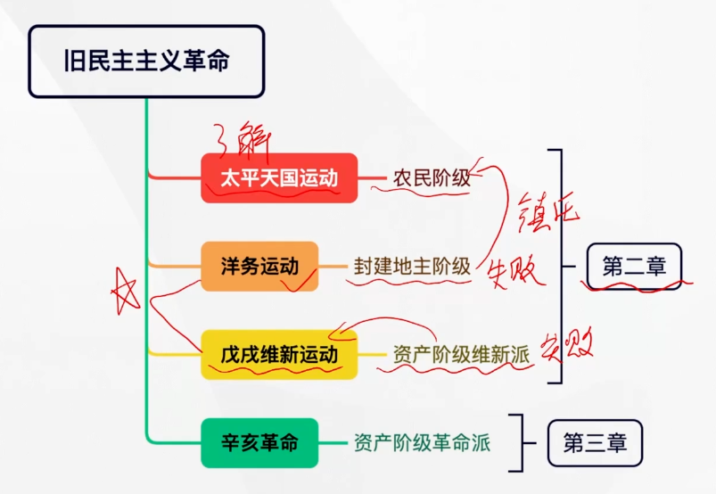
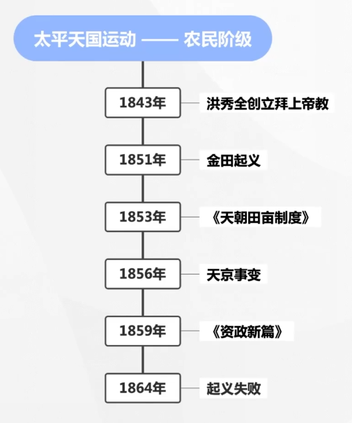
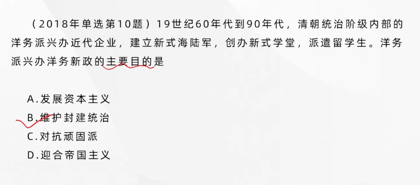
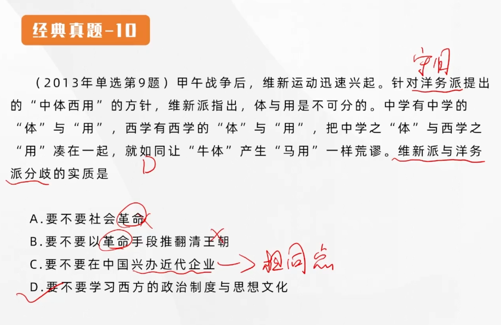
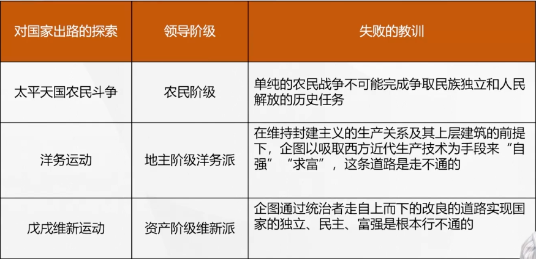

## 第二章 不同社会力量对国家出路的早期探索

### 太平天国农民战争（1851~1864）

#### 金田起义和太平天国的建立

**太平天国农民战争爆发的原因**：鸦片战争失败之后，为了支付对列强的巨额赔款，同时也为了弥补财政亏空，清政府加重了赋税的征收科派，**农民的负担更为沉重**。

太平天国的兴起：金田起义后，势如破竹，迅速发展。洪秀全率拜上帝教教众发动起义，建号太平天国，1853年3月，占领南京，定为首都，改名天京，正式宣告太平天国农民政权的建立。

#### 《天朝田亩制度》和《资质新篇》

《天朝田亩制度》以**解决土地问题**为中心，**是最能体现太平天国社会理想和这次农民起义特色的纲领性文件**。

《天朝田亩制度》确立了**平均分配土地**的方案

- **进步性**
- **空想性**，这种社会理想，在很大程度上具有不切实际的空想性质。实际上《天朝田亩制度》中的平分土地方案即使在太平军占领地区也未能付诸实行。

太平天国后期颁布的社会发展方案——**《资政新篇》**（在向西方资本主义学习，是有**资本主义色彩**的方案）

> 但是也未能付诸实践

---

### 太平天国农民起义的历史意义

- 沉重打击了封建统治阶级，强烈撼动了清政府的统治根基
- 《资质新篇》是中国近代历史上**第一个比较系统的发展资本主义的方案**，这反映了太平天国某些领导人在后期试图通过向外国学习来寻求出路的一种努力。太平天国起义具有了不同于以往农民战争的新的历史特点，是**旧式农民战争的最高峰**
- 太平天国起义**冲击了孔子和儒家经典的正统权威**，这在一定程度上削弱了封建统治的精神支柱
- 太平天国起义还**有力地打击了外国侵略势力**，拒绝承认不平等条约，严禁鸦片贸易
- 太平天国运动还**冲击了西方殖民主义者在亚洲的统治**

---

### 太平天国农民起义失败的原因和教训

---

客观原因：中外反动势力的联合绞杀

主观原因：农民阶级自身的局限性（根本原因）

农民阶级**不是新的生产力和生产关系的代表（应当是工人阶级），无法克服小生产者所固有的阶级局限性**。

#### 教训

单纯的农民战争不可能完成争取民族独立和人民解放的历史任务

---

### 洋务事业的兴办

---

#### 洋务派兴办洋务事业的目的、指导思想和目标

目的：

- 购买洋枪洋炮以**镇压农民起义**，同时也有借此**加强海防、边防**，并乘积**发展本集团的政治、经济、军事实力**的意图

指导思想：

- “中学为体，西学为用”。即“中体西用”，以**中国封建伦理纲常所维护的统治秩序为主体，用西方的近代工业和技术为辅助，并以前者来支配后者**

目标：

- 早期：**自强**
- 后期：**求富**

#### 洋务运动的主要活动

- 兴办近代企业

  - 首先兴办的**军用工业**，这些企业都是**官办**的
  - 洋务派还兴办了一些**民用企业**，多数都采取**官督商办**的方式。基本上是**资本主义性质**的近代企业。

- 建立新式海陆军

  - **北洋水军**是清政府的海军主力

- 创办**新式学堂**，派遣留学生

  - 翻译学堂
  - 工艺学堂
  - 军事学堂
  - 前后派遣赴美幼童及官费赴欧留学生200多人

  > 没有法政学堂！

---

### 洋务运动的历史作用及失败

---

#### 洋务运动的失败

**甲午战争**一役，**北洋海军全军覆没**，标志了洋务运动的失败

#### 失败原因

- 洋务运动具有**封建性**，指导思想是“中学为体，西学为用”，决定了它必然失败的命运（最根本，决定性作用的原因）
- 洋务运动对列强具有**依赖性**
- 洋务企业的管理具有**腐朽性**，新式企业的管理基本上仍然是**封建衙门式**的

#### 历史作用

- 在客观上对**中国早期工业**和**民族资本主义**的发展起了某些促进作用。但是他们主要是为了**维护封建统治**。
- 使得中国近代教育得以开始
- 有利于社会风气的改变

#### 启示

在**维持封建的上层建筑、经济基础**的前提下“自强”，“求富”，这条路是走不通的。

---

### 戊戌维新运动的开展

---

#### 维新派倡导救亡和变法的活动

不但要求学习西方的科学技术，还要求学习西方的政治制度和思想文化

**维新派的运动**：

- 向皇帝上书，如“公车上书”
- 著书立说
- 介绍外国变法的经验教训
- 办学会

重点放在争取光绪皇帝及其周围官员的帝党官员的支持上，希望通过他们**自上而下**地实行变法主张

#### 维新派（资本）与守旧派（封建）的论战

- 要不要**变法**
- 要不要**兴民权，设议院，实行君主立宪**。这就从根本上否定了君主专制制度的合理性，为实行政治制度变革提供了理论根据。
- 要不要**废八股、改科举和兴西学**

> 也没有进行**推翻清政府，推翻君主**，是**温和的改良方法**

论战的实质是**资产阶级思想与封建注意思想在中国的第一次正面交锋**

#### 百日维新

百日维新期间颁布的各项政令大多是接受了维新派的建议而制定的。但是在光绪皇帝发布的新政诏令中，并**没有采纳维新派多次提出的开国会，定宪法等政治主张**

“戊戌政变”，戊戌维新运动宣告失败

#### 戊戌维新运动的意义

- 戊戌维新运动是一次**爱国救亡运动**
- 戊戌维新运动是异常**资产阶级性质**的**政治<u>改良</u>运动**，在政治、经济等领域一定程度上**冲击了封建制度**
- 戊戌维新运动更是一场**思想启蒙运动**，把顽固的封建主义思想壁垒打开了一个缺口，**有利于民主思想在中国的传播，有利于人们的思想解放**

以维新运动为起点，**资产阶级新文化**开始打破**封建文化独占文化阵地**的局面。

#### 戊戌维新运动失败的原因和教训

主要是由于**维新派自身的局限**（内因，根本原因）和**以慈禧太后为首的强大的守旧势力的反对**（外因）

- 民族资产阶级力量弱小
- 维新派本身的局限性
  - 不敢否定封建主义（经济基础：封建地主土地所有制）
  - 对帝国主义抱有幻想
  - 惧怕人民群众

是一次精英运动，少数人的运动

在半殖民地半封建的旧中国，企图通过统治者**走自上而下地改良的道路，是根本行不通的**。

**正确出路**：**工人**进行**武装斗争**
