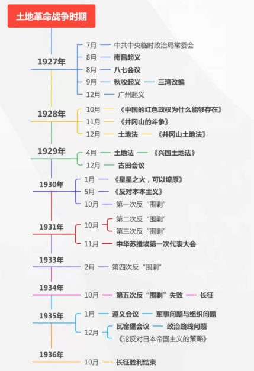
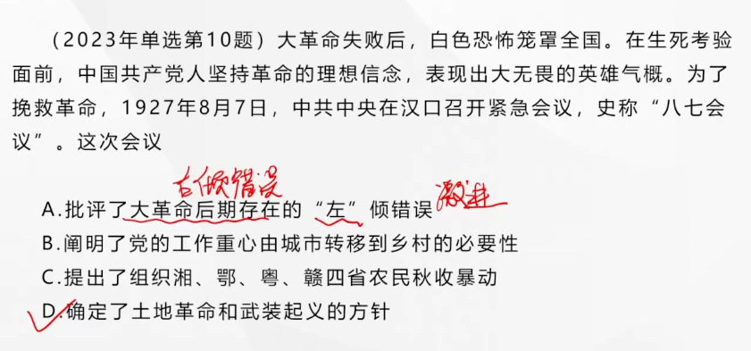
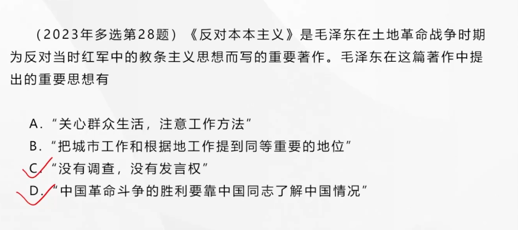
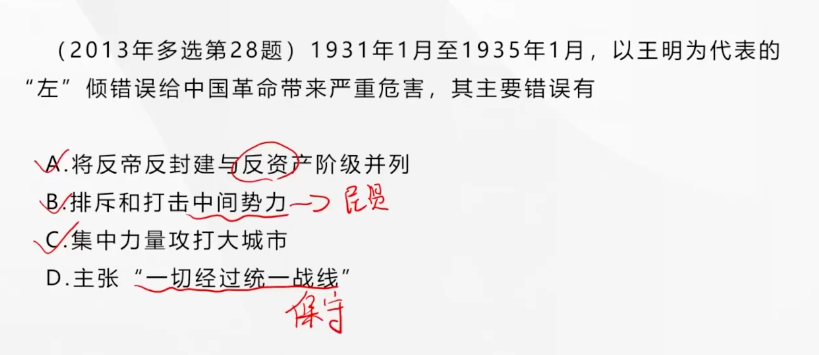
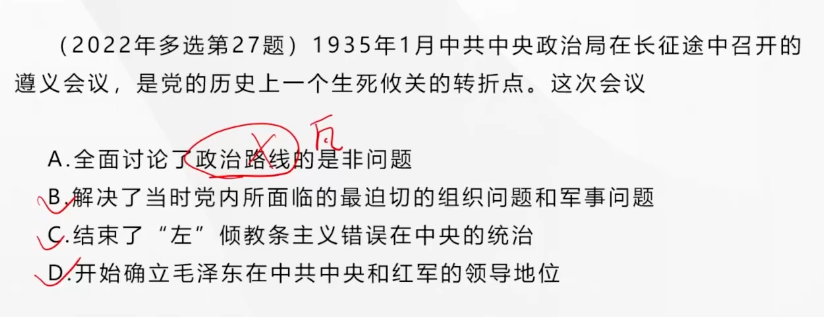

## 第五章 中国革命的新道路

> 围绕土地革命

---

### 土地革命战争的兴起

#### 开展武装反抗国民党反动统治的斗争

在革命的危急关头，中共中央政治局临时常委会决定了三件大事：

- 将党所掌握的影响的部队向南昌集中，准备起义
- 组织湘、鄂、赣、粤四省的农民发动秋收起义
- 召集中央紧急会议（八七会议），讨论和决定大革命失败后的新方针

在**八七会议**中，决定了**土地革命和武装起义**的方针

毛泽东强调：“以后要非常注意军事，须知政权是由枪杆子中获得的。”，会议提出（不等于做到了）了“**找着新的道路**”的任务

八七会议是**由大革命失败到土地革命兴起的历史性转变**

**南昌起义**：打响了武装反抗国民党反动派的**第一枪**，这是**中国共产党<u>独立领导</u>革命战争、<u>创建人民军队</u>和<u>武装夺取政权</u>的开端**

**秋收起义**：起义军公开打出了“**工农革命军**”的旗帜。

- **三湾改编**：从组织上确立了党对军队的领导。三湾改编是**建设无产阶级领导的新型人民军队的重要开端**
- **从进攻大城市转到向农村进军**，这是**中国人民革命史上具有决定意义的新起点**

**广州起义**：是对国民党发动的屠杀政策又一次发动的英勇反击

> 以上三次以攻打城市的起义都失败了
>
> 所以转向攻打农村

大革命失败，中国共产党得到了惨痛的教训。进入了**创造红军的新时期**，开启了**中国革命的新纪元**。中国革命由此发展到了一个新的阶段，即**土地革命战争时期**，或称**十年内战时期**。

---

### 农村包围城市、武装夺取政权道路的开辟

---

#### 对中国革命道路的新探索

党对中国革命道路的认识经历了一个过程。

毛泽东在实践上、理论上为农村包围城市、武装夺取政权革命新道路做出的重大贡献。

毛泽东不仅在实践中**首先把武装斗争的立足点放在农村**，领导开创**井冈山根据地**，创造性地解决了为坚持和发展农村根据地所必须解决的一系列根本问题，而且从理论上逐步对中国革命道路问题作出明确说明。

毛泽东写了《中国的红色政权为什么能够存在？》和《井冈山的斗争》，深刻论证了**<u>红色政权</u>能够长期存在并发展的主客观条件**，提出了**工农武装割据**的思想。

毛泽东在《星星之火、可以燎原》一文中指出：红军、游击队和红色区域的建立和发展，是**半殖民地中国在无产阶级领导之下的农民斗争的最高形式**和**半殖民地农民斗争发展的必然结果**，而且无疑义是**促进全国革命高潮的最重要因素**。

毛泽东在《反对本本主义》一文中阐明了坚持辩证唯物主义的思想路线即坚持理论与实际相结合的原则的**极端重要性**，提出了“没有调查，没有发言权”，和“中国革命斗争的胜利要靠中国同志了解中国情况”的重要思想，**表现了毛泽东开辟新道路、创造新理论的<u>革命首创精神</u>**

---

**农村包围城市、武装夺取政权**是马克思主义**在中国创造性地运用和发展**。指明了中国革命胜利的**唯一正确道路**，标志着**中国化的马克思主义**即**毛泽东思想**的**初步形成**

**古田会议**最重要的是**纠正党内错误思想的决议案**，确立了**思想建党、政治建军**的原则。

党对军队的绝对领导开端于**南昌起义**、奠基于**三湾改编**、定型于**古田会议**

---

#### 反“围剿”战争与土地革命

1928年毛泽东在井冈山住处制定中国共产党历史上**第一个土地法《井冈山土地法》**，规定**没收一切土地归苏维埃政府所有、禁止土地买卖**，并不适合中国农村的实际

1929年4月，毛泽东在兴国主持制定**第二个土地法《兴国土地法》**，将“没收一切土地”改为“**没收一切公共土地及地主阶级的土地**”。这是一个**原则性的改正**，**保护了中农的利益**使之不受侵犯

毛泽东要求各地各级工农民主政府发布公告，明确规定**农民已经分得的田归农民个人私有，可以自主租借买卖，别人不得侵犯**。

毛泽东和邓子恢等一起制定了土地革命中的**阶级路线和土地分配方法**：**坚定地依靠贫农、雇农，联合中农，限制富农，保护中小工商业者，消灭地主阶级；以乡为单位，按<u>人口</u>平分土地，在原耕地的基础上实现抽多补少、抽肥补瘦**

中国革命之所以能够得以坚持和发展，**根本原因**就在于**中国共产党紧紧地依靠农民，领导农民进行了土地制度的革命**

> 上可见附录7

---

---

### 土地革命的发展及其挫折

---

#### 农村革命根据地的建设

1931年11月中国苏维埃第一次全国代表大会在江西瑞金召开

**中华苏维埃共和国是中国历史上是第一个全国性的<u>工农民主政权</u>**，**扩大了党和红色政权的影响**，一定程度上加强了对处于被分割状态的各根据地的中枢指挥作用，还推动了各根据地的政权、经济、文化教育和党的自身建设，**开创了土地革命战争<u>新局面</u>**

- 土地革命战争时期建立的苏维埃政权的性质——**工农民主专政**【！】
- 抗日战争时期建立的政权的性质——**抗日民族统一战线性质**的政权，一切赞成抗日又赞成民主的人们的政权【！】
- 解放战争时期建立的政权的性质——**各个革命阶级**的联合专政【！】
- 新中国初期建立的政权的性质——**人民民主专政**

#### 土地革命战争的严重挫折

**三次“左”倾错误**：尤其是以王明为代表的“左”倾教条主义错误，使中国革命遭受严重挫折

> D是王明在抗日战争时期犯的“右”倾错误

#### 20世纪30年代前期、中期中国共产党内屡次出现严重的“左”倾错误的原因

- 八七会议后党内一直存在的浓厚的“左”倾情绪始终没有得到认真清理
- 共产国际对中国革命的错误领导
- **最重要的原因**，党的马克思主义理论准备不足，**不善于把马克思列宁主义与中国实际全面地、正确地结合起来**。

---

### 遵义会议实现伟大历史转折

---

#### 遵义会议召开的背景

第五次反围剿失败

1934年，中共中央机关和中央红军开始撤离根据地，开始长征

#### 遵义会议的内容

遵义会议集中解决了当时具有决定意义的**军事问题和组织问题**。会议的一系列重大决策，是在中国共产党同共产国际的联系中断的情况下，**独立自主地做出的**

遵义会议中**没有解决政治路线和思想路线问题**，政治路线问题是在**瓦窑堡会议**上开始解决的，思想路线问题是在**延安整风运动**中解决的

#### 遵义会议的意义

遵义会议是党的历史上一次**生死攸关的转折点**，事实上**确立了毛泽东在党中央和红军的领导地位，开始确立以毛泽东为主要代表的马克思主义正确路线在党中央的领导地位，开始形成以毛泽东同志为核心的第一代中央领导集体，开启了我们党<u>独立自主解决中国革命实际问题的新阶段</u>，在最危机关头拯救了党、挽救了红军、挽救了中国革命**

遵义会议的鲜明特点是**坚持真理、修正错误**

---

### 红军长征的胜利及其意义

---

#### 长征胜利的意义

- 极大地促进了党在**政治**上和**思想**上的**成熟**
- 是**中国革命转危为安的关键**
- 长征宣告了**国民党反动派消灭中国共产党和红军的图谋彻底失败，开启了中国共产党为实现<u>民族独立、人民解放</u>而斗争的新的伟大进军**
- 铸就了伟大的**长征精神**，为中国革命不断从胜利走向胜利提供了**强大精神动力**

---

### 总结历史经验，迎接全民族抗日战争

---

1935年12月，毛泽东《论反对日本帝国主义的<u>策略</u>》系统说明了党的**政治策略**上的诸问题；

1936年12月，毛泽东《中国革命战争的<u>战略</u>问题》系统说明了有关中国革命战争**战略方面**的诸多问题

1937年《实践论》和《矛盾论》揭露和批判党内的主观主义尤其是教条主义错误，科学阐明了党的的**马克思主义的思想路线**

