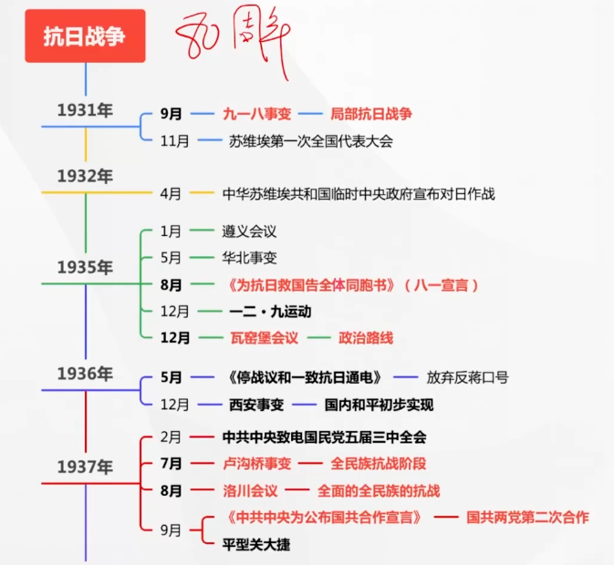
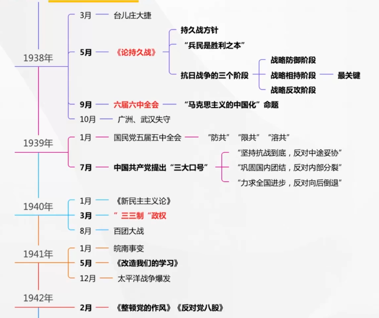
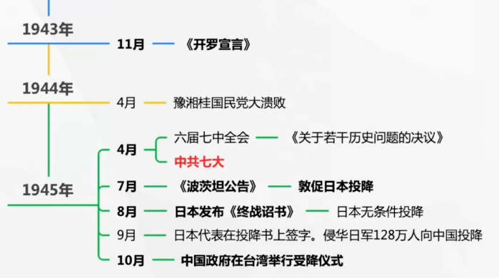
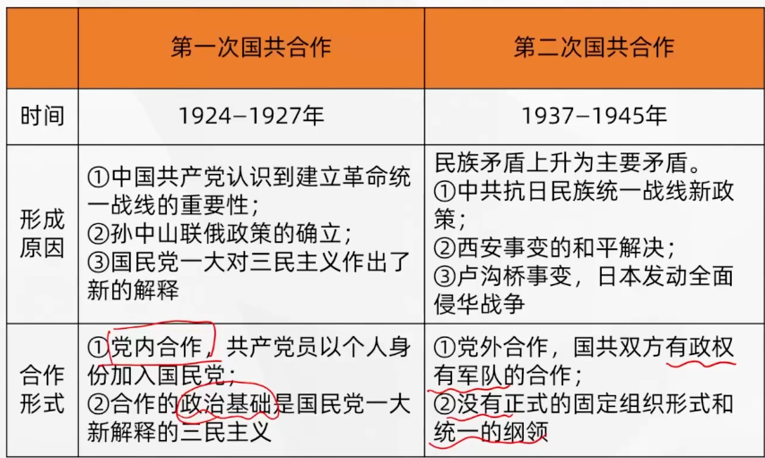
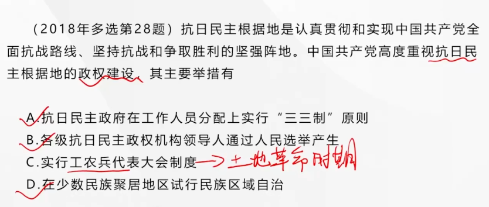
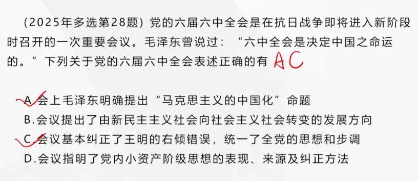
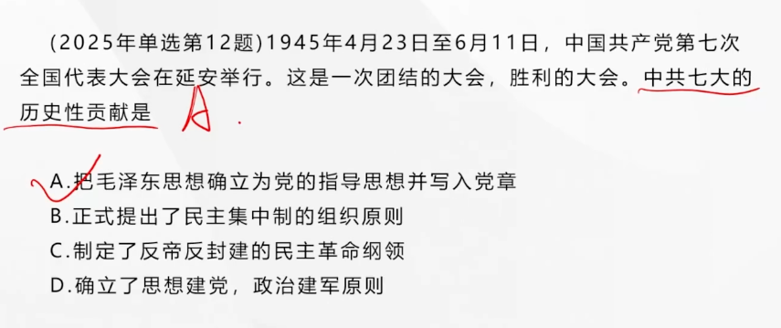
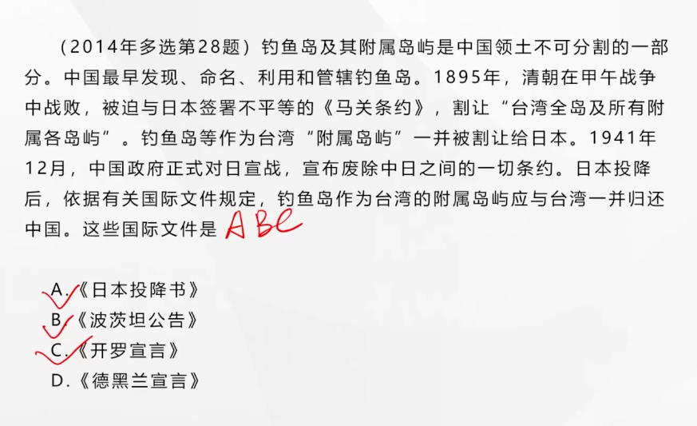

## 第六章 中华民族的抗日战争【80周年纪念，选择题重点】

---

### 日本灭亡中国的计划及其实施

---

#### 从九一八事变到华北事变

九一八事变，日本变中国为其独立殖民地的侵略战争由此开始

#### 卢沟桥事变与日本的全面侵华战争

1937年7月7日发生的**卢沟桥事变**标志着**日本全面侵华战争的开始**

#### 日本帝国主义的残暴统治

---

### 中国共产党举起武装抗日的旗帜

---

#### 中国人民抗日战争的起点

中国人民在九一八事变后开始了局部抗日战争，成为了中国人民抗日战争的起点，同时揭开了**世界反法西斯战争的序幕**。

#### 抗日救亡运动的兴起

1932年4月15日，中华苏维埃共和国临时中央政府宣布对日作战

---

### 抗日民族统一战线的建立与全民族抗战的开始

---

#### 一二·九运动

“停止内战，一致对外”“反对华北自治”“打倒日本帝国主义”

一二·九运动，促进了**中华民族的觉醒**，标志着**公国人民抗日救亡运动新高潮的到来**

#### 中共的抗日民族统一战线新政策

《为抗日救国告全体同胞书》（**八一宣言**），宣言主张**停止内战，组织国防政府和抗日联军，对日作战**。

**瓦窑堡会议**【重要】提出了党的**基本策略任务**是**建立广泛的抗日民族统一战线**，批评了党内**“左”倾冒险主义、关门主义**的错误（解决了**政治路线**问题）

**《停战议和一致抗日通电》**：放弃反蒋口号，总方针变成了“**逼蒋抗日**”

#### 西安事变及其和平解决

中国共产党**独立自主**的方针政策

**西安事变的和平解决**成为**时局转换的枢纽，十年内战局面基本结束，国内和平初步实现。**（不等于国共第二次合作开始）

为促进国共两党合作，中共中央致电**国民党五届三中全会**，提出**停止内战、一致对外**等五项要求。国民党统一两党进行谈判，在会议文件上写上了“抗日”字样。

#### 国共合作，共赴国难

**卢沟桥事变**，中国由此进入**全民族抗战阶段**，并且**开辟了世界反法西斯战争的东方主战场**

中国共产党的军队接受改编

#### 抗日民族统一战线正式形成

国民党中央通讯社发表《中共中央为公布国共合作宣言》，蒋介石发表实际上承认共产党合法地位的谈话。**以国共第二次合作为基础的抗日民族统一战线正式形成**

---

### 战略防御阶段与战略相持阶段的正面战场

---

#### 战略防御阶段的正面战场

**台儿庄**战役取得大捷，表明了国民党爱国将领，表现出空前的民族义愤和抗战热情。

**国民党正面战场失利的原因**，客观原因：日军在力量对比上占很大优势；主观原因：国民党**战略指导方针上的失误**：

- 蒋介石集团实行的是**片面抗战的路线**，不敢放手发动和武装民众，将希望单纯寄托在政府和正规军的抵抗上
- 在战略战术上，国民党军事当局没有采取**积极防御**的方针，而是进行**单纯的阵地防御战**

#### 战略相持阶段的正面战场

国民党由片面抗战逐步转变为消极抗战。**国民党五届五中全会**把**对付共产党作为重要议题**。这标志着国民党政府由片面抗战逐步转变为消极抗战

太平洋战争爆发后配合英、美打击日军

**豫湘桂战役**溃败后陷入全面危机，豫湘桂大溃败成为大后方人心变动的重要转折点

---

### 全面抗战路线和持久战的战略总方针

---

#### 全面的全民族抗战路线

不同于国民党的**片面抗战路线**，中国共产党实行的是**全面抗战路线**，即**人民战争路线**。**两条不同抗战路线的存在，是中国一切问题的关键**。

**洛川会议**制定了**抗日救国十大纲领**，强调要打倒日本帝国主义，关键在于**使已经发动的抗战成为全面的全民族的抗战**。为此，必须实行**全国军事的总动员、全国人民的总动员**

区别于瓦窑堡会议，瓦窑堡会议是**建立抗日民族统一战线**

#### 持久战的战略总方针

**持久抗战**的总方针，毛泽东发表了**《论持久战》**的讲演，批驳了**“亡国论”“速胜论”**等错误观点，系统地阐明了持久战方针

持久战的根据：

- 日本是强国，中国是弱国，决定了抗日战争只能是持久战（驳斥速胜论）
- 日本是小国，发动的是退步的、野蛮的侵略战争，这在国际上失道寡助，而中国进行的是进步的、正义的反侵略战争，**最后胜利将是属于中国的**（驳斥亡国论）

毛泽东强调“**兵民是胜利之本**”，必须进行**人民战争**

抗日战争的三个阶段：**战略防御阶段，战略相持阶段（最关键），战略反攻阶段**

---

### 敌后战场的开辟与游击战争的发展

---

#### 敌后战场的开辟和发展

全民族抗战以来中国军队的**第一次重大胜利**——**平型关战役**（平型关大捷），**打破了日军不可战胜的神话**

发动独立自主的**敌后游击战争**，在华北，以国民党为主体的正规战争结束，以共产党为主体的游击战争上升到主体地位- 

**创建抗日根据地，发展抗日武装**，继续走**农村包围城市、武装夺取政权**的道路

游击战被提到**战略**的地位，具有**全局性的意义**

- 战略防御阶段，从全局看国民党正面战场的正规战是主要的，敌后的游击战是辅助的
- 战略相持阶段，**敌后游击战争成为主要的抗日战争方式**
- 游击战还为人民军队进行**战略返攻**准备了条件

> 游击战是大规模的
>
> 我们是单独的外线作战
>
> 有进攻也有防御战

---

### 坚持抗战、团战、进步的方针

---

#### 统一战线中的独立自主原则

为此共产党必须做到：

- 保持在思想上、政治上和组织上的独立性，放手发动群众，壮大人民力量；
- 坚持对人民军队的绝对领导；
- 对国民党采取又团结又斗争、以斗争求团结的方针。

这样做的目的，就是力争中国共产党对抗日战争的**领导权**，这是**把抗日战争引向胜利的中心一环**

> 王明：一切经过统一战线，一切服从抗日（放弃领导权，过于保守的“右”倾错误）

#### 坚持抗战、团结、进步，反对妥协、分裂、倒退

1939年7月中国共产党明确提出

- **“坚持抗战到底，反对中途妥协”**

- **“巩固国内团结，反对内部分裂”**

- **“力求全国进步，反对向后倒退”**

三大口号

#### 巩固抗日民族统一战线的策略总方针

中国共产党制定了**“发展进步势力、争取中间势力、孤立顽固势力”**的战略总方针

进步势力主要指工人、农民和城市小资产阶级，他们是统一战线的**基础**，抗日战争的**主要依靠力量**

中间势力主要是指**民族资产阶级、开明绅士（抗日方面的地主阶级）和地方实力派**。争取中间势力需要一定的条件：

- 共产党要有充足的力量
- 尊重他们的利益
- 同顽固派作坚决的斗争

顽固势力是指**大地主、大资产阶级的抗日派**，即以**蒋介石集团为代表的国民党亲英美派**

对顽固派贯彻**又联合又斗争**的政策。在同顽固派作斗争时，坚持**有理、有利、有节**的原则

---

### 抗日民主根据地的建设

---

#### “三三制”的民主政权建设

**加强政权建设**是抗日根据地建设的**首要的、根本的任务**

三三制：工作人员的分配上，**共产党员**（代表工人和农民）、**党员进步人士**（代表小资产阶级）和**中间派**（民族资产阶级和开明绅士）各占1/3

中间派代表民族资产阶级和开明绅士，没有地方实力派（地方割据）

> 而抗日民族统一战线策略总方针中争取的中间势力主要是指民族资产阶级、开明绅士和**地方实力派**

抗日民主政权普遍采取**民主集中制**

**民族区域自治**

毛泽东在延安窑洞给出中国共产党**跳出治乱兴衰的历史周期率的第一个答案**，那就是“**让人民来监督政府**”

#### 减租减息，发展生产

减租减息，根据地内停止实行没收土地的政策，普遍实行**减租减息**政策，**减轻农民所受的封建剥削**，提高他们的抗日和生产的积极性；同时实行**交租交息**，以利于**联合地主阶级抗日**

大生产运动，毛泽东提出了“发展经济，保障供给”的经济工作和财政工作的总方针，发出了“**自己动手，丰衣足食**”的号召

在政治主张上，经历了从“工农共和国”到“人民共和国”再到“**民主共和国**”的变化过程。

---

### 大后方的抗日民主运动和进步文化工作

---

### 中国共产党的自身建设

---

#### “马克思主义中国化”命题的提出

**中国共产党六届六中全会**上，毛泽东明确提出了“马克思主义的中国化”这个命题

全会基本纠正了王明的“右”倾错误，进一步巩固了毛泽东在全党的领导地位，统一了全党的思想和步调，推动了各项工作迅速发展

#### 新民主主义理论的系统阐明（详见毛中特）

**新民主主义理论**是马克思主义中国化的重大理论成果。它的**提出和系统阐明，标志着毛泽东思想得到多方面展开而趋于成熟**

> 农村包围城市、武装夺取政权——毛泽东思想初步形成

#### 整风运动和《关于若干历史问题的决议》

毛泽东《改造我们的学习》报告，整风运动首先在党的高级干部中进行

毛泽东《整顿党的作风》和《反对党八股》的讲演，整风运动在全党范围普遍展开

**反对主观主义以整顿学风**

**反对宗派主义以整顿党风**

**反对党八股以整顿文风**

其中，**反对主观主义以整顿学风**是整风运动**最主要的任务**

**延安文艺座谈会**中，毛泽东在讲话中强调：“为什么人的问题，是一个根本的问题，原则的问题”“我们的文学艺术都是为人民大众的，首先是为工农兵的”

**六届七中全会通过了《关于若干历史问题的决议》**，整风运动得以胜利结束

整风运动是一次深刻的**马克思主义思想教育运动**，也是一场**思想解放运动**，使**实事求是的思想路线在全党范围确立起来**。

> 不要把思想路线与政治路线（瓦窑堡会议）、军事路线和组织路线（遵义会议）相混淆 

> B：七届二中全会
>
> D：古田会议

---

### 中共七大和毛泽东思想指导地位的确立

---

#### 中共七大的召开

中共七大制定了党的政治路线，即“放手发动群众，壮大人民力量，在我党的领导下，打败日本侵略者，解放全国人民，建立一个新民主主义的中国”（展望未来）

概括三大作风（总结过去）：

- **理论与实践相结合**
- **和人民群众紧密联系**
- **批评与自我批评**

#### 中共七大把毛泽东思想确定为党的指导思想

正式将毛泽东为主要代表的中国共产党人把马克思列宁主义基本原理同中国具体实际相结合所创造的理论成果命名为**毛泽东思想**，规定为**党的一切工作的指针。把毛泽东思想确立为党的指导思想并写入党章，是中共七大的历史性贡献**（可以称为“第一次飞跃”）

#### 中共七大在党的历史上具有重要里程碑意义，标志着党在政治上思想上组织上走向成熟

---

### 抗日战争的胜利

---

《开罗宣言》要求台湾，东北，澎湖列岛归还给中国

《波茨坦公告》规定归还的领土

日本天皇发布《终战诏书》，日本无条件投降

10月25日，中国政府在台湾举行受降仪式。根据《波茨坦公告》，被日本占领50年之久的台湾以及澎湖列岛，重归中国主权管辖。**这是抗日战争取得完全胜利的重要标志**

>  波开日本

---

### 中国人民抗日战争的世界反法西斯战争中的地位

---

**中国战场是世界反法西斯战争的东方主战场**

---

### 抗日战争胜利的原因和意义

---

- 以**爱国主义为核心的民族精神**是**决定因素**
- **中国共产党的中流砥柱作用**是**关键**
- **全民族抗战**是**重要法宝**
- **同世界所有爱好和平和正义的国家和人民、国际组织以及各种反法西斯力量的同情和支持也是分不开的**（国际条件）

#### 抗日战争胜利的意义

这一伟大胜利，**是中华民族从近代以来陷入深重危机走向伟大复兴的历史转折点**

