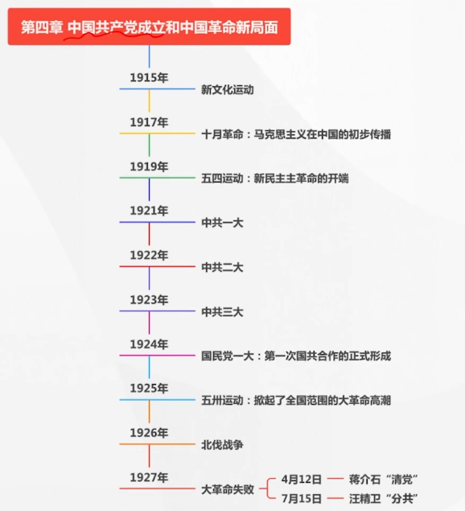
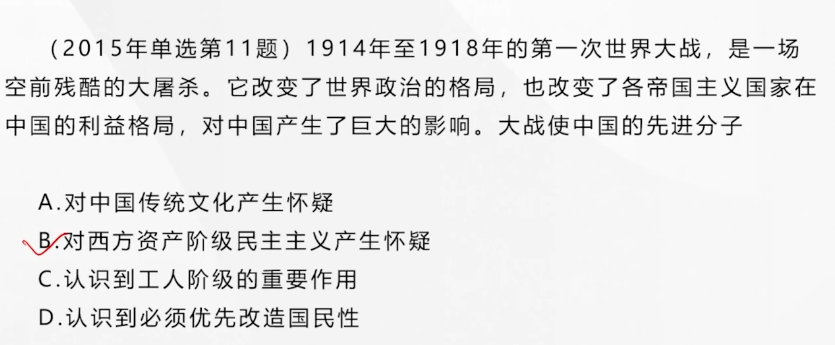
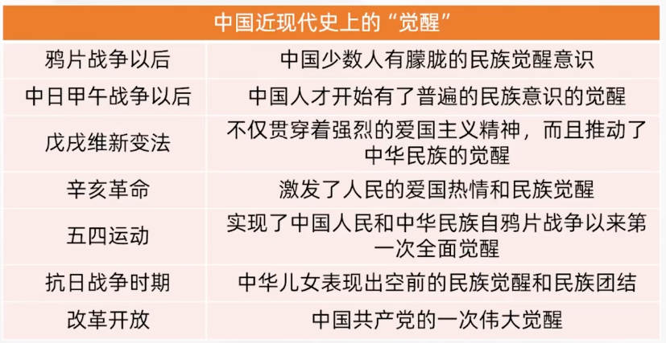
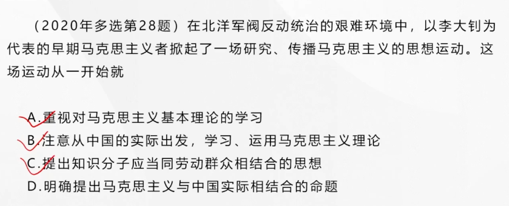
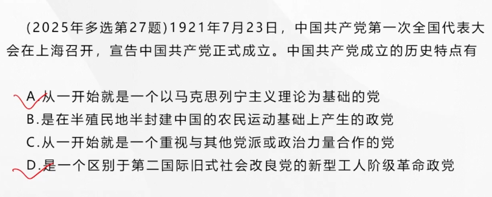
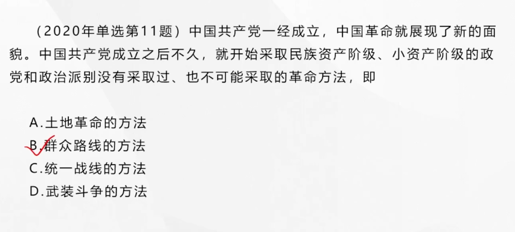
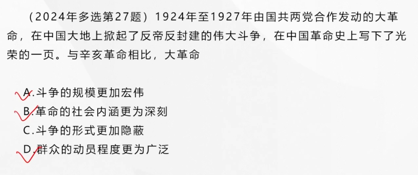

## 第四章 中国共产党成立和中国革命新局面（核心）

### 新文化运动与思想解放的潮流

#### 新文化运动

“欲图根本之救亡”，必须改造中国的**国民性**。这个运动后来被称为**新文化运动**

开始的标志，1915年陈独秀在上海创办**青年杂志**（后改名**《新青年》**），**标志着新文化运动的开始**。《新青年》杂志和北京大学成为**新文化运动的主要阵地**。

**基本内容和基本口号**，新文化运动的基本口号：**倡导民主和科学**。

新文化运动的创造者以**进化论观点**和**个性解放思想**为**主要武器**，猛烈抨击以孔子为代表的“往圣先贤”（**不是彻底，否定全部**）

#### 五四以前新文化运动的性质与评价

五四以前新文化运动的性质是**资产阶级民主主义的新文化反对封建主义旧文化的斗争**（资本主义）

历史意义：

- 倡导者们提倡民主和科学在客观上对于资产阶级民主主义的提倡具有振聋发聩的作用
- 在社会上掀起了一股思想解放的潮流，为马克思主义在中国传播准备了思想和文化的条件

**局限**：

- 新文化运动的倡导者批判孔学，是为了**给中国发展资本主义扫清障碍**，从根本上说，倡导资产阶级民主主义，并不能为人们提供一种有效的思想武器去认识中国
- 新文化运动的倡导者把**改造国民性**置于**优先地位**（不应当是优先地位，实践决定认识）
- 当时的很多领导人物还没有马克思主义的批判精神（用辩证的眼光看待事物），看问题是很片面的

---

### 十月革命与马克思主义在中国的初步传播

---

#### 十月革命对中国先进分子的影响

- 十月革命发生在其国情与中国相同（封建压迫严重）或近似（经济文化落后）的俄国，因而对中国的先进分子具有特殊的吸引力
- 十月革命诞生的社会意义俄国号召**反对帝国主义**，并以新的平等的态度对待中国，有力地推动了社会主义思想在中国的传播
- 十月革命中俄国工人、农民和士兵群众的广泛发动并由此赢得胜利的果实，给予中国的先进分子以**新的革命方法（群众路线）**的启示，推动他们去研究这个革命所遵循的主义

#### 李大钊率先在中国举起马克思主义旗帜

1919年9月、11月，李大钊发表**《我的马克思主义观》**一文，比较系统地介绍了马克思主义理论，在当时思想界产生重大影响，**标志着马克思主义在中国进入比较系统的传播阶段**。

---

### 五四运动：新民主主义革命的开端

---

#### 五四运动的发生和发展

五四运动爆发的时代条件和社会历史条件：

- 新的社会力量的成长、壮大（**工人阶级**），五四运动就获得了比以往的革命斗争更加广泛的群众基础
- 新文化运动掀起的思想解放的潮流为五四运动准备了最初的群众队伍和骨干力量
- 俄国十月革命对中国产生的影响

#### 五四运动的直接导火线——巴黎和会上中国外交的失败

1919年5月4日十几所学校的学生掀起了五四运动。

第一个阶段：**以学生为主，中心在北京**（5月4日到6月5日）

第二个阶段，中国工人阶级开始以独立的姿态登上政治舞台，成为了有**工人阶级、小资产阶级和民族资产阶级**参加的全国规模的革命运动。斗争的主力**由学生转向了工人，运动的中心由北京转到了上海**。

五四运动的**直接斗争目标得到了实现**，中国政府代表没有出席巴黎合约签字仪式

#### 五四运动的历史特点和意义

五四运动是一场**伟大的爱国革命运动，伟大社会革命运动，伟大思想启蒙运动和新文化运动**

五四运动是**中国旧民主主义革命走向新民主主义革命的转折点**，五四运动是中国**新民主主义革命的<u>开端</u>**

五四运动以全民族的力量高举起**爱国主义的伟大旗帜**

五四运动以全民族的行动激发了追求真理、追求进步的伟大觉醒，实现了中国人民和中华民族自鸦片战争以来**第一次全面觉醒**

五四运动以全民族的搏击培育了**永久奋斗的伟大传统**，标志着中国青年成为推动中国社会变革的急先锋

**农民阶级没有参与其中**

---

### 中国早期马克思主义思想运动

---

#### 早期马克思主义者的队伍

中国早期信仰马克思主义的认为主要有三种类型：

- 新文化运动的精神领袖（**李大钊起着主要作用**）
- 五四运动的左翼骨干
- 一部分原中国同盟会会员、辛亥革命时期的活动家

 #### 早期马克思主义思想运动的特点

- 重视对马克思主义基本理论的学习
- **注意**（不等于做到了，不等于明确提出了马克思主义中国化的命题）从中国的实际出发，学习、运用马克思主义（意味着中国马克思主义者已经在实际上初步形成了**马克思主义应当与中国实际相结合**的思想）
- 开始提出**知识分子应当同劳动群众相结合**的思想

#### 新文化运动的发展

广大人民群众的民主和马克思主义的科学

---

### 马克思主义与中国工人运动的结合

---

#### 中国共产党早期组织的活动

- 研究和宣传马克思主义，研究中国实际问题
- 到工人中去进行宣传和组织工作（实践）
- 进行建党问题的讨论和实际组织工作（建党）

---

### 中国共产党第一次全国代表大会的召开与中国共产党的成立

---

#### 中国共产党的诞生成为历史发展的必然

中国共产党的成立，**是近代中国历史发展的必然产物（中国层面），是中国人民在救亡图存斗争中顽强求索的必然产物（中国人民层面），是实现中华民族伟大复兴的必然产物（中华民族层面）**。

#### 中国共产党第一次全国代表大会

**大会确定党的名称为“中国共产党”**。大会通过了中国共产党第一个纲领，明确“革命军队必须与无产阶级一起推翻资本家阶级的政权”，“承认无产阶级专政，直到阶级斗争结束”，“消灭资本家私有制”，联合第三国际

中国共产党一经成立，就旗帜鲜明地把**社会主义和共产主义规定为自己的奋斗目标**，坚持用**革命的手段**实现这个目标。大会在讨论实际工作计划时，决定首先集中精力组织**工人**

#### 中国共产党成立的历史特点和意义

思想基础好：接受的是具有完整科学观和社会革命论的马克思主义

阶级基础好：代表的是工人阶级，是最革命的阶级

中国共产党一开始就是以**马克思列宁主义理论**为基础的党，是一个区别于第二国际旧式社会改良党的**新型工人阶级革命政党**

历史意义：

- 是中国民族发展史上一个**开天辟地的大事变**，具有伟大而深远的意义
- 深刻改变了**近代以后中华民族发展的方向和进程**（人民层面）
- 深刻改变了**中国人民和中华民族的前途和命运**（民族层面）
- 深刻改变了**世界发展的趋势和格局**（世界层面）

---

### 民主革命纲领的制定和工农运动的发动

---

#### 民主革命纲领的制定

**中共二大**第一次提出了**反帝反封建的民主革命纲领**，为中国人民制定了斗争的目标。**分清敌友**，这是**革命的首要问题**

中共二大指出党的**最高纲领**是**实现社会主义、共产主义**

但党在现阶段的纲领，即最低纲领是：打倒军阀；推翻国际帝国主义的压迫；统一中国为真正民主共和国。

大会指出，为实现反帝反军阀的革命目标，必须联合全国一切革命党派，联合资产阶级民主派，组成“民主主义的联合战线”（**党外合作**）

**发动工农群众开展革命斗争**。中国共产党开始采取**群众路线**的革命方法。

#### 工农运动的发动

第一个工人运动高潮**以香港海员罢工为起点，京汉铁路工人罢工为终点**

**安源路矿工人大罢工**是**中国共产党第一次独立领导并取得完全胜利的工人斗争**

---

### 国共合作和大革命的进行

---

#### 国共合作的形成

**中共三大**决定共产党员以**个人身份**加入国民党，以实现国共合作。（**党内合作**）

国民党一大通过的宣言对三民主义做出了新的解释，即“**新三民主义**”，在民族主义中突出了**反对帝国主义**的内容；在民权主义中强调了民主权利应**为一般平民所共有**；把民生主义概括为“**平均地权**”和“**节制资本**”两大原则，后来提出“**耕者有其田**”的主张（提出了≠做到了）

新三民主义的政纲**同中国共产党在民主革命阶段的纲领基本一致**，因而有了国共合作的**政治基础**

（但是只有政治基础，没有军队合作，政权合作）

国民党一大确认了共产党员一个人身份加入国民党的原则。**国民党一大**事实上确认了联俄、联共、扶助农工三大革命政策，**标志着第一次国共合作正式形成**

#### 大革命的准备与进行

国共合作的形成，加快了中国革命前进的步伐

以**五卅运动**为起点，掀起了全国范围的大革命高潮。国民政府在广州建立

**北伐战争的胜利进展**

1924年至1927年中国反帝反封建的革命比以往任何一次革命**群众的动员程度更为广泛，斗争的规模更加宏伟，革命的社会内涵更为深刻**，因此被称作大革命

#### 大革命中的中国共产党

- 大革命是在反对帝国主义、反对军阀的政治口号下进行的。而提出这个口号的，正是**中国共产党**
- 大革命是在国共合作为基础的统一战线的组织形式下进行的。而中国共产党正是**国共合作的倡导者和统一战线的组织者**
- 大革命是近代中国历史上空前广泛而深刻的群众运动。而中国共产党正是**人民群众的主要发动者和组织者**
- 大革命的主要斗争形式是革命战争。

> 没有中国共产党就不会有此次大革命

---

### 大革命的失败及其教训

---

#### 大革命的失败

蒋介石在上海发动反共政变，以“清党”为名大规模捕杀共产党员和革命群众。汪精卫在武汉召开“分共”会议，对共产党员和革命群众实行搜捕和屠杀。

**国共合作全面破裂，大革命最终失败**

对于共产党来说，没有完成彻底反帝反封建的革命目标，所以大革命是失败的。

#### 大革命失败的原因和经验教训

由于这时的中国共产党还处在幼年时期，还不善于将马克思列宁主义基本原理同中国革命的具体实际结合起来（之后都会与这个有关系）

由于党内以陈独秀为代表的**右倾思想**（过于保守）发展为**右倾机会主义错误**并在党的领导机关中占了统治地位，党和人民不能组织有效抵抗。

国际因素：大革命后期共产国际的错误指导，不了解中国实际的情况

#### 大革命的历史意义

**领导了全国反帝反封建的伟大斗争**，在中国革命史上写下了光荣的一页。同时**开始探索马克思主义中国化的途径，初步提出了新民主主义革命的基本思想**，开始懂得**进行土地革命和掌握革命武装的重要性**
